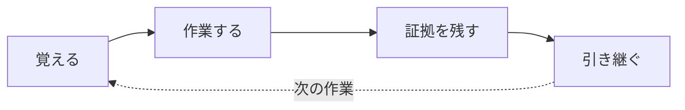

# Caty Agent Harness

<div align="center">

[🇺🇸 English](README.md) ｜ **🇯🇵 日本語** ｜ [🇨🇳 简体中文](README.zh.md) ｜ [🇹🇭 ไทย](README.th.md)


[](LICENSE)


説明のやり直し。消える文脈。証拠のない「できました！」。<br>
Caty Agent Harness は、その全部をただのテキストファイルと確認の仕組みで解決します。<br>
魔法ではありません。覚える・進める・確かめるは機械が受け持ち、AI は考えることに集中する —<br>
いつもの AI のまわりに置く、小さな仕組みです。

**自己成長しながら、指示したタスクを最後まで完走してくれるようになるツール。**

🔧 [エンジニア向けドキュメント](docs/engineering.ja.md) ｜ 📘 [詳細仕様](docs/reference.ja.md)

</div>

- [こんな経験はありませんか？](#problems)
- [使うと何が変わるか](#what-you-get)
- [使うのに必要なもの](#environments)
- [使いはじめる](#get-started)
- [この下にあるもの全部](#shelf)
- [Family OS とのつながり](#family-os)
- [ライセンス](#license)

---

<a id="problems"></a>

## こんな経験はありませんか？

- 新しい会話のたびに、同じ背景説明からやり直しになる。
- AI は「完了しました」と言うのに、結果が無い。あるいは確かめようがない。
- 長い作業が途中でどこまで進んだか分からなくなり、静かに止まる。
- 先週うまくいった解決法を、今週の AI は覚えていない。

ひとつでもうなずいたなら、これはあなたのための道具です。

---

<a id="what-you-get"></a>

## 使うと何が変わるか



### 🌱 勝手に、賢くなる

- 間違えたら、理由と証拠をその場で書き留めます。
- 次の挑戦には前回の失敗が必ず引き継がれ、同じやり方は禁止されます — 同じ失敗を繰り返さなくなります。
- 良い方法も、1回の成功では信用しません。別の仕事でもう一度検証に通って、はじめて「ルール」になります。
- 何度も出てくる良い手順は、作った本人ではない別の AI が審査し、合格したときだけ「スキル」に昇格します。
- これが全部、自動で起こります。「メモしておいて」と頼む必要はありません。

<details>
<summary><b>勝手に賢くなる仕組み</b></summary>

1. **失敗すると** — 何がだめだったか + その証拠が、プロジェクト内のノートに自動で記録されます。
2. **次に挑戦するとき** — 前回の失敗が必ずセットで渡され、「同じやり方の再試行は禁止」というルールが機械的にかかります。
3. **成功すると** — その方法はまず「教訓」としてメモされるだけ。別の仕事でもう一度検証に合格して、はじめて「ルール」に昇格します。
4. **何度も使う手順は** — 作った本人ではない別の AI が審査し、合格したものだけが「スキル」として保存され、次から自動で参照されます。

→ もっと詳しく: [エンジニア向けドキュメント「繰り返す失敗から学ぶ」](docs/engineering.ja.md#learning)

</details>

### 🏁 最後まで、走り切る

- 大きな仕事は記録された小さな一歩に分割され、機械が1歩ずつ確実に進めます。
- AI には毎回「短くて新鮮な文脈 + いまやるべき1歩」だけが渡されます — 小さなモデルでも崩れません。
- 「覚えていられるか」は「機械がファイルを読み直すか」に変わるので、構造的に忘れられません。
- 会話が終わっても、ウィンドウを閉じても、モデルを乗り換えても、続きから再開できます。

<details>
<summary><b>最後まで走り切る仕組み</b></summary>

1. **分割** — 大きな仕事は、番号つきのステップ計画に分割されて記録されます。
2. **1歩ずつ** — スケジューラが数分おきに「次の1歩」を蹴ります。AI に渡されるのは、タスク内容 + これまでの進捗 + 引き継ぎノートだけ。毎回まっさらな短い文脈です。
3. **完了チェック** — 1歩ごとに、実行可能なチェックスクリプトが実際の成果物を確かめます。AI の自己申告は使いません。
4. **予算** — 試行回数と作業時間には上限があり、機械が数えています。ダラダラ続けることはできません。
5. **正直な結末** — 完走するか、予算切れなら直近の試行サマリと証拠を添えて、あなたに報告が届きます。

→ もっと詳しく: [エンジニア向けドキュメント「技術的な実装範囲」](docs/engineering.ja.md#completion)

</details>

### 🔍 「できました」に、証拠がつく

- 完了は状況報告ではなく、実際の成果物への機械チェックで判定されます。
- 検証するのは作った本人ではなく、まっさらな文脈の独立した検証者です。
- ダメなときは無限に回らず、証拠つきで正直に止まって、あなたに報告が届きます。

<a id="safety"></a>

### 🤝 あなたの AI は、何も変わらない

- 人格・指示ファイル・育てた記憶には一切触れません。まわりに数個のファイルを足すだけです。
- 入れるのも止めるのも1コマンド。止めても学びは消えません。試すのに勇気はいりません。
- 中身は全部ただのテキストファイル。何を学んだか、自分の目で読めます。

---

<a id="environments"></a>

## 使うのに必要なもの

対応する AI ツールはどれもターミナルで動くものですが、**あなたがターミナルを触る必要はありません**。設定も管理も AI がやってくれます。あなたは AI と話すだけ。

| 観点 | 対応 |
| --- | --- |
| OS | macOS ✅ ／ Linux ✅ |
| 対応 AI ツール | Claude Code ✅ ／ Codex CLI ✅ ／ Kimi Code CLI ✅ ／ Hermes Agent ✅ ／ OpenClaw ✅ |
| シェル | bash 3.2+ ✅（macOS 標準のままで OK） |
| Python 3 | hook と自動実行の仕組みが使います（有無は AI が確認してくれます） |

ツールごとの対応の深さはわざと違えてあります。詳細は[エンジニア向けドキュメント](docs/engineering.ja.md)へ。

---

<a id="get-started"></a>

## 使いはじめる

### AI に渡す

やることは1つだけ。作業してほしいプロジェクトフォルダの中で、いつもの AI ツールを開いてこれを貼ってください。

```text
https://github.com/caty-ai/caty-agent-harness.git をこのプロジェクトに導入してください。
リポジトリ内の docs/agent-guide.md を読んでその通りに進めてください — このフォルダを
workspace としてインストールし、ヘルスチェックを実行し、終わったら「何を設定したか」
「次に何ができるか」を私にわかる言葉で教えてください。
```

これで終わりです。[エージェント向けガイド](docs/agent-guide.md)が、選択肢・確認・あなたへの報告の仕方まで AI を案内します。

自分の手でコマンドを打ちたい方は → [エンジニア向けドキュメント](docs/engineering.ja.md#quickstart)に完全な手動手順があります。

<details>
<summary>なにか変だなと思ったら</summary>

- AI は読み取り専用のヘルスチェック（`--check`）を実行して結果を見せてくれます。正常なら最後に `ok: required layout and STATE.md headers present` と出ます。
- 中核が正常でも、一部の行に `FAIL` と出ることがあります。それはまだ配線していない任意の自動化項目で、どれが必要かはエージェント向けガイドが AI に教えます。
- あなたの AI・ファイル・プロジェクトが置き換えられることはありません。詳しくは[あなたの AI は、何も変わらない](#safety)へ。

</details>

---

<a id="shelf"></a>

## この下にあるもの全部

いま読んだページは短縮版です。中身は本物で、全部ドキュメントになっています。

| ドキュメント | 中身 |
| --- | --- |
| [docs/agent-guide.md](docs/agent-guide.md) | **導入する AI のための台本** — 選択肢・コマンド・確認・報告の仕方まで一本道（英語） |
| [docs/engineering.ja.md](docs/engineering.ja.md) | **技術ガイド全部** — どこで何が強制されるか、ツール別の深さ、pause の意味論、アーキテクチャ、ディレクトリ地図 |
| [docs/reference.ja.md](docs/reference.ja.md) | **正確な契約** — 全フラグ・全状態・設計文書への索引 |
| [Runtime 別設定](docs/engineering.ja.md#runtime-setup) | **ツール別の配線** — 5つの AI ツールそれぞれの hook・verifier・スケジュール |
| [CONTRIBUTING.md](CONTRIBUTING.md) | **変更の提案方法** — Issue 起点のフローとテストスイート20本（1ループで実行可・英語） |
| [SECURITY.md](SECURITY.md) | **問題の安全な報告先** — private な脆弱性報告の窓口（英語） |

---

<a id="family-os"></a>

## Family OS とのつながり

Caty Agent Harness は、Caty AI プロジェクト **Family OS** — 複数の AI エージェントをひとつの家族として運用するための全体構想 — を構成するツールのひとつです。単独でそのまま使えますが、次と組み合わせると、さらに力を発揮します。

- **family-os**（公開準備中） — 家族全体をまとめる設計図。この Harness はその中で「縦軸 = 個のエージェントを育て、完走させる軸」を担当します。
- **[sitter](https://github.com/caty-ai/sitter)** — 長く走るエージェント作業を外から見張る監視役。作業が止まった・固まったを検知して知らせます。

---

<a id="license"></a>

## ライセンス

[MIT](LICENSE) です。使うのも、学ぶのも、何かに組み込むのも自由に。商用のエージェント構成もどうぞ。そのために作っています。

---

<div align="center">

**ただのテキストファイル** ｜ **5つの AI ツールで動く** ｜ **コマンド1つで一時停止・再開**

</div>
