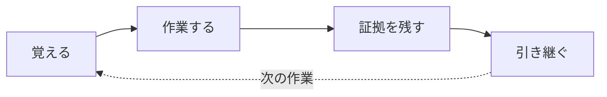

# Caty Agent Harness

<div align="center">

[🇺🇸 English](README.md) ｜ **🇯🇵 日本語** ｜ [🇨🇳 简体中文](README.zh.md) ｜ [🇹🇭 ไทย](README.th.md)

> **お知らせ（2026-08-24）:** この README と実装のあいだに一部乖離が見つかりました（[#144](https://github.com/caty-ai/caty-agent-harness/issues/144)）。以下に記載している学習ループのうち「その方法はまず『教訓』としてメモされるだけ。別の仕事でもう一度検証に合格して、はじめて『ルール』に昇格します。何度も使う手順は、作った本人ではない別の AI が審査し、合格したものだけが『スキル』として保存されます」の部分は、設計済みですがまだ実装されていません。現在実装を進めており（[#147](https://github.com/caty-ai/caty-agent-harness/issues/147), [#148](https://github.com/caty-ai/caty-agent-harness/issues/148), [#149](https://github.com/caty-ai/caty-agent-harness/issues/149)）、完了後にドキュメントを調整して再公開します。追跡: [#146](https://github.com/caty-ai/caty-agent-harness/issues/146)。


[](https://github.com/caty-ai/caty-agent-harness/actions/workflows/test-lint.yml)
[](https://github.com/caty-ai/caty-agent-harness/actions/workflows/ci-matrix.yml?query=branch%3Amain)
[](LICENSE)


<sub>CI 証拠（2026-08-15 UTC）: [マトリクス 7/7 green](https://github.com/caty-ai/caty-agent-harness/actions/runs/31858953187) ・ [同一 SHA に対する 60 回の独立実行・フレーク0件](https://github.com/caty-ai/caty-agent-harness/actions/runs/31859000233)。週次実行 — リポジトリが60日間動かないと GitHub が schedule を自動停止するため、run の日付も確認してください。</sub>
<br><sub>* WSL2 は 1 台の dated VM で条件つき実測済みの tier であり、CI テスト済み tier ではありません。詳しくは [WSL2 サポートメモ](docs/wsl2-support.md) を参照してください。</sub>

説明のやり直し。消える文脈。証拠のない「できました！」。<br>
Caty Agent Harness は、その全部をただのテキストファイルと確認の仕組みで解決します。<br>
魔法ではありません。覚える・進める・確かめるは機械が受け持ち、AI は考えることに集中する —<br>
いつもの AI のまわりに置く、小さな仕組みです。

**自己成長しながら、指示したタスクを最後まで完走してくれるようになるツール。**

**実測** — コンテキストが溢れる量の仕事での封印付き・事前登録ベンチマーク（2026-08）:

| モデル | 検証済み完了率（素 → ハーネス） | 完了ハルシネーション¹ | 時間・トークン |
|---|---|---|---|
| Claude Haiku 4.5 | 13% → **43%**（+30pt, p=0.0079） | 98% → **8%** | **トークン59%減・時間40〜46%減** |
| GPT-5.6 Luna（Codex） | 計画中 | — | — |
| ローカルモデル（Ollama） | 計画中 | — | — |

<sub>¹ 読み切っていないのに「done」と申告すること — 自己申告ではなくツール呼び出し記録から実測: 15〜30万トークンの仕事（各腕30本・採点は機械のみ）で 222件 → 2件。弱点も含めて → [全数字と弱点](docs/benchmark.ja.md)。</sub>

🔧 [エンジニア向けドキュメント](docs/engineering.ja.md) ｜ 📘 [詳細仕様](docs/reference.ja.md)

</div>

- [こんな経験はありませんか？](#problems)
- [できること](#what-you-get)
- [使うのに必要なもの](#environments)
- [使いはじめる](#get-started)
- [安心して使える理由](#safety)
- [もっと詳しく](#shelf)
- [Family OS の一員です](#family-os)
- [ライセンス](#license)

---

<a id="problems"></a>

## こんな経験はありませんか？

AI に仕事を頼むほど、こういう場面が増えていきます。

- 新しい会話のたびに、同じ背景説明からやり直しになる。
- AI は「完了しました」と言うのに、結果が無い。あるいは確かめようがない。
- 長い作業が途中でどこまで進んだか分からなくなり、静かに止まる。
- 先週うまくいった解決法を、今週の AI は覚えていない。

ひとつでもうなずいたなら、これはあなたのためのツールです。逆に、AI を単発の短い質問にしか使わない方には、この仕組みは大げさです — そのままで大丈夫です。

この4つを、仕組みで潰すために作られたのが Caty Agent Harness です。

---

<a id="what-you-get"></a>

## できること

やることは1周の繰り返しです。覚える → 作業する → 証拠を残す → 引き継ぐ。この輪を機械が回し続けるので、AI が忘れても仕事は忘れられません。



- 🌱 **勝手に、賢くなる**

  間違えたら、理由と証拠がその場でノート（実体はただのテキストファイル）に記録されます。次の挑戦には前回の失敗が必ず引き継がれ、同じやり方の再試行は機械的に禁止 — 同じ失敗を繰り返さなくなります。「メモしておいて」と頼む必要はありません。

- 🏁 **最後まで、走り切る**

  大きな仕事は番号つきの小さな一歩に分割され、機械が1歩ずつ進めます。会話が終わっても、ウィンドウを閉じても、モデルを乗り換えても、続きから再開できます。

- 🔍 **「できました」に、証拠がつく**

  完了は AI の自己申告ではなく、実際の成果物への機械チェックで判定されます。独立した検証者が加わるのは設定されている場合だけで、未設定でも機械チェックが中核です。どちらの場合も作業した AI の自己申告を証拠にはしません。ダメなときは無限に回らず、証拠つきで正直に止まって報告が届きます。

<details>
<summary><b>仕組みの種明かし（魔法ではない理由）</b></summary>

1. **失敗すると** — 何がだめだったか + その証拠が、プロジェクト内のノートに自動で記録されます。
2. **次に挑戦するとき** — 前回の失敗が必ずセットで渡され、「同じやり方の再試行は禁止」というルールが機械的にかかります。
3. **成功すると** — その方法はまず「教訓」としてメモされるだけ。別の仕事でもう一度検証に合格して、はじめて「ルール」に昇格します。何度も使う手順は、作った本人ではない別の AI が審査し、合格したものだけが「スキル」として保存されます。
4. **進行中は** — スケジューラが数分おきに「次の1歩」を蹴り、AI には短くて新鮮な文脈だけが渡されます。試行回数と作業時間には機械が数える上限があり、ダラダラ続けることはできません。

→ もっと詳しく: [失敗から学ぶ仕組み](docs/engineering.ja.md#learning) ／ [完走のレール](docs/engineering.ja.md#completion)

</details>

使えるかどうかは、お使いのツール次第です。対応表をどうぞ。

---

<a id="environments"></a>

## 使うのに必要なもの

対応する AI ツールはどれもターミナルで動くものですが、**あなたがターミナルを触る必要はありません**。設定も管理も AI がやってくれます。あなたは AI と話すだけ。

| 観点 | 対応 |
| --- | --- |
| OS | macOS: ✅ CI テスト済み（GitHub Actions `macos-latest`・Apple シリコン） ／ Linux: ✅ CI テスト済み（GitHub Actions `ubuntu-latest`） |
| Windows (native) | ❌ 非対応 — 実測した壁は3つです: `chmod` が黙って `644` になり、`ln -s` はコピーになり、`flock` がありません。詳しくは [WSL2 サポートメモ](docs/wsl2-support.md#windows-native-walls) を参照してください。 |
| WSL2 (Ubuntu on Windows) | 🟡 条件つき対応 — 2026-08-23 に `win11-test-vm` 上で実測済み（30/30 suites、`umask 0002`、非root、Linux filesystem）ですが、CI テストは未実施です。<br>AI ツール（Claude Code / Codex CLI）は同じ WSL2 distro の中で動かす必要があり、Windows 側で動かすと install は通っても hooks は一度も発火しません。<br>repo は速度のためではなく正しさのために Linux filesystem（`/home/...`、`/mnt/c/...` ではない）へ置き、`git 2.34+`・非rootユーザー・wrapper 系ファイルを group/world-writable にしないこと（例 `chmod 0755`）。CI 上の近似セルは `ubuntu-wsl2-profile`（`umask 002`、非root container）です。[実測詳細](docs/wsl2-support.md) |
| 対応 AI ツール | Claude Code ✅ ／ Codex CLI ✅ ／ Kimi Code CLI ✅ ／ Hermes Agent ✅ ／ OpenClaw ✅ |
| シェル | bash 3.2+ ✅（macOS 標準のままで OK） |
| Python 3 | 裏方の自動処理（技術的には hook と呼ばれる仕組み）が使います（有無は AI が確認してくれます） |

ツールごとの対応の深さはわざと違えてあります。詳しくは[エンジニア向けドキュメント](docs/engineering.ja.md)へ。

揃っていれば、導入はプロンプト1つです。

---

<a id="get-started"></a>

## 使いはじめる

あなたがやることは1つだけ。作業してほしいプロジェクトフォルダの中で、いつもの AI ツールを開いてこれを貼ってください。導入・確認・報告まで AI が代行します。

```text
https://github.com/caty-ai/caty-agent-harness.git をこのプロジェクトに導入してください。
リポジトリ内の docs/agent-guide.md を読んでその通りに進めてください — このフォルダを
workspace としてインストールし、ヘルスチェックを実行し、終わったら「何を設定したか」
「次に何ができるか」を私にわかる言葉で教えてください。
```

これで終わりです。[エージェント向けガイド](docs/agent-guide.md)が、選択肢・確認・あなたへの報告の仕方まで AI を案内します。

具体的な最初のデモとして、あなたの AI は同梱の[画像パイロット例](templates/examples/img-pilot.task.md)を実行できます。ローカルツールだけで SVG 画像カードと JSON 配送レシートを作ります。

自分の手でコマンドを打ちたい方は → [エンジニア向けドキュメント](docs/engineering.ja.md#quickstart)に完全な手動手順があります。

<details>
<summary>なにか変だなと思ったら</summary>

- AI は読み取り専用のヘルスチェック（`--check`）を実行して結果を見せてくれます。正常なら最後に `ok: required layout and STATE.md headers present` と出ます。
- 中核が正常でも、一部の行に `FAIL` と出ることがあります。それはまだ配線していない任意の自動化項目で、どれが必要かはエージェント向けガイドが AI に教えます。

</details>

貼る前に不安が残る方へ — 壊さない理由を次で説明します。

---

<a id="safety"></a>

## 安心して使える理由

- **あなたの AI は、あなたのもののまま** — 人格と育てた記憶はそのままです。既存の指示ファイルの内容は書き換えず、`--append-bootstrap` を選んだ場合だけ、指定した指示ファイルに文書化済みの bootstrap block を追記します。それ以外は周囲に harness の scaffold を加えます。
- **やめるのも1コマンド** — 入れるのも止めるのも1コマンド。止めても学びは消えず、再開すれば続きから動きます。
- **中身は全部、読める** — 学んだこと・進捗・証拠はすべてただのテキストファイル。何が起きているか、自分の目で確認できます。

ここまでが短い版です。深さはこの先に全部あります。

---

<a id="shelf"></a>

## もっと詳しく

いま読んだページは地図です。中身は本物で、全部ドキュメントになっています。

| ドキュメント | 中身 |
| --- | --- |
| [docs/agent-guide.md](docs/agent-guide.md) | **導入する AI のための台本** — 選択肢・コマンド・確認・報告の仕方まで一本道（英語） |
| [docs/benchmark.ja.md](docs/benchmark.ja.md) | **封印付きベンチマーク** — 冒頭の表の全根拠・測定方法・正直な弱点 |
| [docs/engineering.ja.md](docs/engineering.ja.md) | **技術ガイド全部** — どこで何が強制されるか、ツール別の深さ、pause の意味論、アーキテクチャ、ディレクトリ地図 |
| [docs/reference.ja.md](docs/reference.ja.md) | **正確な契約** — 全フラグ・全状態・設計文書への索引 |
| [Runtime 別設定](docs/engineering.ja.md#runtime-setup) | **ツール別の配線** — 5つの AI ツールそれぞれの hook・verifier・スケジュール |
| [CONTRIBUTING.md](CONTRIBUTING.md) | **変更の提案方法** — Issue 起点のフローと `tests/` 配下の全テストスイート（`make test` ですべて実行可・英語） |
| [SECURITY.md](SECURITY.md) | **問題の安全な報告先** — private な脆弱性報告の窓口（英語） |

## プロジェクトの現況

- **CI**: [](https://github.com/caty-ai/caty-agent-harness/actions/workflows/test-lint.yml) — すべての pull request で `make test` + `make lint` を実行
- **検証済み環境**: macOS（GitHub Actions `macos-latest`・Apple シリコン）、Linux（`ubuntu-latest`）、WSL2（Ubuntu on Windows。2026-08-23 に `win11-test-vm` 上で 30/30 suites、Linux filesystem、非root、`umask 0002` を実測。CI テストではない）—「[使うのに必要なもの](#使うのに必要なもの)」の表と [WSL2 サポートメモ](docs/wsl2-support.md) を参照
- **成熟度**: public preview — [docs/cli-conventions.md](docs/cli-conventions.md) の FROZEN な CLI 出力契約は安定・それ以外は変わり得ます
- **既知の制約**: Native Windows は非対応です。Windows 系で実測済みなのは上の WSL2 行だけです。加えて updater 系スイートの一部は `ssh-keygen` が必要です（[CONTRIBUTING の Prerequisites](CONTRIBUTING.md#prerequisites) 参照）

最後に、このツールが属する大きな絵を一言だけ。

---

<a id="family-os"></a>

## Family OS の一員です

<!-- family:generated:family-footer:start -->

---

このリポジトリは **Caty AI ファミリー** の一員です — AI エージェントの家族を運用するためのオープンなツール群。公開準備中のモジュールを含む全体の地図は [Family OS](https://github.com/caty-ai/family-os) にあります。

| 軸 | モジュール | 何をするもの | 状態 |
| --- | --- | --- | --- |
| 地図 | [Family OS](https://github.com/caty-ai/family-os) | AIファミリー全体の地図 — モジュール・状態・つながり | 公開・MIT |
| 掟 | [Family Dev Handbook](https://github.com/caty-ai/family-dev-handbook) | 開発の交通ルール — Issue・PR・worktree・受け渡し・並行開発 | 公開・MIT |
| 縦軸・基盤 | **Caty Agent Harness** | AIエージェントのタスク基盤 — 試行・リトライ・チェックポイント・完了判定 | 公開・MIT |
| 縦軸 | [context-kit](https://github.com/caty-ai/context-kit) | エージェント1体分の6点コンテキスト衛生キット — 大出力の退避・委譲ブリーフ検査・安全フック・記憶検索・worktree スナップショット | 公開・MIT |
| 縦軸 | [Persona Engine](https://github.com/caty-ai/persona-engine) | エージェントに人格を与える — 人格レイヤーと感情のグラデーション | 公開・MIT |
| 縦軸 | [Persona Growth Loop](https://github.com/caty-ai/persona-growth-loop) | 人格そのものを育てる — 最小・冪等な提案づくり | 公開・MIT |
| 縦軸 | [X Collector](https://github.com/caty-ai/x-collector) | Xやウェブの素材を1日1回のダイジェストに — 人にもエージェントにも | 公開・MIT |
| 縦軸 | [Self Growth Loop](https://github.com/caty-ai/self-growth-loop) | エージェントが自分の能力を育てるループ — 提案・ガバナンス・採用記録 | 公開・MIT |
| 横軸・基盤 | [Family Memory Architecture](https://github.com/caty-ai/family-memory-architecture) | 記憶バス — 家族が知っていることを共有する層 | 公開・MIT |
| 横軸 | [Sitter](https://github.com/caty-ai/sitter) | 委譲したエージェント実行の見張り番 — 監視・証拠の記録・宣言した範囲内でのみ再起動 | 公開・MIT |
| 横軸 | [Alpha Nightshift](https://github.com/caty-ai/alpha-nightshift) | 夜間自律保守ループ — deny-by-default の guard の内側で夜のレーンが走り、朝は人間が cherry-pick するだけ | 公開・MIT |

<!-- family:generated:family-footer:end -->

Caty Agent Harness は、Caty AI プロジェクト **Family OS** — 複数の AI エージェントをひとつの家族として運用するための全体構想 — を構成するツールのひとつです。単独でそのまま使えますが、次と組み合わせると、さらに力を発揮します。

- **[family-os](https://github.com/caty-ai/family-os)** — 家族全体をまとめる設計図。この Harness はその中で「縦軸 = 個のエージェントを育て、完走させる軸」を担当します。
- **[sitter](https://github.com/caty-ai/sitter)** — 長く走るエージェント作業を外から見張る監視役。作業が止まった・固まったを検知して知らせます。

---

<a id="license"></a>

## ライセンス

[MIT](LICENSE) です。誰でも自由に使い、学び、何かに組み込んでほしいのでこのライセンスにしています。商用のエージェント構成もどうぞ。

---

<div align="center">

**ただのテキストファイル** ｜ **5つの AI ツールで動く** ｜ **コマンド1つで一時停止・再開**

</div>
