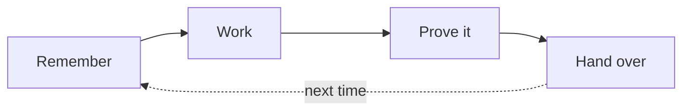

# Caty Agent Harness

<div align="center">

**🇺🇸 English** ｜ [🇯🇵 日本語](README.ja.md) ｜ [🇨🇳 简体中文](README.zh.md) ｜ [🇹🇭 ไทย](README.th.md)


[](LICENSE)


Re-explaining everything. Context that vanishes. A cheerful "done!" with nothing to show for it.<br>
Caty Agent Harness fixes those — with plain text files and real checks.<br>
Not magic. The machinery remembers, drives, and checks, so the AI can focus on thinking —<br>
a small system, wrapped around the AI you already use.

**A tool that grows on its own — and learns to run your tasks all the way to done.**

🔧 [Engineering guide](docs/engineering.md) ｜ 📘 [Reference](docs/reference.md)

</div>

- [Does this sound familiar?](#problems)
- [What you get](#what-you-get)
- [What you need](#environments)
- [Get started](#get-started)
- [Everything under the hood](#shelf)
- [Part of Family OS](#family-os)
- [License](#license)

---

<a id="problems"></a>

## Does this sound familiar?

- Every new session starts with you explaining the same background again.
- The AI says the job is complete — but the result is missing, or you can't tell.
- Long work loses its place halfway and quietly stalls.
- A fix that worked last week is forgotten by this week.

If you nodded at any of these, this was built for you.

---

<a id="what-you-get"></a>

## What you get



### 🌱 It gets smarter on its own

- When it makes a mistake, the reason and the evidence are written down on the spot.
- The next attempt always inherits the previous failure, and taking the same road again is forbidden — the same mistake stops repeating.
- A good method is not trusted after one success. It becomes a rule only after passing verification again on a different job.
- A procedure that keeps coming up is reviewed by a different AI — not the one that wrote it — and becomes a reusable skill only when it passes.
- All of this happens automatically. You never have to say "take a note."

<details>
<summary><b>How it gets smarter</b></summary>

1. **When it fails** — what went wrong, plus the evidence, is recorded automatically in a notebook inside your project.
2. **On the next attempt** — the previous failure is always handed over, and a mechanical rule forbids retrying the same way.
3. **When it succeeds** — the method is saved only as a lesson at first. It is promoted to a rule after passing verification again on a different job.
4. **Procedures that keep coming up** — are reviewed by a different AI than the one that wrote them; only the ones that pass are stored as skills and consulted automatically next time.

→ In depth: [engineering guide — learning from repeated failures](docs/engineering.md#learning)

</details>

### 🏁 It runs to the finish

- Big jobs are split into small recorded steps, and the machinery drives them forward one step at a time.
- The AI receives only a short, fresh context plus the one step to do now — so even small models don't fall apart.
- "Can it remember?" becomes "does the machinery re-read the file?" — forgetting becomes structurally impossible.
- Sessions can end, windows can close, models can change — the work continues from where it left off.

<details>
<summary><b>How it reaches the finish line</b></summary>

1. **Split** — a big job becomes a numbered step plan, written down.
2. **One step at a time** — a scheduler kicks the next step every few minutes. The AI gets only the task, the progress so far, and the handover notebook: a short, fresh context every time.
3. **Real checks** — after each step, an executable check script inspects the actual result. The AI's own claim is never the judge.
4. **Budgets** — attempts and active time have limits, counted by the machinery. Endless grinding is impossible.
5. **An honest ending** — either the job finishes, or you get a report with the recent attempts and their evidence.

→ In depth: [engineering guide — the completion rail](docs/engineering.md#completion)

</details>

### 🔍 "Done" comes with proof

- "Done" is judged by mechanical checks against the actual result — never by a status message.
- The checking is done by an independent verifier with a fresh context — never by the maker grading its own work.
- When nothing is working, it doesn't spin forever: it stops honestly, with evidence, and reports to you.

<a id="safety"></a>

### 🤝 Your AI stays exactly yours

- Your AI's personality, instruction files, and accumulated memory are never touched — this only adds a few files around them.
- Installing is one command; pausing is one command too, and nothing it learned is lost. Trying it takes no courage.
- Everything it knows lives in plain text files — you can read every lesson with your own eyes.

---

<a id="environments"></a>

## What you need

The supported AI tools all run in a terminal — **but you won't be the one typing**. Your AI does the setup and the upkeep; you just talk to it.

| Category | Supported |
| --- | --- |
| OS | macOS ✅ ／ Linux ✅ |
| AI tools | Claude Code ✅ ／ Codex CLI ✅ ／ Kimi Code CLI ✅ ／ Hermes Agent ✅ ／ OpenClaw ✅ |
| Shell | bash 3.2+ ✅ (the macOS default is fine) |
| Python 3 | used by the hooks and automated paths — your AI will check this for you |

Support depth differs by tool on purpose — the details live in the [engineering guide](docs/engineering.md).

---

<a id="get-started"></a>

## Get started

### Hand it to your AI

One step. Open the AI tool you already use inside the project folder where it works, and paste this:

```text
Please set up https://github.com/caty-ai/caty-agent-harness.git in this project:
read docs/agent-guide.md in that repository and follow it — install into this folder
as the workspace, run the health check, and then tell me in plain words what you set
up and what I can do next.
```

That's it. The [agent guide](docs/agent-guide.md) walks your AI through every choice, the health check, and what to report back to you.

Prefer to type the commands yourself? → the [engineering guide](docs/engineering.md#quickstart) has the full manual path.

<details>
<summary>If something feels off</summary>

- Your AI will run a read-only health check (`--check`) and show you the result — a healthy setup ends with `ok: required layout and STATE.md headers present`.
- Some check rows can say `FAIL` while the core is healthy: those are optional automation paths that aren't wired yet. The agent guide tells your AI which ones matter for your tool.
- Nothing here replaces your AI, your files, or your project — see [Your AI stays exactly yours](#safety).

</details>

---

<a id="shelf"></a>

## Everything under the hood

The page you just read is the short version. This is the full shelf — the depth is real, and it's all documented.

| Document | What's inside |
| --- | --- |
| [docs/agent-guide.md](docs/agent-guide.md) | **The installer's playbook** — a step-by-step guide your AI follows: choices, commands, checks, and how to report back |
| [docs/engineering.md](docs/engineering.md) | **The full technical guide** — what's enforced where, per-tool depth, pause semantics, architecture, directory map |
| [docs/reference.md](docs/reference.md) | **The exact contracts** — every flag, every state, every pointer to the design documents |
| [Runtime setup](docs/engineering.md#runtime-setup) | **Per-tool wiring** — hooks, verifiers, and schedules for each of the five AI tools |
| [CONTRIBUTING.md](CONTRIBUTING.md) | **How to propose changes** — issue-first flow and the test suites (20 of them, one loop to run) |
| [SECURITY.md](SECURITY.md) | **How to report issues safely** — private vulnerability reporting |

---

<a id="family-os"></a>

## Part of Family OS

Caty Agent Harness is one tool inside **Family OS** — the Caty AI project's larger blueprint for running multiple AI agents as one family. It works fully on its own, and it becomes even stronger combined with:

- **family-os** (public release in preparation) — the blueprint that ties the family together. Inside it, this Harness owns the vertical axis: growing an individual agent and driving its work to completion.
- **[sitter](https://github.com/caty-ai/sitter)** — a watchdog that keeps an eye on long-running agent work from the outside, and raises its hand when the work stalls or freezes.

---

<a id="license"></a>

## License

[MIT](LICENSE). Use it, study it, build it into anything — including commercial agent setups. That's the point.

---

<div align="center">

**plain text files** ｜ **works with 5 AI tools** ｜ **paused in one command**

</div>
