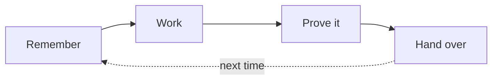

# Caty Agent Harness

<div align="center">

**🇺🇸 English** ｜ [🇯🇵 日本語](README.ja.md) ｜ [🇨🇳 简体中文](README.zh.md) ｜ [🇹🇭 ไทย](README.th.md)


[](LICENSE)


Re-explaining everything. Context that vanishes. A cheerful "done!" with nothing to show for it.<br>
Caty Agent Harness fixes those — with plain text files and real checks.<br>
Not magic. The machinery remembers, drives, and checks, so the AI can focus on thinking —<br>
a small system, wrapped around the AI you already use.

**A tool that grows on its own — and learns to run your tasks all the way to done.**

🔧 [Engineering guide](docs/engineering.md) ｜ 📘 [Reference](docs/reference.md)

</div>

- [Does this sound familiar?](#problems)
- [What you get](#what-you-get)
- [What you need](#environments)
- [Get started](#get-started)
- [Why it's safe to try](#safety)
- [Dig deeper](#shelf)
- [Part of Family OS](#family-os)
- [License](#license)

---

<a id="problems"></a>

## Does this sound familiar?

The more work you hand to an AI, the more often these moments show up.

- Every new session starts with you explaining the same background again.
- The AI says the job is complete — but the result is missing, or you can't tell.
- Long work loses its place halfway and quietly stalls.
- A fix that worked last week is forgotten by this week.

If you nodded at any of these, this was built for you. And if you only use AI for short one-off questions, this machinery is more than you need — you're fine as you are.

These four problems are exactly what Caty Agent Harness was built to crush, with machinery instead of promises.

---

<a id="what-you-get"></a>

## What you get

It's one loop, repeated: remember → work → prove it → hand over. The machinery keeps that loop turning, so even when the AI forgets, the work is never forgotten.



- 🌱 **It gets smarter on its own**

  When it makes a mistake, the reason and the evidence are recorded on the spot in a notebook (really just a plain text file). The next attempt always inherits the previous failure, and retrying the same way is mechanically forbidden — the same mistake stops repeating. You never have to say "take a note."

- 🏁 **It runs to the finish**

  Big jobs are split into small numbered steps, and the machinery drives them forward one at a time. Sessions can end, windows can close, models can change — the work continues from where it left off.

- 🔍 **"Done" comes with proof**

  "Done" is judged by mechanical checks against the actual result — never by the AI's own claim. The checking is done by an independent verifier, not by the maker grading its own work. When nothing is working, it doesn't spin forever: it stops honestly, with evidence, and reports to you.

<details>
<summary><b>How it works (the reason it isn't magic)</b></summary>

1. **When it fails** — what went wrong, plus the evidence, is recorded automatically in a notebook inside your project.
2. **On the next attempt** — the previous failure is always handed over, and a mechanical rule forbids retrying the same way.
3. **When it succeeds** — the method is saved only as a lesson at first, and becomes a rule after passing verification again on a different job. Procedures that keep coming up are reviewed by a different AI than the one that wrote them; only the ones that pass are stored as skills.
4. **While it runs** — a scheduler kicks the next step every few minutes, handing the AI only a short, fresh context. Attempts and active time have limits counted by the machinery, so endless grinding is impossible.

→ In depth: [learning from repeated failures](docs/engineering.md#learning) ／ [the completion rail](docs/engineering.md#completion)

</details>

Whether you can use it comes down to the tools you already have — here's the table.

---

<a id="environments"></a>

## What you need

The supported AI tools all run in a terminal — **but you won't be the one typing**. Your AI does the setup and the upkeep; you just talk to it.

| Category | Supported |
| --- | --- |
| OS | macOS ✅ ／ Linux ✅ |
| AI tools | Claude Code ✅ ／ Codex CLI ✅ ／ Kimi Code CLI ✅ ／ Hermes Agent ✅ ／ OpenClaw ✅ |
| Shell | bash 3.2+ ✅ (the macOS default is fine) |
| Python 3 | used by behind-the-scenes automation (technically, a mechanism called hooks) — your AI will check this for you |

Support depth differs by tool on purpose — the details live in the [engineering guide](docs/engineering.md).

If your setup is on the table, installing takes one prompt.

---

<a id="get-started"></a>

## Get started

There is one thing to do on your side. Open the AI tool you already use inside the project folder where it works, and paste this — your AI handles the install, the checks, and the report back to you.

```text
Please set up https://github.com/caty-ai/caty-agent-harness.git in this project:
read docs/agent-guide.md in that repository and follow it — install into this folder
as the workspace, run the health check, and then tell me in plain words what you set
up and what I can do next.
```

That's it. The [agent guide](docs/agent-guide.md) walks your AI through every choice, the health check, and what to report back to you.

Prefer to type the commands yourself? → the [engineering guide](docs/engineering.md#quickstart) has the full manual path.

<details>
<summary>If something feels off</summary>

- Your AI will run a read-only health check (`--check`) and show you the result — a healthy setup ends with `ok: required layout and STATE.md headers present`.
- Some check rows can say `FAIL` while the core is healthy: those are optional automation paths that aren't wired yet. The agent guide tells your AI which ones matter for your tool.

</details>

Still hesitant to paste it? The next section explains why nothing gets broken.

---

<a id="safety"></a>

## Why it's safe to try

- **Your AI stays exactly yours** — its personality, instruction files, and accumulated memory are never touched. This only adds a few files around them.
- **Quitting is one command too** — installing is one command, pausing is one command, and nothing it learned is lost. Resume, and it continues where it stopped.
- **You can read everything** — lessons, progress, and evidence all live in plain text files, so you can see what's happening with your own eyes.

That's the short version. The depth is all below.

---

<a id="shelf"></a>

## Dig deeper

The page you just read is a map. The substance is real, and it's all documented.

| Document | What's inside |
| --- | --- |
| [docs/agent-guide.md](docs/agent-guide.md) | **The installer's playbook** — a step-by-step guide your AI follows: choices, commands, checks, and how to report back |
| [docs/engineering.md](docs/engineering.md) | **The full technical guide** — what's enforced where, per-tool depth, pause semantics, architecture, directory map |
| [docs/reference.md](docs/reference.md) | **The exact contracts** — every flag, every state, every pointer to the design documents |
| [Runtime setup](docs/engineering.md#runtime-setup) | **Per-tool wiring** — hooks, verifiers, and schedules for each of the five AI tools |
| [CONTRIBUTING.md](CONTRIBUTING.md) | **How to propose changes** — issue-first flow and the test suites (20 of them, one loop to run) |
| [SECURITY.md](SECURITY.md) | **How to report issues safely** — private vulnerability reporting |

One last thing — the bigger picture this tool belongs to.

---

<a id="family-os"></a>

<!-- family:generated:family-footer:start -->

---

Part of the **Caty AI family** — open tools for running a family of AI agents. The full map, including modules still being prepared for release, lives in [Family OS](https://github.com/caty-ai/family-os).

| Axis | Module | What it does | State |
| --- | --- | --- | --- |
| Map | [Family OS](https://github.com/caty-ai/family-os) | The map of the whole family — every module, its state, and how they fit | published, MIT |
| Rules | [Family Dev Handbook](https://github.com/caty-ai/family-dev-handbook) | The rules of the road — issues, PRs, worktrees, handoffs, parallel development | published, MIT |
| Vertical · foundation | **Caty Agent Harness** | Task backbone for AI agents — retries, checkpoints, and honest completion | published, MIT |
| Vertical | [Persona Engine](https://github.com/caty-ai/persona-engine) | Gives an agent a persona — layered personality and graded emotion | published, MIT |
| Vertical | **Persona Growth Loop** | Grows the persona itself — minimal, idempotent proposals | publication in preparation |
| Vertical | [X Collector](https://github.com/caty-ai/x-collector) | Turns X and the web into one daily digest — for people and agents | published, MIT |
| Vertical | **Self Growth Loop** | Lets an agent grow its own abilities — proposals, governance, adoption records | publication in preparation |
| Horizontal · foundation | **Family Memory Architecture** | The memory bus — how the family shares what it knows | publication in preparation |
| Horizontal | [Sitter](https://github.com/caty-ai/sitter) | Babysits delegated agent runs — watches, keeps evidence, restarts | published, MIT |

<!-- family:generated:family-footer:end -->

## Part of Family OS

Caty Agent Harness is one tool inside **Family OS** — the Caty AI project's larger blueprint for running multiple AI agents as one family. It works fully on its own, and it becomes even stronger combined with:

- **family-os** (public release in preparation) — the blueprint that ties the family together. Inside it, this Harness owns the vertical axis: growing an individual agent and driving its work to completion.
- **[sitter](https://github.com/caty-ai/sitter)** — a watchdog that keeps an eye on long-running agent work from the outside, and raises its hand when the work stalls or freezes.

---

<a id="license"></a>

## License

[MIT](LICENSE) — chosen so anyone can use it, study it, and build it into anything, including commercial agent setups. That's the point.

---

<div align="center">

**plain text files** ｜ **works with 5 AI tools** ｜ **paused in one command**

</div>
