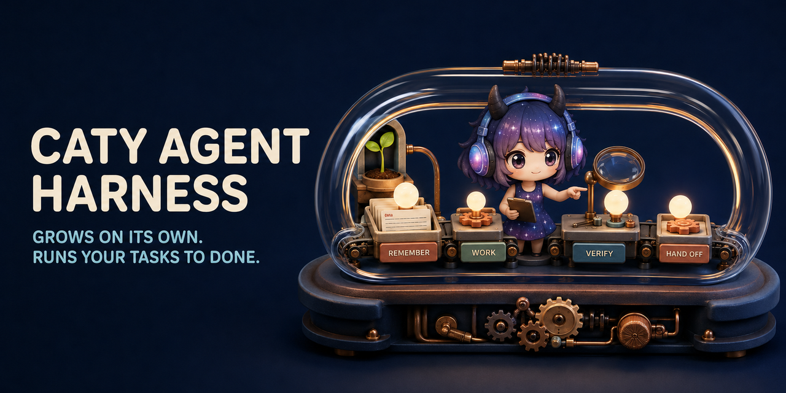

# Caty Agent Harness

<div align="center">

**🇺🇸 English** ｜ [🇯🇵 日本語](README.ja.md) ｜ [🇨🇳 简体中文](README.zh.md) ｜ [🇹🇭 ไทย](README.th.md)

> **Notice (2026-08-24):** We found a gap between this README and the shipped behaviour ([#144](https://github.com/caty-ai/caty-agent-harness/issues/144)): part of the learning loop described below — "the method is saved only as a lesson at first, and becomes a rule after passing verification again on a different job. Procedures that keep coming up are reviewed by a different AI than the one that wrote them; only the ones that pass are stored as skills" — is designed but not yet implemented. We are implementing it now ([#147](https://github.com/caty-ai/caty-agent-harness/issues/147), [#148](https://github.com/caty-ai/caty-agent-harness/issues/148), [#149](https://github.com/caty-ai/caty-agent-harness/issues/149)) and will adjust and republish these docs once it ships. Tracking: [#146](https://github.com/caty-ai/caty-agent-harness/issues/146).



[](https://github.com/caty-ai/caty-agent-harness/actions/workflows/test-lint.yml)
[](https://github.com/caty-ai/caty-agent-harness/actions/workflows/ci-matrix.yml?query=branch%3Amain)
[](LICENSE)


<sub>CI evidence (2026-08-15 UTC): [matrix 7/7 green](https://github.com/caty-ai/caty-agent-harness/actions/runs/31858953187) ・ [60 independent runs of one SHA, 0 flakes](https://github.com/caty-ai/caty-agent-harness/actions/runs/31859000233). Weekly schedule — GitHub pauses schedules after 60 days of repo inactivity, so mind the run date.</sub>
<br><sub>* WSL2 is a verified-with-conditions tier on one dated VM, not a CI-tested tier; see the [WSL2 support note](docs/wsl2-support.md).</sub>

Re-explaining everything. Context that vanishes. A cheerful "done!" with nothing to show for it.<br>
Caty Agent Harness fixes those — with plain text files and real checks.<br>
Not magic. The machinery remembers, drives, and checks, so the AI can focus on thinking —<br>
a small system, wrapped around the AI you already use.

**A tool that grows on its own — and learns to run your tasks all the way to done.**

**Measured** — two sealed, pre-registered experiments on context-overflow jobs (2026-08):

| Model | Completion hallucination¹ | Verified outcome | Tokens vs bare |
|---|---|---|---|
| claude-haiku-4.5 ² | 98% → 8% | 13% → 43% (p=0.0079) | −59% |
| claude-sonnet-5 ³ | — | no loss | −20% (cells −71%…+11%) |
| claude-opus-5 ³ ⁴ | — | no loss | −8% |

<sub>¹ Claiming "done" without having read the work — machine-scored from tool-call transcripts, not self-reports (222 → 2 claims, 30 runs/arm): [full numbers & limitations](docs/benchmark.md)</sub>
<br><sub>² EV-006 — bare vs **shipped harness**; verified completion rate over 30 runs/arm (M/L sizes)</sub>
<br><sub>³ EV-008 — bare vs **overflow sentinel**. Sentinel v1 shipped as opt-in for the claude-code runtime in v0.17.0 ([#180](https://github.com/caty-ai/caty-agent-harness/issues/180), implementing [#159](https://github.com/caty-ai/caty-agent-harness/issues/159)); enable with [`OVF_SENTINEL=shadow|active`](adapters/claude-code/INSTALL.md), unset = fully off (byte-identical passthrough). Default-on remains future work, decided per model against the [#159](https://github.com/caty-ai/caty-agent-harness/issues/159) conditions; see [per-model profiles](#model-effects). EV-008 remains a rig pre-measurement taken ahead of that implementation and has not been re-measured on the shipped implementation. `no loss` = both arms scored 20/20 (hidden key) in every cell; `Tokens vs bare` = 1 − median(sentinel/bare) over 4 sealed cells: sonnet **0.801** → −20%, opus **0.923** → −8%. `—` = not measured in this lane</sub>
<br><sub>⁴ descriptive, post-GO</sub>

<sub>Codex, qwen, grok, gemini and the blind-telemetry runtimes (glm/muse/kimi) are measured too — including cells where the sentinel cost more than bare: [per-model profiles](#model-effects) · [full numbers & history](docs/benchmark.md#ev-008) · planned lanes incl. local models (Ollama): [#129](https://github.com/caty-ai/caty-agent-harness/issues/129)</sub>

🔧 [Engineering guide](docs/engineering.md) ｜ 📘 [Reference](docs/reference.md)

</div>

- [Does this sound familiar?](#problems)
- [What you get](#what-you-get)
- [What you need](#environments)
- [Get started](#get-started)
- [Why it's safe to try](#safety)
- [Which models benefit](#model-effects)
- [Dig deeper](#shelf)
- [Part of Family OS](#family-os)
- [License](#license)

---

<a id="problems"></a>

## Does this sound familiar?

The more work you hand to an AI, the more often these moments show up.

- Every new session starts with you explaining the same background again.
- The AI says the job is complete — but the result is missing, or you can't tell.
- Long work loses its place halfway and quietly stalls.
- A fix that worked last week is forgotten by this week.

If you nodded at any of these, this was built for you. And if you only use AI for short one-off questions, this machinery is more than you need — you're fine as you are.

These four problems are exactly what Caty Agent Harness was built to crush, with machinery instead of promises.

---

<a id="what-you-get"></a>

## What you get

It's one loop, repeated: remember → work → prove it → hand over. The machinery keeps that loop turning, so even when the AI forgets, the work is never forgotten.


- 🌱 **It gets smarter on its own**

  When it makes a mistake, the reason and the evidence are recorded on the spot in a notebook (really just a plain text file). The next attempt always inherits the previous failure, and retrying the same way is mechanically forbidden — the same mistake stops repeating. You never have to say "take a note."

- 🏁 **It runs to the finish**

  Big jobs are split into small numbered steps, and the machinery drives them forward one at a time. Sessions can end, windows can close, models can change — the work continues from where it left off.

- 🔍 **"Done" comes with proof**

  "Done" is judged by mechanical checks against the actual result — never by the AI's own claim. An independent verifier joins only when configured; without one, the mechanical check remains the core, and the maker's claim is still not treated as proof. When nothing is working, it doesn't spin forever: it stops honestly, with evidence, and reports to you.

<details>
<summary><b>How it works (the reason it isn't magic)</b></summary>

1. **When it fails** — what went wrong, plus the evidence, is recorded automatically in a notebook inside your project.
2. **On the next attempt** — the previous failure is always handed over, and a mechanical rule forbids retrying the same way.
3. **When it succeeds** — the method is saved only as a lesson at first, and becomes a rule after passing verification again on a different job. Procedures that keep coming up are reviewed by a different AI than the one that wrote them; only the ones that pass are stored as skills.
4. **While it runs** — a scheduler kicks the next step every few minutes, handing the AI only a short, fresh context. Attempts and active time have limits counted by the machinery, so endless grinding is impossible.

→ In depth: [learning from repeated failures](docs/engineering.md#learning) ／ [the completion rail](docs/engineering.md#completion)

</details>

Whether you can use it comes down to the tools you already have — here's the table.

---

<a id="environments"></a>

## What you need

The supported AI tools all run in a terminal — **but you won't be the one typing**. Your AI does the setup and the upkeep; you just talk to it.

| Category | Supported |
| --- | --- |
| OS | macOS: ✅ CI-tested (GitHub Actions `macos-latest`, Apple silicon) ／ Linux: ✅ CI-tested (GitHub Actions `ubuntu-latest`) |
| Windows (native) | ❌ not supported — measured walls: `chmod` silently becomes `644`, `ln -s` becomes a copy, and there is no `flock`. See [WSL2 support note](docs/wsl2-support.md#windows-native-walls). |
| WSL2 (Ubuntu on Windows) | 🟡 supported with conditions — verified 2026-08-23 on `win11-test-vm` (30/30 suites, `umask 0002`, non-root, Linux filesystem), but not CI-tested.<br>Your AI tool (Claude Code / Codex CLI) must run inside the same WSL2 distro; a Windows-side agent can install successfully and the hooks will simply never fire.<br>Keep the repo on the Linux filesystem (`/home/...`, not `/mnt/c/...`) for correctness, not speed; use `git 2.34+`, run as a non-root user, and keep wrapper-type files not group/world-writable (for example `chmod 0755`). CI approximation: `ubuntu-wsl2-profile` (`umask 002`, non-root container). [Measured details](docs/wsl2-support.md) |
| AI tools | Claude Code ✅ ／ Codex CLI ✅ ／ Kimi Code CLI ✅ ／ Hermes Agent ✅ ／ OpenClaw ✅ |
| Shell | bash 3.2+ ✅ (the macOS default is fine) |
| Python 3 | used by behind-the-scenes automation (technically, a mechanism called hooks) — your AI will check this for you |

Support depth differs by tool on purpose — the details live in the [engineering guide](docs/engineering.md).

If your setup is on the table, installing takes one prompt.

---

<a id="get-started"></a>

## Get started

There is one thing to do on your side. Open the AI tool you already use inside the project folder where it works, and paste this — your AI handles the install, the checks, and the report back to you.

```text
Please set up https://github.com/caty-ai/caty-agent-harness.git in this project:
read docs/agent-guide.md in that repository and follow it — install into this folder
as the workspace, run the health check, and then tell me in plain words what you set
up and what I can do next.
```

That's it. The [agent guide](docs/agent-guide.md) walks your AI through every choice, the health check, and what to report back to you.

For a concrete first demo, your AI can run the bundled [image pilot example](templates/examples/img-pilot.task.md), which builds an SVG image card and JSON delivery receipt using local tools only.

Prefer to type the commands yourself? → the [engineering guide](docs/engineering.md#quickstart) has the full manual path.

<details>
<summary>If something feels off</summary>

- Your AI will run a read-only health check (`--check`) and show you the result — a healthy setup ends with `ok: required layout and STATE.md headers present`.
- Some check rows can say `FAIL` while the core is healthy: those are optional automation paths that aren't wired yet. The agent guide tells your AI which ones matter for your tool.

</details>

Still hesitant to paste it? The next section explains why nothing gets broken.

---

<a id="safety"></a>

## Why it's safe to try

- **Your AI stays exactly yours** — its personality and accumulated memory stay as they are. Existing instruction-file content is left intact; if you choose `--append-bootstrap`, setup adds only the documented bootstrap block to the selected instruction file. The rest is harness scaffold around it.
- **Quitting is one command too** — installing is one command, pausing is one command, and nothing it learned is lost. Resume, and it continues where it stopped.
- **You can read everything** — lessons, progress, and evidence all live in plain text files, so you can see what's happening with your own eyes.

That's the short version. The depth is all below.

---

<a id="model-effects"></a>

## Which models benefit

The **overflow sentinel** ([design issue #159](https://github.com/caty-ai/caty-agent-harness/issues/159)) watches the measured per-turn context level and, past a threshold, stops the run and decomposes the job instead of letting the context overflow. Sentinel v1 shipped as opt-in for the claude-code runtime in v0.17.0 ([#180](https://github.com/caty-ai/caty-agent-harness/issues/180), implementing [#159](https://github.com/caty-ai/caty-agent-harness/issues/159)); enable with [`OVF_SENTINEL=shadow|active`](adapters/claude-code/INSTALL.md), unset = fully off (byte-identical passthrough). Default-on remains future work, decided per model against the [#159](https://github.com/caty-ai/caty-agent-harness/issues/159) conditions; see the per-model profiles in this section and the [benchmark](docs/benchmark.md#ev-008). EV-008 remains a rig pre-measurement taken ahead of that implementation and has not been re-measured on the shipped implementation. EV-008 — a sealed, pre-registered benchmark (2026-08) — measured how that behaves per model. The effect splits by how a runtime reads:

| Runtime type | Measured models | Behaviour | Verdict |
|---|---|---|---|
| **Full-read** — context grows monotonically | claude-haiku-4.5 · claude-sonnet-5 · claude-opus-5 | fires mid-task → decomposes → completes; correctness held (sonnet/opus 20/20 in every fired cell · haiku 19–20/20) | **This is where the benefit lives.** For sonnet, savings grow with job size (largest in the L band). sonnet median sentinel/bare **0.801** (best cell −71 % tokens) · opus **0.923** · haiku 0.35 (descriptive; carries an arm/phase confound — see [benchmark](docs/benchmark.md#ev-008)) |
| **Search-type** — context plateaued in the observed range | gpt-5.6-luna (Codex) · qwen3.8-max | no fire in any measured run: codex **0/127 turns** · qwen 0/4 cells (max observed 79.7K @ 80K threshold — thin margin, stated as observed range only) | **No-fire in the observed range is the design intent** — it is the default-on safety condition itself. A fire here would be a false positive and a design send-back |
| **Fires but uneconomic** — grows, yet bare is cheap | grok-4.6 | fires 4/4, decomposes and completes correctly (20/20) — but bare runs are so cheap that decomposition costs more (median ratio **2.145**) | The mechanism is proven on this runtime; **default-on is not recommended**. Judge by economics vs bare, not by whether it fires |
| **Fires, mixed outcomes** — early-onset firing, heavy full-read | gemini-3.7-flash (descriptive — outside the pre-registered GO conditions) | fires 4/4 (turns 31–82); bare collapses on L-band jobs; decomposition rescued completion in one L cell; 2/4 sentinel cells (M-i3, L-i2) scored 0 (headless permission stalls in the child steps) | **Descriptive only — no efficiency claim, no default-on judgement.** [Per-cell numbers](docs/benchmark.md#ev-008) |

<sub>Ratios are sentinel/bare token cost (lower = cheaper), median of 4 sealed cells per model, measured 2026-08-25. Read before quoting: ① the codex condition first **FAILed** (M4, n=1, geometric mean 1.337) and passed only on the n=3 repeat — a data-informed post-design sealed via a 3-seat delta review (0.9944 ≤ 1.05) — the FAIL is history, not erased; ② sonnet's 0.801 met the decision threshold (<1.0) but narrowly missed the stretch goal (<0.8); ③ most per-pair ratios are n=1 — run-to-run variance is real (≈25 % SE on the codex mean). [Full numbers, method and caveats](docs/benchmark.md#ev-008).</sub>

**Blind telemetry paths — do not switch these on unmeasured.** Through the current shim, glm / muse report all-zero per-turn usage, and kimi emits no usage at all. A runtime whose live telemetry cannot be seen must not run the sentinel default-on: there is no water level to watch.

**One water-level manager at a time.** If the host has its own auto-compaction (Hermes, OpenClaw, an agent CLI's built-in compaction…), either the host **or** the sentinel manages the context level — never both. Two managers means either the host compacts first and the sentinel becomes decorative, or both intervene on the same overflow. Pick one: disable host auto-compaction when the sentinel is default-on, or demote the sentinel to record-only when the host leads. The sentinel's event log (on the EV-008 rig) already records `runtime_compaction` / `compaction_suspected` (false across all EV-008 runs) as the detection basis.

**How to profile a new model** (before any default-on decision):

1. Run **one live job with telemetry on** and confirm every usage field carries real values — a mock pass is not enough; blind paths look healthy until live.
2. Measure the injected-context curve over turns.
3. **Plateau** → search-type: verify no-fire holds (a fire is a design send-back). **Monotonic growth** → full-read: run the 3-arm comparison (bare / always-on / sentinel).
4. Compare sentinel/bare cost before enabling — a firing sentinel earns default-on only if decomposing is cheaper than pushing through (grok is the measured counter-example).

---

<a id="shelf"></a>

## Dig deeper

The page you just read is a map. The substance is real, and it's all documented.

| Document | What's inside |
| --- | --- |
| [docs/agent-guide.md](docs/agent-guide.md) | **The installer's playbook** — a step-by-step guide your AI follows: choices, commands, checks, and how to report back |
| [docs/benchmark.md](docs/benchmark.md) | **The sealed benchmark** — full numbers behind the hero table, method, and the honest limitations |
| [docs/engineering.md](docs/engineering.md) | **The full technical guide** — what's enforced where, per-tool depth, pause semantics, architecture, directory map |
| [docs/reference.md](docs/reference.md) | **The exact contracts** — every flag, every state, every pointer to the design documents |
| [Runtime setup](docs/engineering.md#runtime-setup) | **Per-tool wiring** — hooks, verifiers, and schedules for each of the five AI tools |
| [CONTRIBUTING.md](CONTRIBUTING.md) | **How to propose changes** — issue-first flow and every test suite under `tests/` (one `make test` runs them all) |
| [SECURITY.md](SECURITY.md) | **How to report issues safely** — private vulnerability reporting |

## Project status

- **CI**: [](https://github.com/caty-ai/caty-agent-harness/actions/workflows/test-lint.yml) — runs `make test` + `make lint` on every pull request
- **Verified environments**: macOS (GitHub Actions `macos-latest`, Apple silicon), Linux (`ubuntu-latest`), and WSL2 (Ubuntu on Windows; verified 2026-08-23 on `win11-test-vm`, 30/30 suites, Linux filesystem, non-root, `umask 0002`; not CI-tested) — see the table in [What you need](#what-you-need) and the [WSL2 support note](docs/wsl2-support.md)
- **Maturity**: public preview — the FROZEN CLI output contracts in [docs/cli-conventions.md](docs/cli-conventions.md) are stable; everything else may still move
- **Known constraints**: Native Windows is not supported; the WSL2 row above is the only verified Windows-adjacent path, and some updater suites need `ssh-keygen` (see [CONTRIBUTING Prerequisites](CONTRIBUTING.md#prerequisites))

One last thing — the bigger picture this tool belongs to.

---

<a id="family-os"></a>

## Part of Family OS

<!-- family:generated:family-footer:start -->

---

Part of the **Caty AI family** — open tools for running a family of AI agents. The full map, including modules still being prepared for release, lives in [Family OS](https://github.com/caty-ai/family-os).

| Axis | Module | What it does | State |
| --- | --- | --- | --- |
| Map | [Family OS](https://github.com/caty-ai/family-os) | The map of the whole family — every module, its state, and how they fit | published, MIT |
| Rules | [Family Dev Handbook](https://github.com/caty-ai/family-dev-handbook) | The rules of the road — issues, PRs, worktrees, handoffs, parallel development | published, MIT |
| Vertical · foundation | **Caty Agent Harness** | Task backbone for AI agents — retries, checkpoints, and honest completion | published, MIT |
| Vertical | [context-kit](https://github.com/caty-ai/context-kit) | Six-piece context hygiene kit for one agent — bounded output, delegation briefs, safety guards, recall, worktree snapshots | published, MIT |
| Vertical | [Persona Engine](https://github.com/caty-ai/persona-engine) | Gives an agent a persona — layered personality and graded emotion | published, MIT |
| Vertical | [Persona Growth Loop](https://github.com/caty-ai/persona-growth-loop) | Grows the persona itself — minimal, idempotent proposals | published, MIT |
| Vertical | [X Collector](https://github.com/caty-ai/x-collector) | Turns X and the web into one daily digest — for people and agents | published, MIT |
| Vertical | [Self Growth Loop](https://github.com/caty-ai/self-growth-loop) | Lets an agent grow its own abilities — proposals, governance, adoption records | published, MIT |
| Horizontal · foundation | [Family Memory Architecture](https://github.com/caty-ai/family-memory-architecture) | The memory bus — how the family shares what it knows | published, MIT |
| Horizontal | [Sitter](https://github.com/caty-ai/sitter) | Babysits delegated agent runs — watches, keeps evidence, restarts only within declared bounds | published, MIT |
| Horizontal | [Alpha Nightshift](https://github.com/caty-ai/alpha-nightshift) | Nightly autonomous maintenance loop — isolated night lanes behind a deny-by-default guard; humans cherry-pick in the morning | published, MIT |

<!-- family:generated:family-footer:end -->

Caty Agent Harness is one tool inside **Family OS** — the Caty AI project's larger blueprint for running multiple AI agents as one family. It works fully on its own, and it becomes even stronger combined with:

- **[family-os](https://github.com/caty-ai/family-os)** — the blueprint that ties the family together. Inside it, this Harness owns the vertical axis: growing an individual agent and driving its work to completion.
- **[sitter](https://github.com/caty-ai/sitter)** — a watchdog that keeps an eye on long-running agent work from the outside, and raises its hand when the work stalls or freezes.

---

<a id="license"></a>

## License

[MIT](LICENSE) — chosen so anyone can use it, study it, and build it into anything, including commercial agent setups. That's the point.

---

<div align="center">

**plain text files** ｜ **works with 5 AI tools** ｜ **paused in one command**

</div>
