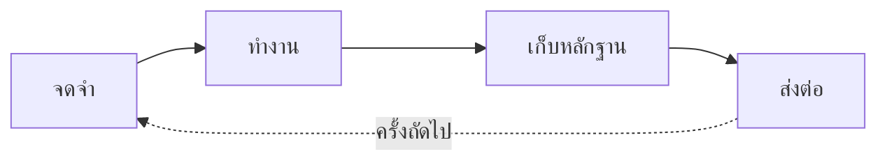

# Caty Agent Harness

<div align="center">

[🇺🇸 English](README.md) ｜ [🇯🇵 日本語](README.ja.md) ｜ [🇨🇳 简体中文](README.zh.md) ｜ **🇹🇭 ไทย**

> **ประกาศ (2026-08-24):** เราพบความคลาดเคลื่อนบางส่วนระหว่าง README นี้กับพฤติกรรมจริงของระบบ ([#144](https://github.com/caty-ai/caty-agent-harness/issues/144)): ส่วนหนึ่งของลูปการเรียนรู้ที่อธิบายด้านล่าง — "วิธีนั้นถูกจดเป็นแค่ 'บทเรียน' ก่อน และเลื่อนขั้นเป็น 'กฎ' หลังผ่านการตรวจสอบอีกครั้งในงานอื่น ขั้นตอนที่โผล่มาบ่อยถูกตรวจโดย AI อีกตัวที่ไม่ใช่ผู้เขียน เฉพาะที่สอบผ่านจึงถูกเก็บเป็น 'สกิล'" — ได้รับการออกแบบแล้วแต่ยังไม่ได้ถูกพัฒนา ขณะนี้เรากำลังพัฒนาส่วนนี้ ([#147](https://github.com/caty-ai/caty-agent-harness/issues/147), [#148](https://github.com/caty-ai/caty-agent-harness/issues/148), [#149](https://github.com/caty-ai/caty-agent-harness/issues/149)) และจะปรับปรุงเอกสารแล้วเผยแพร่ใหม่เมื่อเสร็จสิ้น ติดตามได้ที่: [#146](https://github.com/caty-ai/caty-agent-harness/issues/146)


[](https://github.com/caty-ai/caty-agent-harness/actions/workflows/test-lint.yml)
[](https://github.com/caty-ai/caty-agent-harness/actions/workflows/ci-matrix.yml?query=branch%3Amain)
[](LICENSE)


<sub>หลักฐาน CI (2026-08-15 UTC): [เมทริกซ์ผ่าน 7/7](https://github.com/caty-ai/caty-agent-harness/actions/runs/31858953187) ・ [รัน 60 ครั้งอย่างอิสระบน SHA เดียว ไม่มี flake](https://github.com/caty-ai/caty-agent-harness/actions/runs/31859000233) รันรายสัปดาห์ — หาก repo ไม่มีความเคลื่อนไหว 60 วัน GitHub จะหยุด schedule อัตโนมัติ โปรดดูวันที่ของ run ด้วย</sub>
<br><sub>* WSL2 เป็น tier ที่ยืนยันจากการวัดจริงแบบมีเงื่อนไขบน VM ที่ลงวันที่ไว้เพียงเครื่องเดียว ไม่ใช่ tier ที่ผ่าน CI; ดู [WSL2 support note](docs/wsl2-support.md)</sub>

การอธิบายซ้ำแล้วซ้ำอีก บริบทที่หายไป และ "เสร็จแล้ว!" ที่ไม่มีหลักฐาน<br>
Caty Agent Harness แก้ทั้งหมดนี้ด้วยไฟล์ข้อความธรรมดาและการตรวจสอบจริง<br>
ไม่ใช่เวทมนตร์ — กลไกรับหน้าที่จดจำ เดินงาน และตรวจสอบ เพื่อให้ AI โฟกัสกับการคิด<br>
เป็นกลไกเล็ก ๆ ที่ครอบรอบ AI ที่คุณใช้อยู่แล้ว

**เครื่องมือที่เติบโตขึ้นเอง และเรียนรู้ที่จะพางานที่คุณสั่งวิ่งไปจนถึง "เสร็จจริง"**

**วัดผลแล้ว** — เบนช์มาร์กแบบปิดผนึกและลงทะเบียนล่วงหน้า บนงานที่ context ล้น (2026-08):

| โมเดล | อัตราทำงานสำเร็จที่ยืนยันแล้ว (เปล่า → harness) | อาการหลอนว่าเสร็จแล้ว¹ | เวลาและ token |
|---|---|---|---|
| Claude Haiku 4.5 | 13% → **43%** (+30 pt, p=0.0079) | 98% → **8%** | **token น้อยลง 59% · เวลาน้อยลง 40–46%** |
| GPT-5.6 Luna (Codex) | อยู่ในแผน | — | — |
| โมเดลภายในเครื่อง (Ollama) | อยู่ในแผน | — | — |

<sub>ตารางนี้คือเลน**อัตราทำงานสำเร็จ** (completion-rate) แบบเปล่า vs harness (การเพิ่มเลนติดตามที่ [#129](https://github.com/caty-ai/caty-agent-harness/issues/129)) Codex, qwen, grok และ opus ถูกวัดผลแล้วใน[ส่วน overflow sentinel](#model-effects) ด้านล่าง — เป็นการทดลองอีกชุด (EV-008) ที่ตอบคำถามคนละข้อ ดังนั้น "อยู่ในแผน" ตรงนี้กับตัวเลขที่วัดผลแล้วตรงนั้นไม่ได้ขัดแย้งกัน</sub>

<sub>¹ อ้างว่า "เสร็จ" ทั้งที่ยังไม่ได้อ่านงานที่ทำ — วัดจาก transcript การเรียกใช้ tool ไม่ใช่จากการรายงานตัวเอง: ในงานขนาด 150K–300K token (รันคู่เทียบ 30 ครั้งต่อฝั่ง ให้คะแนนโดยเครื่องล้วน ๆ) การอ้างแบบนี้ลดจาก 222 ครั้งเหลือ 2 ครั้ง รวมจุดอ่อนไว้ด้วย: [ตัวเลขและข้อจำกัดฉบับเต็ม (ภาษาอังกฤษ)](docs/benchmark.md)</sub>

**วัดผลแล้ว — overflow sentinel** (ปิดผนึก EV-008, 2026-08-25): เมื่อเปิด sentinel, claude-sonnet-5 รักษาความถูกต้อง 20/20 บนงานที่ context ล้น พร้อมลด token ลง (ค่ามัธยฐาน sentinel/bare 0.801 ・ เซลล์ที่ดีที่สุด −71%); claude-opus-5 อยู่ที่ 0.923 ส่วนรันไทม์แบบ search-type ทำงาน (fire) เป็นศูนย์ในทุกการรันที่วัดผล — เป็นไปตามการออกแบบ (Codex 0/127 turns) ตัว sentinel เองยังอยู่ระหว่างการออกแบบและพัฒนา ([#159](https://github.com/caty-ai/caty-agent-harness/issues/159)) และยังไม่ได้เผยแพร่ในผลิตภัณฑ์ — ตัวเลขเหล่านี้คือการวัดบน rig ก่อนการพัฒนาจริง โมเดลไหนได้ประโยชน์ — และโมเดลไหนไม่ควรเปิดใช้: [โปรไฟล์รายโมเดล](#model-effects) ・ [ตัวเลขและประวัติฉบับเต็ม (ภาษาอังกฤษ)](docs/benchmark.md#ev-008)

🔧 [คู่มือวิศวกรรม (ภาษาอังกฤษ)](docs/engineering.md) ｜ 📘 [ข้อมูลอ้างอิง (ภาษาอังกฤษ)](docs/reference.md)

</div>

- [เคยเจอแบบนี้ไหม?](#problems)
- [ทำอะไรได้บ้าง](#what-you-get)
- [สิ่งที่ต้องมี](#environments)
- [เริ่มต้นใช้งาน](#get-started)
- [ทำไมจึงลองได้อย่างสบายใจ](#safety)
- [โมเดลไหนได้ประโยชน์](#model-effects)
- [อ่านเพิ่มเติม](#shelf)
- [ส่วนหนึ่งของ Family OS](#family-os)
- [สัญญาอนุญาต](#license)

---

<a id="problems"></a>

## เคยเจอแบบนี้ไหม?

ยิ่งมอบงานให้ AI มากเท่าไร สถานการณ์เหล่านี้ก็ยิ่งโผล่มาบ่อยขึ้น

- ทุกเซสชันใหม่ต้องเริ่มอธิบายบริบทเดิมอีกครั้ง
- AI บอกว่างานเสร็จแล้ว — แต่ผลลัพธ์ไม่มีอยู่ หรือคุณตรวจสอบไม่ได้
- งานยาว ๆ หลงทางกลางคันแล้วหยุดไปเงียบ ๆ
- วิธีแก้ที่ได้ผลเมื่อสัปดาห์ก่อน สัปดาห์นี้ AI ลืมไปแล้ว

ถ้าคุณพยักหน้าให้ข้อใดข้อหนึ่ง เครื่องมือนี้ถูกสร้างมาเพื่อคุณ ในทางกลับกัน ถ้าคุณใช้ AI แค่ถามคำถามสั้น ๆ เป็นครั้งคราว กลไกนี้ก็ใหญ่เกินความจำเป็น — แบบที่เป็นอยู่ก็ดีแล้ว

ปัญหาทั้งสี่ข้อนี้ คือสิ่งที่ Caty Agent Harness ถูกสร้างมาเพื่อบดขยี้ ด้วยกลไก ไม่ใช่คำสัญญา

---

<a id="what-you-get"></a>

## ทำอะไรได้บ้าง

มันคือลูปเดียวที่ทำซ้ำ: จดจำ → ทำงาน → เก็บหลักฐาน → ส่งต่อ กลไกหมุนลูปนี้ต่อไปเรื่อย ๆ ดังนั้นแม้ AI จะลืม แต่ตัวงานจะไม่มีวันถูกลืม



- 🌱 **ฉลาดขึ้นได้เอง**

  เมื่อทำพลาด เหตุผลและหลักฐานจะถูกจดทันทีลงสมุดโน้ต (ตัวจริงคือไฟล์ข้อความธรรมดา) การลองครั้งถัดไปจะได้รับความล้มเหลวครั้งก่อนเสมอ และกฎเชิงกลไกห้ามลองซ้ำด้วยวิธีเดิม — ความผิดพลาดเดิมจึงไม่เกิดซ้ำ คุณไม่ต้องพูดว่า "ช่วยจดไว้หน่อย" เลย

- 🏁 **วิ่งจนถึงเส้นชัย**

  งานใหญ่ถูกแบ่งเป็นก้าวเล็ก ๆ ที่มีหมายเลขกำกับ และกลไกพาเดินหน้าทีละก้าว เซสชันจบ หน้าต่างปิด หรือเปลี่ยนโมเดล งานก็ยังเดินต่อจากจุดที่ค้างไว้

- 🔍 **"เสร็จแล้ว" มาพร้อมหลักฐาน**

  "เสร็จ" ถูกตัดสินด้วยการตรวจเชิงกลไกกับผลลัพธ์จริง — ไม่ใช่คำกล่าวอ้างของ AI เอง ผู้ตรวจสอบอิสระจะเข้าร่วมเฉพาะเมื่อมีการตั้งค่าไว้ หากไม่ได้ตั้งค่า การตรวจเชิงกลไกยังคงเป็นแกนหลัก และไม่ว่ากรณีใดคำกล่าวอ้างของ AI ผู้ทำงานก็ไม่ถือเป็นหลักฐาน เมื่อไปต่อไม่ได้จริง ๆ มันไม่หมุนวนไม่รู้จบ: หยุดอย่างซื่อตรงพร้อมหลักฐาน และรายงานถึงคุณ

<details>
<summary><b>กลไกภายใน (เหตุผลที่ไม่ใช่เวทมนตร์)</b></summary>

1. **เมื่อล้มเหลว** — อะไรที่ผิดพลาด พร้อมหลักฐาน จะถูกบันทึกอัตโนมัติลงสมุดโน้ตในโปรเจกต์ของคุณ
2. **เมื่อลองครั้งถัดไป** — ความล้มเหลวครั้งก่อนถูกส่งมอบมาด้วยเสมอ และมีกฎเชิงกลไกห้ามลองซ้ำด้วยวิธีเดิม
3. **เมื่อสำเร็จ** — วิธีนั้นถูกจดเป็นแค่ "บทเรียน" ก่อน และเลื่อนขั้นเป็น "กฎ" หลังผ่านการตรวจสอบอีกครั้งในงานอื่น ขั้นตอนที่โผล่มาบ่อยถูกตรวจโดย AI อีกตัวที่ไม่ใช่ผู้เขียน เฉพาะที่สอบผ่านจึงถูกเก็บเป็น "สกิล"
4. **ระหว่างทำงาน** — ตัวจัดตารางเตะ "ก้าวถัดไป" ทุก ๆ ไม่กี่นาที ส่งให้ AI เพียงบริบทสั้นและสดใหม่ จำนวนครั้งและเวลาทำงานมีเพดานที่กลไกเป็นผู้นับ ลากยาวไม่รู้จบไม่ได้

→ เจาะลึก: [เรียนรู้จากความล้มเหลวซ้ำ ๆ (ภาษาอังกฤษ)](docs/engineering.md#learning) ／ [รางแห่งการทำให้เสร็จ (ภาษาอังกฤษ)](docs/engineering.md#completion)

</details>

จะใช้ได้หรือไม่ ขึ้นอยู่กับเครื่องมือที่คุณมีอยู่แล้ว — ดูตารางด้านล่าง

---

<a id="environments"></a>

## สิ่งที่ต้องมี

เครื่องมือ AI ที่รองรับล้วนทำงานในเทอร์มินัล — **แต่คนพิมพ์ไม่ใช่คุณ** AI ของคุณเป็นผู้ติดตั้งและดูแล คุณแค่คุยกับมัน

| หมวด | รองรับ |
| --- | --- |
| ระบบปฏิบัติการ | macOS: ✅ ทดสอบผ่าน CI แล้ว (GitHub Actions `macos-latest`, Apple silicon) ／ Linux: ✅ ทดสอบผ่าน CI แล้ว (GitHub Actions `ubuntu-latest`) |
| Windows (native) | ❌ ไม่รองรับ — กำแพงที่วัดได้มี 3 ข้อ: `chmod` จะกลายเป็น `644` แบบเงียบ ๆ, `ln -s` กลายเป็นการ copy และไม่มี `flock` ดู [WSL2 support note](docs/wsl2-support.md#windows-native-walls) |
| WSL2 (Ubuntu on Windows) | 🟡 รองรับแบบมีเงื่อนไข — ยืนยันแล้วเมื่อ 2026-08-23 บน `win11-test-vm` (30/30 suites, `umask 0002`, non-root, Linux filesystem) แต่ยังไม่ใช่ tier ที่ผ่าน CI<br>AI tool ของคุณ (Claude Code / Codex CLI) ต้องรันอยู่ใน WSL2 distro เดียวกัน; ถ้า agent รันอยู่ฝั่ง Windows การติดตั้งจะผ่าน แต่ hooks จะไม่ทำงานเลย<br>repo ต้องอยู่บน Linux filesystem (`/home/...` ไม่ใช่ `/mnt/c/...`) เพื่อความถูกต้อง ไม่ใช่เรื่องความเร็ว, ใช้ `git 2.34+`, รันด้วยผู้ใช้ non-root และทำให้ไฟล์ประเภท wrapper ไม่เป็น group/world-writable (เช่น `chmod 0755`) ค่าใกล้เคียงใน CI คือ `ubuntu-wsl2-profile` (`umask 002`, non-root container) [รายละเอียดการวัด](docs/wsl2-support.md) |
| เครื่องมือ AI | Claude Code ✅ ／ Codex CLI ✅ ／ Kimi Code CLI ✅ ／ Hermes Agent ✅ ／ OpenClaw ✅ |
| Shell | bash 3.2+ ✅ (ค่าเริ่มต้นของ macOS ใช้ได้เลย) |
| Python 3 | ใช้โดยระบบอัตโนมัติเบื้องหลัง (ในทางเทคนิคเรียกว่า hooks) — AI ของคุณจะตรวจให้เอง |

ความลึกของการรองรับแต่ละเครื่องมือตั้งใจให้ต่างกัน — รายละเอียดอยู่ใน[คู่มือวิศวกรรม (ภาษาอังกฤษ)](docs/engineering.md)

ถ้าครบตามตาราง การติดตั้งใช้แค่ prompt เดียว

---

<a id="get-started"></a>

## เริ่มต้นใช้งาน

ฝั่งคุณมีสิ่งที่ต้องทำแค่อย่างเดียว เปิดเครื่องมือ AI ที่คุณใช้อยู่ในโฟลเดอร์โปรเจกต์ที่ต้องการ แล้ววางข้อความนี้ — การติดตั้ง การตรวจสอบ และการรายงาน AI ของคุณจัดการให้ทั้งหมด:

```text
ช่วยติดตั้ง https://github.com/caty-ai/caty-agent-harness.git ในโปรเจกต์นี้:
อ่าน docs/agent-guide.md ใน repository นั้นแล้วทำตาม — ติดตั้งโดยใช้โฟลเดอร์นี้
เป็น workspace, รันเช็กสุขภาพ แล้วเล่าให้ฟังด้วยภาษาง่าย ๆ ว่าตั้งค่าอะไรไปบ้าง
และฉันทำอะไรต่อได้บ้าง
```

แค่นั้นเลย [คู่มือ Agent (ภาษาอังกฤษ)](docs/agent-guide.md) จะพา AI ของคุณผ่านทุกทางเลือก การตรวจสอบ และวิธีรายงานกลับมาหาคุณ

สำหรับเดโมแรกแบบเจาะจง AI ของคุณสามารถรัน[ตัวอย่าง image pilot ที่ให้มาด้วย](templates/examples/img-pilot.task.md) ซึ่งสร้างการ์ดภาพ SVG และใบรับการส่งมอบ JSON โดยใช้เฉพาะเครื่องมือในเครื่อง

อยากพิมพ์คำสั่งเองทุกขั้น? → [คู่มือวิศวกรรม (ภาษาอังกฤษ)](docs/engineering.md#quickstart) มีขั้นตอน manual ฉบับเต็ม

<details>
<summary>ถ้ารู้สึกว่ามีอะไรแปลก ๆ</summary>

- AI ของคุณจะรันเช็กสุขภาพแบบอ่านอย่างเดียว (`--check`) แล้วให้คุณดูผล — ถ้าปกติ บรรทัดสุดท้ายคือ `ok: required layout and STATE.md headers present`
- บางแถวอาจแสดง `FAIL` แม้แกนกลางจะปกติ: นั่นคือระบบอัตโนมัติเสริมที่ยังไม่ได้เดินสาย คู่มือ Agent จะบอก AI ของคุณเองว่าแถวไหนสำคัญ

</details>

ยังลังเลก่อนวางอยู่ไหม? หัวข้อถัดไปอธิบายว่าทำไมจะไม่มีอะไรพัง

---

<a id="safety"></a>

## ทำไมจึงลองได้อย่างสบายใจ

- **AI ของคุณยังเป็นของคุณเหมือนเดิม** — บุคลิกและความทรงจำที่สั่งสมมายังคงเดิม เนื้อหาเดิมในไฟล์คำสั่งจะไม่ถูกเขียนทับ และเฉพาะเมื่อเลือก `--append-bootstrap` การติดตั้งจึงจะต่อท้ายบล็อก bootstrap ที่มีคำอธิบายในเอกสารลงในไฟล์คำสั่งที่เลือก ส่วนที่เหลือเป็นเพียงการเพิ่ม scaffold ของ harness ไว้รอบ ๆ
- **เลิกใช้ก็แค่คำสั่งเดียว** — ติดตั้งหนึ่งคำสั่ง หยุดชั่วคราวก็หนึ่งคำสั่ง สิ่งที่เรียนรู้มาไม่หายไปไหน กลับมาทำต่อได้จากจุดที่หยุด
- **อ่านทุกอย่างได้ด้วยตาตัวเอง** — บทเรียน ความคืบหน้า และหลักฐานอยู่ในไฟล์ข้อความธรรมดาทั้งหมด เกิดอะไรขึ้นคุณตรวจสอบเองได้

ถึงตรงนี้คือฉบับย่อ ความลึกทั้งหมดอยู่ด้านล่าง

---

<a id="model-effects"></a>

## โมเดลไหนได้ประโยชน์

**overflow sentinel** ([design issue #159](https://github.com/caty-ai/caty-agent-harness/issues/159)) เฝ้าดูระดับ context ต่อเทิร์นที่วัดได้จริง และเมื่อเกินเกณฑ์ จะหยุดการรันแล้วแตกงานออกเป็นส่วนย่อย แทนที่จะปล่อยให้ context ล้น ตัว sentinel เองยังอยู่ระหว่างออกแบบและพัฒนาใน issue นั้น (เอกสารออกแบบ: [PR #166](https://github.com/caty-ai/caty-agent-harness/pull/166)) — ยังไม่ได้รวมเข้ากับผลิตภัณฑ์ที่เผยแพร่จริง EV-008 คือการวัดผลล่วงหน้าที่ทดสอบความเป็นไปได้ของการเปิดใช้เป็นค่าเริ่มต้น (default-on) ก่อนการพัฒนานั้น และส่วนนี้คือโปรไฟล์ผลวัดของมัน EV-008 — เบนช์มาร์กแบบปิดผนึกและลงทะเบียนล่วงหน้า (2026-08) — วัดพฤติกรรมนี้แยกตามโมเดล ผลลัพธ์แบ่งตามวิธีที่รันไทม์ "อ่าน" context:

| ประเภทรันไทม์ | โมเดลที่วัดผล | พฤติกรรม | ข้อสรุป |
|---|---|---|---|
| **Full-read** — context เพิ่มขึ้นแบบ monotonic | claude-haiku-4.5 · claude-sonnet-5 · claude-opus-5 | ทำงาน (fire) กลางงาน → แตกงาน → ทำสำเร็จ; ความถูกต้องรักษาไว้ (sonnet/opus= 20/20 ในทุกเซลล์ที่ทำงาน ・ haiku= 19–20/20) | **นี่คือจุดที่ได้ประโยชน์จริง** สำหรับ sonnet ยิ่งงานใหญ่ยิ่งประหยัดมาก (มากที่สุดในงานระดับ L) ค่ามัธยฐาน sentinel/bare ของ sonnet คือ **0.801** (เซลล์ที่ดีที่สุด token ลด −71%) ・ opus **0.923** ・ haiku 0.35 (descriptive มีปัจจัยกวน arm/phase ปนอยู่ — ดู [benchmark](docs/benchmark.md#ev-008)) |
| **Search-type** — นิ่งเป็นที่ราบในช่วงที่สังเกตได้ | gpt-5.6-luna (Codex) · qwen3.8-max | ทำงาน (fire) เป็นศูนย์ในทุกการรันที่วัดผล: codex **0/127 turns** ・ qwen 0/4 เซลล์ (ค่าสูงสุดที่วัดได้ 79.7K จากเกณฑ์ 80K — ส่วนต่างเหลือน้อย ระบุไว้เฉพาะในฐานะช่วงที่สังเกตได้เท่านั้น) | **การไม่ทำงานในช่วงที่สังเกตได้คือเจตนาของการออกแบบ** — นี่คือเงื่อนไขความปลอดภัยของ default-on เอง หากทำงานที่นี่จะถือเป็น false positive และต้องส่งกลับไปแก้การออกแบบ |
| **ทำงานแต่ไม่คุ้มค่า** — context เพิ่มขึ้น แต่ bare ถูก | grok-4.6 | ทำงาน 4/4 แตกงานและทำสำเร็จถูกต้อง (20/20) — แต่ bare รันถูกมากจนการแตกงานมีต้นทุนสูงกว่า (ค่ามัธยฐานของอัตราส่วน **2.145**) | กลไกนี้พิสูจน์แล้วว่าใช้ได้บนรันไทม์นี้ แต่**ไม่แนะนำให้ default-on** ตัดสินจากความคุ้มค่าเทียบกับ bare ไม่ใช่จากว่ามันทำงานหรือไม่ |
| **ทำงานแต่ผลลัพธ์ผสม** — ทำงานเร็ว (early onset) ・ full-read แบบหนัก | gemini-3.7-flash (descriptive — อยู่นอกเงื่อนไข GO ที่ลงทะเบียนล่วงหน้า) | ทำงาน 4/4 (เทิร์น 31–82); bare พังในงานระดับ L; การแตกงานช่วยกู้การทำสำเร็จได้ 1 เซลล์ระดับ L แต่ 2/4 เซลล์ของ sentinel ได้คะแนน 0 (ขั้นตอนย่อยติดค้างเรื่อง permission ในโหมด headless) | **เป็นการบันทึกเชิงพรรณนาเท่านั้น — ไม่อ้างประสิทธิภาพ ไม่ตัดสิน default-on** [ตัวเลขรายเซลล์](docs/benchmark.md#ev-008) |

<sub>อัตราส่วนคือต้นทุน token ของ sentinel/bare (ยิ่งน้อยยิ่งถูก) ค่ามัธยฐานของ 4 เซลล์ที่ปิดผนึกต่อโมเดล วัดเมื่อ 2026-08-25 อ่านก่อนนำไปอ้างอิง: ① เงื่อนไขของ codex **FAIL** ในครั้งแรก (M4, n=1, ค่าเฉลี่ยเรขาคณิต 1.337) และผ่านเฉพาะในการทำซ้ำ n=3 — เป็นการออกแบบภายหลังจากเห็นข้อมูลแล้ว ที่ถูกปิดผนึกผ่านการรีวิว delta แบบ 3 ที่นั่ง (0.9944 ≤ 1.05) — FAIL คือประวัติที่ไม่ถูกลบทิ้ง; ② 0.801 ของ sonnet ผ่านเกณฑ์การตัดสินใจ (<1.0) แต่พลาดเป้าหมายที่ตั้งไว้สูงกว่า (<0.8) ไปเพียงเล็กน้อย; ③ อัตราส่วนต่อคู่ส่วนใหญ่เป็น n=1 — ความแปรปรวนระหว่างการรันมีอยู่จริง (SE ของค่าเฉลี่ย codex ≈25%) [ตัวเลข วิธีการ และข้อควรระวังฉบับเต็ม (ภาษาอังกฤษ)](docs/benchmark.md#ev-008)</sub>

**เส้นทาง telemetry แบบมองไม่เห็น — อย่าเปิดใช้โดยไม่วัดผลก่อน** ผ่าน shim ปัจจุบัน glm / muse รายงาน usage ต่อเทิร์นเป็นศูนย์ทั้งหมด ส่วน kimi ไม่ส่ง usage ออกมาเลย รันไทม์ที่มองไม่เห็น telemetry แบบสด ต้องไม่เปิด sentinel เป็น default-on เพราะไม่มีระดับน้ำให้เฝ้าดูตั้งแต่แรก

**ผู้จัดการระดับน้ำมีได้ทีละคนเท่านั้น** ถ้าฝั่ง host มีการบีบอัดอัตโนมัติของตัวเอง (Hermes, OpenClaw, การบีบอัดในตัวของ agent CLI ...) ผู้จัดการระดับ context ต้องเป็น host **หรือ** sentinel เพียงฝ่ายเดียว — ห้ามเป็นทั้งสองฝ่าย การมีผู้จัดการสองคนหมายความว่า host บีบอัดก่อนแล้ว sentinel กลายเป็นแค่ของประดับ หรือทั้งสองเข้าแทรกแซง overflow เดียวกันพร้อมกัน เลือกทางใดทางหนึ่ง: ปิดการบีบอัดอัตโนมัติของ host เมื่อ sentinel เป็น default-on หรือลดระดับ sentinel ให้เป็นแค่ตัวบันทึกเมื่อ host เป็นผู้นำ event log ของ sentinel (บน rig ของ EV-008) บันทึก `runtime_compaction` / `compaction_suspected` (เป็น false ในทุกการรันของ EV-008) ไว้เป็นฐานของการตรวจจับอยู่แล้ว

**วิธีทำโปรไฟล์โมเดลใหม่** (ก่อนตัดสินใจ default-on ใด ๆ):

1. รัน **งาน live หนึ่งงานพร้อมเปิด telemetry** แล้วยืนยันว่าทุกฟิลด์ usage มีค่าจริง — ผ่านแค่ mock ยังไม่พอ เส้นทางที่มองไม่เห็นจะดูปกติจนกว่าจะเจอของจริง
2. วัดกราฟ context ที่ถูกฉีดเข้าไปตามแต่ละ turn
3. **นิ่งเป็นที่ราบ** → search-type: ตรวจสอบว่าไม่ทำงาน (no-fire) ยังคงอยู่ (ถ้าทำงานคือการออกแบบต้องส่งกลับไปแก้) **เพิ่มขึ้นแบบ monotonic** → full-read: รันการเปรียบเทียบ 3 แขน (bare / always-on / sentinel)
4. เปรียบเทียบต้นทุน sentinel/bare ก่อนเปิดใช้งาน — sentinel ที่ทำงานจะคุ้มกับ default-on ก็ต่อเมื่อการแตกงานถูกกว่าการฝ่าไปตรง ๆ (grok คือตัวอย่างค้านที่วัดผลได้จริง)

---

<a id="shelf"></a>

## อ่านเพิ่มเติม

หน้าที่คุณเพิ่งอ่านคือแผนที่ ของจริงอยู่ครบ และมีเอกสารทั้งหมด

| เอกสาร | ข้างในมีอะไร |
| --- | --- |
| [docs/agent-guide.md](docs/agent-guide.md) | **บทละครของ AI ผู้ติดตั้ง** — ทางเลือก คำสั่ง การตรวจสอบ และวิธีรายงาน เดินทางเดียวจบ (ภาษาอังกฤษ) |
| [docs/benchmark.md](docs/benchmark.md) | **เบนช์มาร์กแบบปิดผนึก** — ตัวเลขทั้งหมดเบื้องหลังตารางเปิดเรื่อง วิธีวัดผล และข้อจำกัดแบบตรงไปตรงมา (ภาษาอังกฤษ) |
| [docs/engineering.md](docs/engineering.md) | **คู่มือเทคนิคฉบับเต็ม** — อะไรถูกบังคับใช้ที่ไหน ความลึกราย runtime ความหมายของ pause สถาปัตยกรรม แผนที่ไดเรกทอรี (ภาษาอังกฤษ) |
| [docs/reference.md](docs/reference.md) | **สัญญาที่แม่นยำ** — ทุกแฟล็ก ทุกสถานะ ดัชนีเอกสารการออกแบบ (ภาษาอังกฤษ) |
| [ตั้งค่า runtime (ภาษาอังกฤษ)](docs/engineering.md#runtime-setup) | **การเดินสายรายเครื่องมือ** — hooks, verifier และตารางเวลาของ AI ทั้ง 5 ตัว |
| [CONTRIBUTING.md](CONTRIBUTING.md) | **วิธีเสนอการเปลี่ยนแปลง** — เริ่มจาก issue และชุดทดสอบทั้งหมดภายใต้ `tests/` (รันทั้งหมดได้ด้วย `make test` คำสั่งเดียว, ภาษาอังกฤษ) |
| [SECURITY.md](SECURITY.md) | **ช่องทางรายงานปัญหาอย่างปลอดภัย** — การรายงานช่องโหว่แบบส่วนตัว (ภาษาอังกฤษ) |

## สถานะโปรเจกต์

- **CI**: [](https://github.com/caty-ai/caty-agent-harness/actions/workflows/test-lint.yml) — รัน `make test` + `make lint` ในทุก pull request
- **สภาพแวดล้อมที่ตรวจสอบแล้ว**: macOS (GitHub Actions `macos-latest`, Apple silicon), Linux (`ubuntu-latest`) และ WSL2 (Ubuntu on Windows; ยืนยันเมื่อ 2026-08-23 บน `win11-test-vm`, 30/30 suites, Linux filesystem, non-root, `umask 0002`; ยังไม่ผ่าน CI) — ดูตารางใน「[สิ่งที่ต้องมี](#สิ่งที่ต้องมี)」และ [WSL2 support note](docs/wsl2-support.md)
- **ระดับความพร้อม**: public preview — สัญญา output ของ CLI ที่ระบุเป็น FROZEN ใน [docs/cli-conventions.md](docs/cli-conventions.md) มีความเสถียร ส่วนอื่นอาจเปลี่ยนแปลงได้
- **ข้อจำกัดที่ทราบ**: Native Windows ไม่รองรับ; เส้นทางฝั่ง Windows ที่ยืนยันจากการวัดมีเฉพาะแถว WSL2 ด้านบนเท่านั้น และชุดทดสอบ updater บางชุดต้องใช้ `ssh-keygen` (ดู [Prerequisites ใน CONTRIBUTING](CONTRIBUTING.md#prerequisites))

สุดท้ายอีกเรื่องเดียว — ภาพใหญ่ที่เครื่องมือนี้สังกัดอยู่

---

<a id="family-os"></a>

## ส่วนหนึ่งของ Family OS

<!-- family:generated:family-footer:start -->

---

รีโพนี้เป็นส่วนหนึ่งของ **ครอบครัว Caty AI** — ชุดเครื่องมือโอเพนซอร์สสำหรับดูแลครอบครัวเอเจนต์ AI แผนที่ฉบับเต็ม (รวมโมดูลที่กำลังเตรียมเปิด) อยู่ที่ [Family OS](https://github.com/caty-ai/family-os)

| แกน | โมดูล | ทำอะไร | สถานะ |
| --- | --- | --- | --- |
| แผนที่ | [Family OS](https://github.com/caty-ai/family-os) | แผนที่ของทั้งครอบครัว — โมดูล สถานะ และโครงสร้าง | เปิดแล้ว・MIT |
| กติกา | [Family Dev Handbook](https://github.com/caty-ai/family-dev-handbook) | กติกากลางของการพัฒนา — Issue, PR, worktree, การส่งงานต่อ และการทำงานคู่ขนาน | เปิดแล้ว・MIT |
| แกนตั้ง · รากฐาน | **Caty Agent Harness** | แกนงานของเอเจนต์ AI — การลองใหม่ เช็คพอยต์ และการตัดสินว่าเสร็จจริง | เปิดแล้ว・MIT |
| แกนตั้ง | [context-kit](https://github.com/caty-ai/context-kit) | ชุดดูแลคอนเท็กซ์ 6 ชิ้นสำหรับเอเจนต์หนึ่งตัว — จำกัดเอาต์พุตขนาดใหญ่, ตรวจ brief การมอบงาน, การ์ดความปลอดภัย, ค้นความทรงจำ, snapshot ของ worktree | เปิดแล้ว・MIT |
| แกนตั้ง | [Persona Engine](https://github.com/caty-ai/persona-engine) | มอบบุคลิกให้เอเจนต์ — เลเยอร์บุคลิกและอารมณ์แบบไล่ระดับ | เปิดแล้ว・MIT |
| แกนตั้ง | [Persona Growth Loop](https://github.com/caty-ai/persona-growth-loop) | พัฒนาบุคลิกของเอเจนต์ — สร้างข้อเสนอแบบน้อยที่สุดและทำซ้ำได้ | เปิดแล้ว・MIT |
| แกนตั้ง | [X Collector](https://github.com/caty-ai/x-collector) | รวบรวมข้อมูลจาก X และเว็บเป็นสรุปวันละฉบับ — สำหรับคนและเอเจนต์ | เปิดแล้ว・MIT |
| แกนตั้ง | [Self Growth Loop](https://github.com/caty-ai/self-growth-loop) | วงจรให้เอเจนต์พัฒนาความสามารถของตัวเอง — ข้อเสนอ ธรรมาภิบาล และบันทึกการนำไปใช้ | เปิดแล้ว・MIT |
| แกนนอน · รากฐาน | [Family Memory Architecture](https://github.com/caty-ai/family-memory-architecture) | บัสความทรงจำ — ชั้นที่ครอบครัวใช้แบ่งปันสิ่งที่รู้ | เปิดแล้ว・MIT |
| แกนนอน | [Sitter](https://github.com/caty-ai/sitter) | พี่เลี้ยงของงานที่มอบหมายให้เอเจนต์ — เฝ้าดู เก็บหลักฐาน และรีสตาร์ตเฉพาะในขอบเขตที่ประกาศไว้ | เปิดแล้ว・MIT |
| แกนนอน | [Alpha Nightshift](https://github.com/caty-ai/alpha-nightshift) | ลูปบำรุงรักษาอัตโนมัติยามค่ำคืน — เลนกลางคืนทำงานหลังการ์ดแบบปฏิเสธโดยปริยาย ตอนเช้ามนุษย์เลือก cherry-pick | เปิดแล้ว・MIT |

<!-- family:generated:family-footer:end -->

Caty Agent Harness เป็นเครื่องมือหนึ่งใน **Family OS** — พิมพ์เขียวของโปรเจกต์ Caty AI สำหรับดูแลเอเจนต์ AI หลายตัวเสมือนครอบครัวเดียว ใช้เดี่ยว ๆ ได้เต็มรูปแบบ และจะยิ่งทรงพลังเมื่อประกอบเข้ากับ:

- **[family-os](https://github.com/caty-ai/family-os)** — พิมพ์เขียวที่ร้อยครอบครัวทั้งหมดเข้าด้วยกัน โดย Harness ตัวนี้รับผิดชอบ "แกนตั้ง = ปั้นเอเจนต์รายตัวให้เติบโตและพางานวิ่งจนเสร็จ"
- **[sitter](https://github.com/caty-ai/sitter)** — ผู้เฝ้าดูที่คอยจับตางานเอเจนต์ที่รันยาว ๆ จากภายนอก และยกมือเตือนเมื่องานค้างหรือแข็งตาย

---

<a id="license"></a>

## สัญญาอนุญาต

[MIT](LICENSE) — เลือกใบอนุญาตนี้เพื่อให้ใครก็ได้ใช้ ศึกษา และนำไปประกอบกับอะไรก็ได้อย่างอิสระ รวมถึงระบบ agent เชิงพาณิชย์ นั่นแหละคือจุดประสงค์

---

<div align="center">

**ไฟล์ข้อความธรรมดา** ｜ **ใช้ได้กับเครื่องมือ AI 5 ตัว** ｜ **คำสั่งเดียวหยุด/ทำต่อได้**

</div>
