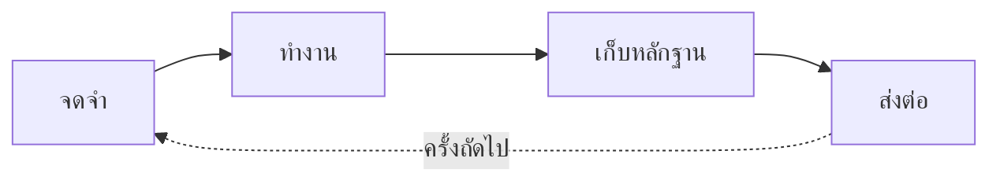

# Caty Agent Harness

<div align="center">

[🇺🇸 English](README.md) ｜ [🇯🇵 日本語](README.ja.md) ｜ [🇨🇳 简体中文](README.zh.md) ｜ **🇹🇭 ไทย**


[](LICENSE)


การอธิบายซ้ำแล้วซ้ำอีก บริบทที่หายไป และ "เสร็จแล้ว!" ที่ไม่มีหลักฐาน<br>
Caty Agent Harness แก้ทั้งหมดนี้ด้วยไฟล์ข้อความธรรมดาและการตรวจสอบจริง<br>
ไม่ใช่เวทมนตร์ — กลไกรับหน้าที่จดจำ เดินงาน และตรวจสอบ เพื่อให้ AI โฟกัสกับการคิด<br>
เป็นกลไกเล็ก ๆ ที่ครอบรอบ AI ที่คุณใช้อยู่แล้ว

**เครื่องมือที่เติบโตขึ้นเอง และเรียนรู้ที่จะพางานที่คุณสั่งวิ่งไปจนถึง "เสร็จจริง"**

🔧 [คู่มือวิศวกรรม (ภาษาอังกฤษ)](docs/engineering.md) ｜ 📘 [ข้อมูลอ้างอิง (ภาษาอังกฤษ)](docs/reference.md)

</div>

- [เคยเจอแบบนี้ไหม?](#problems)
- [ใช้แล้วอะไรเปลี่ยนไป](#what-you-get)
- [สิ่งที่ต้องมี](#environments)
- [เริ่มต้นใช้งาน](#get-started)
- [ทั้งหมดที่อยู่ข้างใต้](#shelf)
- [ส่วนหนึ่งของ Family OS](#family-os)
- [สัญญาอนุญาต](#license)

---

<a id="problems"></a>

## เคยเจอแบบนี้ไหม?

- ทุกเซสชันใหม่ต้องเริ่มอธิบายบริบทเดิมอีกครั้ง
- AI บอกว่างานเสร็จแล้ว — แต่ผลลัพธ์ไม่มีอยู่ หรือคุณตรวจสอบไม่ได้
- งานยาว ๆ หลงทางกลางคันแล้วหยุดไปเงียบ ๆ
- วิธีแก้ที่ได้ผลเมื่อสัปดาห์ก่อน สัปดาห์นี้ AI ลืมไปแล้ว

ถ้าคุณพยักหน้าให้ข้อใดข้อหนึ่ง เครื่องมือนี้ถูกสร้างมาเพื่อคุณ

---

<a id="what-you-get"></a>

## ใช้แล้วอะไรเปลี่ยนไป



### 🌱 ฉลาดขึ้นได้เอง

- เมื่อทำพลาด เหตุผลและหลักฐานจะถูกจดไว้ทันที ณ ตรงนั้น
- การลองครั้งถัดไปจะได้รับความล้มเหลวครั้งก่อนเสมอ และห้ามเดินซ้ำทางเดิม — ความผิดพลาดเดิมจึงไม่เกิดซ้ำ
- วิธีที่ดีก็ไม่ถูกเชื่อเพียงเพราะสำเร็จครั้งเดียว ต้องผ่านการตรวจสอบอีกครั้งในงานอื่น จึงจะกลายเป็น "กฎ"
- ขั้นตอนที่โผล่มาบ่อย ๆ จะถูกตรวจโดย AI อีกตัวที่ไม่ใช่ผู้เขียน และเลื่อนขั้นเป็น "สกิล" เฉพาะเมื่อสอบผ่าน
- ทั้งหมดนี้เกิดขึ้นอัตโนมัติ คุณไม่ต้องพูดว่า "ช่วยจดไว้หน่อย" เลย

<details>
<summary><b>กลไกที่ทำให้ฉลาดขึ้นเอง</b></summary>

1. **เมื่อล้มเหลว** — อะไรที่ผิดพลาด พร้อมหลักฐาน จะถูกบันทึกอัตโนมัติลงสมุดโน้ตในโปรเจกต์ของคุณ
2. **เมื่อลองครั้งถัดไป** — ความล้มเหลวครั้งก่อนถูกส่งมอบมาด้วยเสมอ และมีกฎเชิงกลไกห้ามลองซ้ำด้วยวิธีเดิม
3. **เมื่อสำเร็จ** — วิธีนั้นถูกจดเป็นแค่ "บทเรียน" ก่อน ต้องผ่านการตรวจสอบอีกครั้งในงานอื่น จึงเลื่อนขั้นเป็น "กฎ"
4. **ขั้นตอนที่ใช้บ่อย** — ถูกตรวจโดย AI อีกตัวที่ไม่ใช่ผู้เขียน เฉพาะที่สอบผ่านเท่านั้นจึงถูกเก็บเป็น "สกิล" และถูกนำมาใช้อัตโนมัติในครั้งถัดไป

→ เจาะลึก: [คู่มือวิศวกรรม — เรียนรู้จากความล้มเหลวซ้ำ ๆ (ภาษาอังกฤษ)](docs/engineering.md#learning)

</details>

### 🏁 วิ่งจนถึงเส้นชัย

- งานใหญ่ถูกแบ่งเป็นก้าวเล็ก ๆ ที่มีบันทึก และกลไกพาเดินหน้าทีละก้าวอย่างมั่นคง
- AI ได้รับเพียง "บริบทสั้น ๆ สดใหม่ + ก้าวเดียวที่ต้องทำตอนนี้" — โมเดลเล็กก็ไม่พัง
- "จำได้ไหม" กลายเป็น "กลไกอ่านไฟล์ซ้ำหรือเปล่า" — การหลงลืมจึงเป็นไปไม่ได้เชิงโครงสร้าง
- เซสชันจบ หน้าต่างปิด หรือเปลี่ยนโมเดล งานก็ยังเดินต่อจากจุดที่ค้างไว้

<details>
<summary><b>กลไกที่พาไปถึงเส้นชัย</b></summary>

1. **แบ่ง** — งานใหญ่กลายเป็นแผนขั้นตอนที่มีหมายเลขกำกับ ถูกจดบันทึกไว้
2. **ทีละก้าว** — ตัวจัดตารางเตะ "ก้าวถัดไป" ทุก ๆ ไม่กี่นาที AI ได้รับเพียงเนื้องาน + ความคืบหน้า + สมุดส่งต่องาน: บริบทสั้นและสดใหม่ทุกครั้ง
3. **ตรวจของจริง** — ทุกก้าวมีสคริปต์ตรวจสอบที่รันได้จริงมาตรวจผลลัพธ์จริง คำกล่าวอ้างของ AI เองไม่เคยเป็นผู้ตัดสิน
4. **งบประมาณ** — จำนวนครั้งและเวลาทำงานมีเพดาน โดยกลไกเป็นผู้นับ ลากยาวไม่รู้จบไม่ได้
5. **ตอนจบที่ซื่อตรง** — ไม่วิ่งจนจบ ก็ส่งรายงานพร้อมสรุปความพยายามล่าสุดและหลักฐานถึงคุณ

→ เจาะลึก: [คู่มือวิศวกรรม — รางแห่งการทำให้เสร็จ (ภาษาอังกฤษ)](docs/engineering.md#completion)

</details>

### 🔍 "เสร็จแล้ว" มาพร้อมหลักฐาน

- "เสร็จ" ถูกตัดสินด้วยการตรวจเชิงกลไกกับผลลัพธ์จริง — ไม่ใช่ฟังแค่ข้อความรายงานสถานะ
- ผู้ตรวจคือผู้ตรวจสอบอิสระที่มีบริบทสดใหม่ — ไม่ใช่ผู้ทำงานให้คะแนนตัวเอง
- เมื่อไปต่อไม่ได้จริง ๆ มันไม่หมุนวนไม่รู้จบ: หยุดอย่างซื่อตรงพร้อมหลักฐาน และรายงานถึงคุณ

<a id="safety"></a>

### 🤝 AI ของคุณยังเป็นของคุณเหมือนเดิม

- บุคลิก ไฟล์คำสั่ง และความทรงจำที่สั่งสมมาของ AI ของคุณไม่ถูกแตะต้องเลย — แค่เพิ่มไฟล์ไม่กี่ไฟล์ไว้รอบ ๆ
- ติดตั้งหนึ่งคำสั่ง หยุดชั่วคราวก็หนึ่งคำสั่ง สิ่งที่เรียนรู้มาไม่หายไปไหน ลองใช้ได้โดยไม่ต้องกล้าหาญอะไร
- ทุกอย่างที่มันรู้อยู่ในไฟล์ข้อความธรรมดา — ทุกบทเรียนคุณอ่านได้ด้วยตาตัวเอง

---

<a id="environments"></a>

## สิ่งที่ต้องมี

เครื่องมือ AI ที่รองรับล้วนทำงานในเทอร์มินัล — **แต่คนพิมพ์ไม่ใช่คุณ** AI ของคุณเป็นผู้ติดตั้งและดูแล คุณแค่คุยกับมัน

| หมวด | รองรับ |
| --- | --- |
| ระบบปฏิบัติการ | macOS ✅ ／ Linux ✅ |
| เครื่องมือ AI | Claude Code ✅ ／ Codex CLI ✅ ／ Kimi Code CLI ✅ ／ Hermes Agent ✅ ／ OpenClaw ✅ |
| Shell | bash 3.2+ ✅ (ค่าเริ่มต้นของ macOS ใช้ได้เลย) |
| Python 3 | ใช้โดย hooks และเส้นทางอัตโนมัติ — AI ของคุณจะตรวจให้เอง |

ความลึกของการรองรับแต่ละเครื่องมือตั้งใจให้ต่างกัน — รายละเอียดอยู่ใน[คู่มือวิศวกรรม (ภาษาอังกฤษ)](docs/engineering.md)

---

<a id="get-started"></a>

## เริ่มต้นใช้งาน

### ส่งให้ AI ของคุณ

แค่ขั้นตอนเดียว เปิดเครื่องมือ AI ที่คุณใช้อยู่ในโฟลเดอร์โปรเจกต์ที่ต้องการ แล้ววางข้อความนี้:

```text
ช่วยติดตั้ง https://github.com/caty-ai/caty-agent-harness.git ในโปรเจกต์นี้:
อ่าน docs/agent-guide.md ใน repository นั้นแล้วทำตาม — ติดตั้งโดยใช้โฟลเดอร์นี้
เป็น workspace, รันเช็กสุขภาพ แล้วเล่าให้ฟังด้วยภาษาง่าย ๆ ว่าตั้งค่าอะไรไปบ้าง
และฉันทำอะไรต่อได้บ้าง
```

แค่นั้นเลย [คู่มือ Agent (ภาษาอังกฤษ)](docs/agent-guide.md) จะพา AI ของคุณผ่านทุกทางเลือก การตรวจสอบ และวิธีรายงานกลับมาหาคุณ

อยากพิมพ์คำสั่งเองทุกขั้น? → [คู่มือวิศวกรรม (ภาษาอังกฤษ)](docs/engineering.md#quickstart) มีขั้นตอน manual ฉบับเต็ม

<details>
<summary>ถ้ารู้สึกว่ามีอะไรแปลก ๆ</summary>

- AI ของคุณจะรันเช็กสุขภาพแบบอ่านอย่างเดียว (`--check`) แล้วให้คุณดูผล — ถ้าปกติ บรรทัดสุดท้ายคือ `ok: required layout and STATE.md headers present`
- บางแถวอาจแสดง `FAIL` แม้แกนกลางจะปกติ: นั่นคือระบบอัตโนมัติเสริมที่ยังไม่ได้เดินสาย คู่มือ Agent จะบอก AI ของคุณเองว่าแถวไหนสำคัญ
- ไม่มีอะไรในนี้ที่แทนที่ AI ไฟล์ หรือโปรเจกต์ของคุณ — ดู[AI ของคุณยังเป็นของคุณเหมือนเดิม](#safety)

</details>

---

<a id="shelf"></a>

## ทั้งหมดที่อยู่ข้างใต้

หน้าที่คุณเพิ่งอ่านคือฉบับย่อ ของจริงอยู่ครบ และมีเอกสารทั้งหมด

| เอกสาร | ข้างในมีอะไร |
| --- | --- |
| [docs/agent-guide.md](docs/agent-guide.md) | **บทละครของ AI ผู้ติดตั้ง** — ทางเลือก คำสั่ง การตรวจสอบ และวิธีรายงาน เดินทางเดียวจบ (ภาษาอังกฤษ) |
| [docs/engineering.md](docs/engineering.md) | **คู่มือเทคนิคฉบับเต็ม** — อะไรถูกบังคับใช้ที่ไหน ความลึกราย runtime ความหมายของ pause สถาปัตยกรรม แผนที่ไดเรกทอรี (ภาษาอังกฤษ) |
| [docs/reference.md](docs/reference.md) | **สัญญาที่แม่นยำ** — ทุกแฟล็ก ทุกสถานะ ดัชนีเอกสารการออกแบบ (ภาษาอังกฤษ) |
| [ตั้งค่า runtime (ภาษาอังกฤษ)](docs/engineering.md#runtime-setup) | **การเดินสายรายเครื่องมือ** — hooks, verifier และตารางเวลาของ AI ทั้ง 5 ตัว |
| [CONTRIBUTING.md](CONTRIBUTING.md) | **วิธีเสนอการเปลี่ยนแปลง** — เริ่มจาก issue และชุดทดสอบ 20 ชุด (รันได้ในลูปเดียว, ภาษาอังกฤษ) |
| [SECURITY.md](SECURITY.md) | **ช่องทางรายงานปัญหาอย่างปลอดภัย** — การรายงานช่องโหว่แบบส่วนตัว (ภาษาอังกฤษ) |

---

<a id="family-os"></a>

## ส่วนหนึ่งของ Family OS

Caty Agent Harness เป็นเครื่องมือหนึ่งใน **Family OS** — พิมพ์เขียวของโปรเจกต์ Caty AI สำหรับดูแลเอเจนต์ AI หลายตัวเสมือนครอบครัวเดียว ใช้เดี่ยว ๆ ได้เต็มรูปแบบ และจะยิ่งทรงพลังเมื่อประกอบเข้ากับ:

- **family-os** (กำลังเตรียมเปิดสาธารณะ) — พิมพ์เขียวที่ร้อยครอบครัวทั้งหมดเข้าด้วยกัน โดย Harness ตัวนี้รับผิดชอบ "แกนตั้ง = ปั้นเอเจนต์รายตัวให้เติบโตและพางานวิ่งจนเสร็จ"
- **[sitter](https://github.com/caty-ai/sitter)** — ผู้เฝ้าดูที่คอยจับตางานเอเจนต์ที่รันยาว ๆ จากภายนอก และยกมือเตือนเมื่องานค้างหรือแข็งตาย

---

<a id="license"></a>

## สัญญาอนุญาต

[MIT](LICENSE) ใช้ ศึกษา หรือนำไปประกอบกับอะไรก็ได้ — รวมถึงระบบ agent เชิงพาณิชย์ นั่นแหละคือจุดประสงค์

---

<div align="center">

**ไฟล์ข้อความธรรมดา** ｜ **ใช้ได้กับเครื่องมือ AI 5 ตัว** ｜ **คำสั่งเดียวหยุด/ทำต่อได้**

</div>
