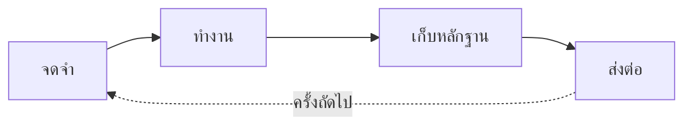

# Caty Agent Harness

<div align="center">

[🇺🇸 English](README.md) ｜ [🇯🇵 日本語](README.ja.md) ｜ [🇨🇳 简体中文](README.zh.md) ｜ **🇹🇭 ไทย**


[](https://github.com/caty-ai/caty-agent-harness/actions/workflows/test-lint.yml)
[](https://github.com/caty-ai/caty-agent-harness/actions/workflows/ci-matrix.yml?query=branch%3Amain)
[](LICENSE)


<sub>หลักฐาน CI (2026-08-15 UTC): [เมทริกซ์ผ่าน 7/7](https://github.com/caty-ai/caty-agent-harness/actions/runs/31858953187) ・ [รัน 60 ครั้งอย่างอิสระบน SHA เดียว ไม่มี flake](https://github.com/caty-ai/caty-agent-harness/actions/runs/31859000233) รันรายสัปดาห์ — หาก repo ไม่มีความเคลื่อนไหว 60 วัน GitHub จะหยุด schedule อัตโนมัติ โปรดดูวันที่ของ run ด้วย</sub>

การอธิบายซ้ำแล้วซ้ำอีก บริบทที่หายไป และ "เสร็จแล้ว!" ที่ไม่มีหลักฐาน<br>
Caty Agent Harness แก้ทั้งหมดนี้ด้วยไฟล์ข้อความธรรมดาและการตรวจสอบจริง<br>
ไม่ใช่เวทมนตร์ — กลไกรับหน้าที่จดจำ เดินงาน และตรวจสอบ เพื่อให้ AI โฟกัสกับการคิด<br>
เป็นกลไกเล็ก ๆ ที่ครอบรอบ AI ที่คุณใช้อยู่แล้ว

**เครื่องมือที่เติบโตขึ้นเอง และเรียนรู้ที่จะพางานที่คุณสั่งวิ่งไปจนถึง "เสร็จจริง"**

🔧 [คู่มือวิศวกรรม (ภาษาอังกฤษ)](docs/engineering.md) ｜ 📘 [ข้อมูลอ้างอิง (ภาษาอังกฤษ)](docs/reference.md)

</div>

- [เคยเจอแบบนี้ไหม?](#problems)
- [ทำอะไรได้บ้าง](#what-you-get)
- [สิ่งที่ต้องมี](#environments)
- [เริ่มต้นใช้งาน](#get-started)
- [ทำไมจึงลองได้อย่างสบายใจ](#safety)
- [อ่านเพิ่มเติม](#shelf)
- [ส่วนหนึ่งของ Family OS](#family-os)
- [สัญญาอนุญาต](#license)

---

<a id="problems"></a>

## เคยเจอแบบนี้ไหม?

ยิ่งมอบงานให้ AI มากเท่าไร สถานการณ์เหล่านี้ก็ยิ่งโผล่มาบ่อยขึ้น

- ทุกเซสชันใหม่ต้องเริ่มอธิบายบริบทเดิมอีกครั้ง
- AI บอกว่างานเสร็จแล้ว — แต่ผลลัพธ์ไม่มีอยู่ หรือคุณตรวจสอบไม่ได้
- งานยาว ๆ หลงทางกลางคันแล้วหยุดไปเงียบ ๆ
- วิธีแก้ที่ได้ผลเมื่อสัปดาห์ก่อน สัปดาห์นี้ AI ลืมไปแล้ว

ถ้าคุณพยักหน้าให้ข้อใดข้อหนึ่ง เครื่องมือนี้ถูกสร้างมาเพื่อคุณ ในทางกลับกัน ถ้าคุณใช้ AI แค่ถามคำถามสั้น ๆ เป็นครั้งคราว กลไกนี้ก็ใหญ่เกินความจำเป็น — แบบที่เป็นอยู่ก็ดีแล้ว

ปัญหาทั้งสี่ข้อนี้ คือสิ่งที่ Caty Agent Harness ถูกสร้างมาเพื่อบดขยี้ ด้วยกลไก ไม่ใช่คำสัญญา

---

<a id="what-you-get"></a>

## ทำอะไรได้บ้าง

มันคือลูปเดียวที่ทำซ้ำ: จดจำ → ทำงาน → เก็บหลักฐาน → ส่งต่อ กลไกหมุนลูปนี้ต่อไปเรื่อย ๆ ดังนั้นแม้ AI จะลืม แต่ตัวงานจะไม่มีวันถูกลืม



- 🌱 **ฉลาดขึ้นได้เอง**

  เมื่อทำพลาด เหตุผลและหลักฐานจะถูกจดทันทีลงสมุดโน้ต (ตัวจริงคือไฟล์ข้อความธรรมดา) การลองครั้งถัดไปจะได้รับความล้มเหลวครั้งก่อนเสมอ และกฎเชิงกลไกห้ามลองซ้ำด้วยวิธีเดิม — ความผิดพลาดเดิมจึงไม่เกิดซ้ำ คุณไม่ต้องพูดว่า "ช่วยจดไว้หน่อย" เลย

- 🏁 **วิ่งจนถึงเส้นชัย**

  งานใหญ่ถูกแบ่งเป็นก้าวเล็ก ๆ ที่มีหมายเลขกำกับ และกลไกพาเดินหน้าทีละก้าว เซสชันจบ หน้าต่างปิด หรือเปลี่ยนโมเดล งานก็ยังเดินต่อจากจุดที่ค้างไว้

- 🔍 **"เสร็จแล้ว" มาพร้อมหลักฐาน**

  "เสร็จ" ถูกตัดสินด้วยการตรวจเชิงกลไกกับผลลัพธ์จริง — ไม่ใช่คำกล่าวอ้างของ AI เอง ผู้ตรวจคือผู้ตรวจสอบอิสระ ไม่ใช่ผู้ทำงานให้คะแนนตัวเอง เมื่อไปต่อไม่ได้จริง ๆ มันไม่หมุนวนไม่รู้จบ: หยุดอย่างซื่อตรงพร้อมหลักฐาน และรายงานถึงคุณ

<details>
<summary><b>กลไกภายใน (เหตุผลที่ไม่ใช่เวทมนตร์)</b></summary>

1. **เมื่อล้มเหลว** — อะไรที่ผิดพลาด พร้อมหลักฐาน จะถูกบันทึกอัตโนมัติลงสมุดโน้ตในโปรเจกต์ของคุณ
2. **เมื่อลองครั้งถัดไป** — ความล้มเหลวครั้งก่อนถูกส่งมอบมาด้วยเสมอ และมีกฎเชิงกลไกห้ามลองซ้ำด้วยวิธีเดิม
3. **เมื่อสำเร็จ** — วิธีนั้นถูกจดเป็นแค่ "บทเรียน" ก่อน และเลื่อนขั้นเป็น "กฎ" หลังผ่านการตรวจสอบอีกครั้งในงานอื่น ขั้นตอนที่โผล่มาบ่อยถูกตรวจโดย AI อีกตัวที่ไม่ใช่ผู้เขียน เฉพาะที่สอบผ่านจึงถูกเก็บเป็น "สกิล"
4. **ระหว่างทำงาน** — ตัวจัดตารางเตะ "ก้าวถัดไป" ทุก ๆ ไม่กี่นาที ส่งให้ AI เพียงบริบทสั้นและสดใหม่ จำนวนครั้งและเวลาทำงานมีเพดานที่กลไกเป็นผู้นับ ลากยาวไม่รู้จบไม่ได้

→ เจาะลึก: [เรียนรู้จากความล้มเหลวซ้ำ ๆ (ภาษาอังกฤษ)](docs/engineering.md#learning) ／ [รางแห่งการทำให้เสร็จ (ภาษาอังกฤษ)](docs/engineering.md#completion)

</details>

จะใช้ได้หรือไม่ ขึ้นอยู่กับเครื่องมือที่คุณมีอยู่แล้ว — ดูตารางด้านล่าง

---

<a id="environments"></a>

## สิ่งที่ต้องมี

เครื่องมือ AI ที่รองรับล้วนทำงานในเทอร์มินัล — **แต่คนพิมพ์ไม่ใช่คุณ** AI ของคุณเป็นผู้ติดตั้งและดูแล คุณแค่คุยกับมัน

| หมวด | รองรับ |
| --- | --- |
| ระบบปฏิบัติการ | macOS: ✅ ทดสอบผ่าน CI แล้ว (GitHub Actions `macos-latest`, Apple silicon) ／ Linux: ✅ ทดสอบผ่าน CI แล้ว (GitHub Actions `ubuntu-latest`) |
| Windows | ❌ ไม่รองรับ (ยังไม่ได้ทดสอบ และยังไม่ได้ทดสอบ WSL) |
| เครื่องมือ AI | Claude Code ✅ ／ Codex CLI ✅ ／ Kimi Code CLI ✅ ／ Hermes Agent ✅ ／ OpenClaw ✅ |
| Shell | bash 3.2+ ✅ (ค่าเริ่มต้นของ macOS ใช้ได้เลย) |
| Python 3 | ใช้โดยระบบอัตโนมัติเบื้องหลัง (ในทางเทคนิคเรียกว่า hooks) — AI ของคุณจะตรวจให้เอง |

ความลึกของการรองรับแต่ละเครื่องมือตั้งใจให้ต่างกัน — รายละเอียดอยู่ใน[คู่มือวิศวกรรม (ภาษาอังกฤษ)](docs/engineering.md)

ถ้าครบตามตาราง การติดตั้งใช้แค่ prompt เดียว

---

<a id="get-started"></a>

## เริ่มต้นใช้งาน

ฝั่งคุณมีสิ่งที่ต้องทำแค่อย่างเดียว เปิดเครื่องมือ AI ที่คุณใช้อยู่ในโฟลเดอร์โปรเจกต์ที่ต้องการ แล้ววางข้อความนี้ — การติดตั้ง การตรวจสอบ และการรายงาน AI ของคุณจัดการให้ทั้งหมด:

```text
ช่วยติดตั้ง https://github.com/caty-ai/caty-agent-harness.git ในโปรเจกต์นี้:
อ่าน docs/agent-guide.md ใน repository นั้นแล้วทำตาม — ติดตั้งโดยใช้โฟลเดอร์นี้
เป็น workspace, รันเช็กสุขภาพ แล้วเล่าให้ฟังด้วยภาษาง่าย ๆ ว่าตั้งค่าอะไรไปบ้าง
และฉันทำอะไรต่อได้บ้าง
```

แค่นั้นเลย [คู่มือ Agent (ภาษาอังกฤษ)](docs/agent-guide.md) จะพา AI ของคุณผ่านทุกทางเลือก การตรวจสอบ และวิธีรายงานกลับมาหาคุณ

สำหรับเดโมแรกแบบเจาะจง AI ของคุณสามารถรัน[ตัวอย่าง image pilot ที่ให้มาด้วย](templates/examples/img-pilot.task.md) ซึ่งสร้างการ์ดภาพ SVG และใบรับการส่งมอบ JSON โดยใช้เฉพาะเครื่องมือในเครื่อง

อยากพิมพ์คำสั่งเองทุกขั้น? → [คู่มือวิศวกรรม (ภาษาอังกฤษ)](docs/engineering.md#quickstart) มีขั้นตอน manual ฉบับเต็ม

<details>
<summary>ถ้ารู้สึกว่ามีอะไรแปลก ๆ</summary>

- AI ของคุณจะรันเช็กสุขภาพแบบอ่านอย่างเดียว (`--check`) แล้วให้คุณดูผล — ถ้าปกติ บรรทัดสุดท้ายคือ `ok: required layout and STATE.md headers present`
- บางแถวอาจแสดง `FAIL` แม้แกนกลางจะปกติ: นั่นคือระบบอัตโนมัติเสริมที่ยังไม่ได้เดินสาย คู่มือ Agent จะบอก AI ของคุณเองว่าแถวไหนสำคัญ

</details>

ยังลังเลก่อนวางอยู่ไหม? หัวข้อถัดไปอธิบายว่าทำไมจะไม่มีอะไรพัง

---

<a id="safety"></a>

## ทำไมจึงลองได้อย่างสบายใจ

- **AI ของคุณยังเป็นของคุณเหมือนเดิม** — บุคลิก ไฟล์คำสั่ง และความทรงจำที่สั่งสมมาไม่ถูกแตะต้องเลย แค่เพิ่มไฟล์ไม่กี่ไฟล์ไว้รอบ ๆ
- **เลิกใช้ก็แค่คำสั่งเดียว** — ติดตั้งหนึ่งคำสั่ง หยุดชั่วคราวก็หนึ่งคำสั่ง สิ่งที่เรียนรู้มาไม่หายไปไหน กลับมาทำต่อได้จากจุดที่หยุด
- **อ่านทุกอย่างได้ด้วยตาตัวเอง** — บทเรียน ความคืบหน้า และหลักฐานอยู่ในไฟล์ข้อความธรรมดาทั้งหมด เกิดอะไรขึ้นคุณตรวจสอบเองได้

ถึงตรงนี้คือฉบับย่อ ความลึกทั้งหมดอยู่ด้านล่าง

---

<a id="shelf"></a>

## อ่านเพิ่มเติม

หน้าที่คุณเพิ่งอ่านคือแผนที่ ของจริงอยู่ครบ และมีเอกสารทั้งหมด

| เอกสาร | ข้างในมีอะไร |
| --- | --- |
| [docs/agent-guide.md](docs/agent-guide.md) | **บทละครของ AI ผู้ติดตั้ง** — ทางเลือก คำสั่ง การตรวจสอบ และวิธีรายงาน เดินทางเดียวจบ (ภาษาอังกฤษ) |
| [docs/engineering.md](docs/engineering.md) | **คู่มือเทคนิคฉบับเต็ม** — อะไรถูกบังคับใช้ที่ไหน ความลึกราย runtime ความหมายของ pause สถาปัตยกรรม แผนที่ไดเรกทอรี (ภาษาอังกฤษ) |
| [docs/reference.md](docs/reference.md) | **สัญญาที่แม่นยำ** — ทุกแฟล็ก ทุกสถานะ ดัชนีเอกสารการออกแบบ (ภาษาอังกฤษ) |
| [ตั้งค่า runtime (ภาษาอังกฤษ)](docs/engineering.md#runtime-setup) | **การเดินสายรายเครื่องมือ** — hooks, verifier และตารางเวลาของ AI ทั้ง 5 ตัว |
| [CONTRIBUTING.md](CONTRIBUTING.md) | **วิธีเสนอการเปลี่ยนแปลง** — เริ่มจาก issue และชุดทดสอบ 20 ชุด (รันทั้งหมดได้ด้วย `make test` คำสั่งเดียว, ภาษาอังกฤษ) |
| [SECURITY.md](SECURITY.md) | **ช่องทางรายงานปัญหาอย่างปลอดภัย** — การรายงานช่องโหว่แบบส่วนตัว (ภาษาอังกฤษ) |

## สถานะโปรเจกต์

- **CI**: [](https://github.com/caty-ai/caty-agent-harness/actions/workflows/test-lint.yml) — รัน `make test` + `make lint` ในทุก pull request
- **สภาพแวดล้อมที่ตรวจสอบแล้ว**: macOS (GitHub Actions `macos-latest`, Apple silicon) และ Linux (`ubuntu-latest`) — ดูตารางใน「[สิ่งที่ต้องมี](#สิ่งที่ต้องมี)」
- **ระดับความพร้อม**: public preview — ตัวระบุที่ถูกตรึงไว้ใน [docs/reference.md](docs/reference.md) มีความเสถียร ส่วนอื่นอาจเปลี่ยนแปลงได้
- **ข้อจำกัดที่ทราบ**: ไม่รองรับ Windows; ชุดทดสอบ updater บางชุดต้องใช้ `ssh-keygen` (ดู [Prerequisites ใน CONTRIBUTING](CONTRIBUTING.md#prerequisites))

สุดท้ายอีกเรื่องเดียว — ภาพใหญ่ที่เครื่องมือนี้สังกัดอยู่

---

<a id="family-os"></a>

## ส่วนหนึ่งของ Family OS

<!-- family:generated:family-footer:start -->

---

รีโพนี้เป็นส่วนหนึ่งของ **ครอบครัว Caty AI** — ชุดเครื่องมือโอเพนซอร์สสำหรับดูแลครอบครัวเอเจนต์ AI แผนที่ฉบับเต็ม (รวมโมดูลที่กำลังเตรียมเปิด) อยู่ที่ [Family OS](https://github.com/caty-ai/family-os)

| แกน | โมดูล | ทำอะไร | สถานะ |
| --- | --- | --- | --- |
| แผนที่ | [Family OS](https://github.com/caty-ai/family-os) | แผนที่ของทั้งครอบครัว — โมดูล สถานะ และโครงสร้าง | เปิดแล้ว・MIT |
| กติกา | [Family Dev Handbook](https://github.com/caty-ai/family-dev-handbook) | กติกากลางของการพัฒนา — Issue, PR, worktree, การส่งงานต่อ และการทำงานคู่ขนาน | เปิดแล้ว・MIT |
| แกนตั้ง · รากฐาน | **Caty Agent Harness** | แกนงานของเอเจนต์ AI — การลองใหม่ เช็คพอยต์ และการตัดสินว่าเสร็จจริง | เปิดแล้ว・MIT |
| แกนตั้ง | [context-kit](https://github.com/caty-ai/context-kit) | ชุดดูแลคอนเท็กซ์สำหรับเอเจนต์หนึ่งตัว — จำกัดเอาต์พุตขนาดใหญ่, ตรวจ brief การมอบงาน, การ์ดความปลอดภัย, ค้นความทรงจำ | เปิดแล้ว・MIT |
| แกนตั้ง | [Persona Engine](https://github.com/caty-ai/persona-engine) | มอบบุคลิกให้เอเจนต์ — เลเยอร์บุคลิกและอารมณ์แบบไล่ระดับ | เปิดแล้ว・MIT |
| แกนตั้ง | **Persona Growth Loop** | พัฒนาบุคลิกของเอเจนต์ — สร้างข้อเสนอแบบน้อยที่สุดและทำซ้ำได้ | กำลังเตรียมเปิด |
| แกนตั้ง | [X Collector](https://github.com/caty-ai/x-collector) | รวบรวมข้อมูลจาก X และเว็บเป็นสรุปวันละฉบับ — สำหรับคนและเอเจนต์ | เปิดแล้ว・MIT |
| แกนตั้ง | [Self Growth Loop](https://github.com/caty-ai/self-growth-loop) | วงจรให้เอเจนต์พัฒนาความสามารถของตัวเอง — ข้อเสนอ ธรรมาภิบาล และบันทึกการนำไปใช้ | เปิดแล้ว・MIT |
| แกนนอน · รากฐาน | [Family Memory Architecture](https://github.com/caty-ai/family-memory-architecture) | บัสความทรงจำ — ชั้นที่ครอบครัวใช้แบ่งปันสิ่งที่รู้ | เปิดแล้ว・MIT |
| แกนนอน | [Sitter](https://github.com/caty-ai/sitter) | พี่เลี้ยงของงานที่มอบหมายให้เอเจนต์ — เฝ้าดู เก็บหลักฐาน และรีสตาร์ต | เปิดแล้ว・MIT |

<!-- family:generated:family-footer:end -->

Caty Agent Harness เป็นเครื่องมือหนึ่งใน **Family OS** — พิมพ์เขียวของโปรเจกต์ Caty AI สำหรับดูแลเอเจนต์ AI หลายตัวเสมือนครอบครัวเดียว ใช้เดี่ยว ๆ ได้เต็มรูปแบบ และจะยิ่งทรงพลังเมื่อประกอบเข้ากับ:

- **[family-os](https://github.com/caty-ai/family-os)** — พิมพ์เขียวที่ร้อยครอบครัวทั้งหมดเข้าด้วยกัน โดย Harness ตัวนี้รับผิดชอบ "แกนตั้ง = ปั้นเอเจนต์รายตัวให้เติบโตและพางานวิ่งจนเสร็จ"
- **[sitter](https://github.com/caty-ai/sitter)** — ผู้เฝ้าดูที่คอยจับตางานเอเจนต์ที่รันยาว ๆ จากภายนอก และยกมือเตือนเมื่องานค้างหรือแข็งตาย

---

<a id="license"></a>

## สัญญาอนุญาต

[MIT](LICENSE) — เลือกใบอนุญาตนี้เพื่อให้ใครก็ได้ใช้ ศึกษา และนำไปประกอบกับอะไรก็ได้อย่างอิสระ รวมถึงระบบ agent เชิงพาณิชย์ นั่นแหละคือจุดประสงค์

---

<div align="center">

**ไฟล์ข้อความธรรมดา** ｜ **ใช้ได้กับเครื่องมือ AI 5 ตัว** ｜ **คำสั่งเดียวหยุด/ทำต่อได้**

</div>
