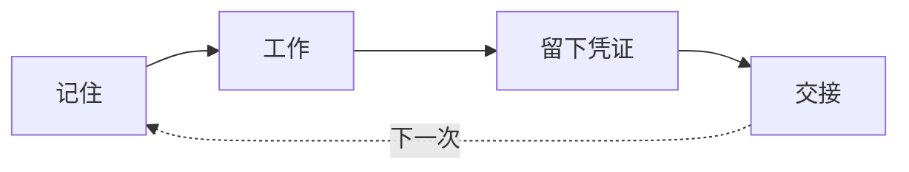

# Caty Agent Harness

<div align="center">

[🇺🇸 English](README.md) ｜ [🇯🇵 日本語](README.ja.md) ｜ **🇨🇳 简体中文** ｜ [🇹🇭 ไทย](README.th.md)

> **公告（2026-08-24）：** 我们发现本 README 与当前实现之间存在部分差距（[#144](https://github.com/caty-ai/caty-agent-harness/issues/144)）：下文所述学习循环中"这个方法先只作为「经验」记下，在另一个任务中再次通过核查后才升格为「规则」。反复出现的流程由另一个 AI（不是写它的那个）审查，只有通过的才会存为「技能」"的部分已完成设计，但尚未实现。我们正在实现它（[#147](https://github.com/caty-ai/caty-agent-harness/issues/147), [#148](https://github.com/caty-ai/caty-agent-harness/issues/148), [#149](https://github.com/caty-ai/caty-agent-harness/issues/149)），完成后将调整并重新发布本文档。跟踪：[#146](https://github.com/caty-ai/caty-agent-harness/issues/146)。


[](https://github.com/caty-ai/caty-agent-harness/actions/workflows/test-lint.yml)
[](https://github.com/caty-ai/caty-agent-harness/actions/workflows/ci-matrix.yml?query=branch%3Amain)
[](LICENSE)


<sub>CI 证据（2026-08-15 UTC）：[矩阵 7/7 通过](https://github.com/caty-ai/caty-agent-harness/actions/runs/31858953187) ・ [同一 SHA 的 60 次独立运行、0 次失败](https://github.com/caty-ai/caty-agent-harness/actions/runs/31859000233)。每周运行 — 仓库 60 天无活动时 GitHub 会自动暂停计划任务，请留意运行日期。</sub>
<br><sub>* WSL2 是一个“经实测但带条件”的 tier，只在一台带日期记录的 VM 上验证过，不属于 CI 已测试 tier；详见 [WSL2 support note](docs/wsl2-support.md)。</sub>

一遍遍重复的背景说明。莫名消失的上下文。没有任何凭证的「完成了！」。<br>
Caty Agent Harness 用纯文本文件和真实的核查，把这些全都解决掉。<br>
不是魔法：记住、推进、核查都交给机械来做，AI 只管专心思考——<br>
一套包在你现有 AI 外面的小机制。

**一套不轻信 AI「完成了！」的机制——把工作拆成阶段推进，用证据确认之后才算「完成」。成绩单持续公开，输赢都在。**

**实际会变好的地方** — 是实测出来的，不是承诺：

- **在弱模型上，虚假的「完成」不再蒙混过关——已验证的任务完成率达到原来的约三倍。** 在 Claude Haiku 4.5（能力较弱的模型）上，宣称「完成」却没读完工作的申报从完成申报的 98% 降到 8%（222/226 → 2/26；每组 30 次运行，M/L 规模任务）——已验证的完成率也从 13% 升到了 43%（[完整数字](docs/benchmark.md#ev-006)）。
- **强模型保持准确率——大任务的 token 用量减少 58%（sonnet）/ 31%（opus）。** sonnet 和 opus 在隐藏答案上的得分在有无 harness 时相同——在大任务上，不用 harness 时用掉的 token 是有 harness 时的 2.40 倍（sonnet）/ 1.46 倍（opus）（相当于用 harness 时少用 58% / 31%；L 档中位数——[P1 表格](docs/benchmark.md#ev-006-p1)）。在这些测试里，sonnet 的小任务用 harness 反而更费 token——用在大任务上才合适。而在实测最大的任务上（≈2.4M token，约为上下文窗口的 2.4 倍），没有 harness 的 opus 只读了 2–4% 的文件就不断尝试提交，而 harness 下的 opus 以 100% 的文件实读完成了验证通过（[两个溢出档位均为 2/2](https://github.com/caty-ai/caty-agent-harness/issues/235)；两组测试使用的预算范围并不相同）。
- **结果也展示了它的局限。** 在搜索型运行时（例如 Codex）上，溢出防护一次都没有触发——按设计，本就没有需要拯救的东西——还有一个运行时触发了，但比不用 harness 用掉了更多 token（[各模型详情](#model-effects)）。sonnet 的溢出档位停在 0/2：四次运行都交付了成果、20/20 正确、引用全部有效，但漏读了约 10–12% 的文件——验证关卡每次都拒绝了「完成」，并列出未读的文件（这正是预先注册的 honest-failure 分支）。每一个失败的结果，都和成功的结果一起公开。

<sub>四组密封、预先注册、机器评分的实验系列（2026-08） — 全部数字、方法与注意事项，包括 harness 反而用掉更多 token 的地方：[benchmark](docs/benchmark.md) ・ **2 分钟即可上手** — 把[这一段可直接粘贴的提示词](#get-started)，贴进你已经在用的 AI 工具。</sub>

🔧 [工程指南（英文）](docs/engineering.md) ｜ 📘 [详细规范（英文）](docs/reference.md)

</div>
<!-- repo-state:begin (generated; do not edit) -->
<p align="center"><sub>generation: <code>90bc370</code> (2026-09-03T18:38:35Z) · verify: <a href="https://api.github.com/repos/caty-ai/caty-agent-harness/commits/main">API HEAD</a> · <a href="./status.json">status.json</a></sub></p>
<!-- repo-state:end -->

- [这些情况是否似曾相识？](#problems)
- [它能做什么](#what-you-get)
- [使用前提](#environments)
- [开始使用](#get-started)
- [为什么可以放心一试](#safety)
- [哪些模型能受益](#model-effects)
- [更深入了解](#shelf)
- [Family OS 中的一员](#family-os)
- [许可证](#license)

---

<a id="problems"></a>

## 这些情况是否似曾相识？

交给 AI 的工作越多，这些场面就出现得越频繁。

- 每开一个新会话，都要把同样的背景再解释一遍。
- AI 说任务完成了——但结果不存在，或者你无从核实。
- 长任务做到一半就找不到位置，悄悄停摆。
- 上周有效的解决办法，这周的 AI 已经不记得了。

只要有一条让你点头，这个工具就是为你做的。反过来，如果你只用 AI 问一些一次性的小问题，这套机制就大材小用了——保持现状就很好。

这四个问题，正是 Caty Agent Harness 要用机制（而不是承诺）去碾碎的东西。

---

<a id="what-you-get"></a>

## 它能做什么

就是一个循环，反复进行：记住 → 工作 → 留下凭证 → 交接。机械让这个循环持续转动，所以即使 AI 忘了，工作本身也不会被忘记。



- 🌱 **它会自己变聪明**

  一旦出错，原因和凭证会当场记进笔记（实体只是一个纯文本文件）。下一次尝试必定带着上一次的失败记录，并且机械规则禁止用同样的方式重试——同样的错误不再重复。你永远不用说「记一下笔记」。

- 🏁 **一路跑到终点**

  大任务被拆成一个个带编号的小步骤，由机械一步一步推进。会话结束、窗口关闭、甚至换了模型，都能从上次的位置接着跑。

- 🔍 **「完成」自带凭证**

  「完成」由机械核查对照实际结果来判定——从来不是听 AI 的一句自我声明。只有配置了独立审查时，独立验证者才会参与；没有配置时，机械核查仍是核心。无论哪种情况，都不会把做事的 AI 的自我声明当作凭证。实在做不动时，它不会无限空转：带着凭证诚实地停下来，向你报告。

<details>
<summary><b>它的工作原理（不是魔法的理由）</b></summary>

1. **失败时** — 哪里出了问题、凭证是什么，会被自动记录到项目内的笔记里。
2. **下次尝试时** — 上一次的失败必定随任务一起交付，并有一条机械规则禁止用同样的方式重试。
3. **成功时** — 这个方法先只作为「经验」记下，在另一个任务中再次通过核查后才升格为「规则」。反复出现的流程由另一个 AI（不是写它的那个）审查，只有通过的才会存为「技能」。
4. **运行期间** — 调度器每隔几分钟踢一次「下一步」，AI 每次拿到的只有简短新鲜的上下文。尝试次数和工作时长都有机械计数的上限，不可能无休止地磨。

→ 深入了解：[从重复的失败中学习（英文）](docs/engineering.md#learning) ／ [完成轨道（英文）](docs/engineering.md#completion)

</details>

能不能用，取决于你手上已有的工具——请看下面的表格。

---

<a id="environments"></a>

## 使用前提

支持的 AI 工具都运行在终端里——**但敲终端的不是你**。安装和维护都由你的 AI 来做，你只管和它说话。

| 类别 | 支持情况 |
| --- | --- |
| 操作系统 | macOS：✅ 已通过 CI 测试（GitHub Actions `macos-latest`，Apple 芯片） ／ Linux：✅ 已通过 CI 测试（GitHub Actions `ubuntu-latest`） |
| Windows (native) | ❌ 不支持 — 实测到三道硬墙：`chmod` 会悄悄变成 `644`，`ln -s` 会变成复制，且没有 `flock`。详见 [WSL2 support note](docs/wsl2-support.md#windows-native-walls)。 |
| WSL2 (Ubuntu on Windows) | 🟡 有条件支持 — 已于 2026-08-23 在 `win11-test-vm` 上实测通过（30/30 suites、`umask 0002`、非 root、Linux filesystem），但不是 CI 已测试 tier。<br>你的 AI tool（Claude Code / Codex CLI）必须运行在同一个 WSL2 distro 里；如果 agent 运行在 Windows 侧，安装会成功，但 hooks 会始终不触发。<br>repo 必须放在 Linux filesystem（`/home/...`，不要放在 `/mnt/c/...`），这是正确性要求，不是速度建议；并使用 `git 2.34+`、非 root 用户，且确保 wrapper 类文件不是 group/world-writable（例如 `chmod 0755`）。CI 里的近似单元是 `ubuntu-wsl2-profile`（`umask 002`、非 root container）。[实测详情](docs/wsl2-support.md) |
| AI 工具 | Claude Code ✅ ／ Codex CLI ✅ ／ Kimi Code CLI ✅ ／ Hermes Agent ✅ ／ OpenClaw ✅ |
| Shell | bash 3.2+ ✅（macOS 默认版本即可） |
| Python 3 (3.9+) | 幕后自动化（技术上叫 hooks 的机制）会用到——你的 AI 会替你确认 |

对每个工具的支持深度是刻意不同的——详见[工程指南（英文）](docs/engineering.md)。

条件都齐了的话，安装只需要一段提示词。

---

<a id="get-started"></a>

## 开始使用

你要做的只有一件事。在希望它工作的项目文件夹里，打开你常用的 AI 工具，粘贴这段话——安装、检查、汇报都由你的 AI 代劳。

```text
请把 https://github.com/caty-ai/caty-agent-harness.git 安装到这个项目里：
阅读仓库中的 docs/agent-guide.md 并照着执行——把当前文件夹作为 workspace 安装，
运行健康检查，然后用我能听懂的话告诉我：你设置了什么、我接下来能做什么。
```

就这样。[Agent 指南（英文）](docs/agent-guide.md)会引导你的 AI 完成每个选择、健康检查，以及如何向你汇报。

作为一个具体的首次演示，你的 AI 可以运行随附的[图像试运行示例](templates/examples/img-pilot.task.md)，仅使用本地工具生成 SVG 图像卡片和 JSON 交付回执。

想亲手敲命令？→ [工程指南（英文）](docs/engineering.md#quickstart)有完整的手动流程。

<details>
<summary>感觉不对劲时</summary>

- 你的 AI 会运行只读的健康检查（`--check`）并给你看结果——一切正常时最后一行是 `ok: required layout and STATE.md headers present`。
- 核心正常时，个别行也可能显示 `FAIL`：那是尚未接好的可选自动化项目，哪些需要处理由 Agent 指南告诉你的 AI。

</details>

粘贴之前还有点犹豫？下一节解释为什么什么都不会被破坏。

---

<a id="safety"></a>

## 为什么可以放心一试

- **你的 AI 仍然属于你** — 人格和积累的记忆保持原样。现有指令文件的内容不会被改写；只有选择 `--append-bootstrap` 时，安装过程才会向指定的指令文件追加文档中说明的 bootstrap 区块。其余改动只是在周围加入 harness 脚手架。
- **退出也只要一条命令** — 安装是一条命令，暂停也是一条命令，学到的东西一点不丢。恢复之后从停下的地方接着跑。
- **所有内容都能亲眼读到** — 经验、进度、凭证全部存在纯文本文件里，发生了什么你可以亲眼确认。

到这里是简版。深度全在下面。

---

<a id="model-effects"></a>

## 哪些模型能受益

**overflow sentinel**（[设计 Issue #159](https://github.com/caty-ai/caty-agent-harness/issues/159)）监视实测的每轮上下文水位，超过阈值时就停止运行并分解任务，而不是任由上下文溢出。Sentinel v1 已作为 claude-code runtime 的 opt-in 功能在 v0.17.0 发布（[#180](https://github.com/caty-ai/caty-agent-harness/issues/180) 实现了 [#159](https://github.com/caty-ai/caty-agent-harness/issues/159)）；通过 [`OVF_SENTINEL=shadow|active`](adapters/claude-code/INSTALL.md) 启用，未设置 = 完全关闭（byte-identical passthrough）。default-on 仍属后续工作，将按模型对照 [#159](https://github.com/caty-ai/caty-agent-harness/issues/159) 的条件决定；详见本节档案与 [benchmark（英文）](docs/benchmark.md#ev-008)。EV-008 仍是该实现之前取得的 rig 预先测量，且尚未在已发布实现上重新测量。EV-008——一项密封、预先注册的基准测试（2026-08）——按模型实测了这种行为。效果的差异取决于运行时「读」的方式：

| 运行时类型 | 实测模型 | 行为 | 判定 |
|---|---|---|---|
| **全量读取型** — 上下文单调增长 | claude-haiku-4.5 · claude-sonnet-5 · claude-opus-5 | 任务进行到一半时触发 → 分解 → 完成；正确率保持（sonnet/opus= 触发的每个单元均为 20/20・haiku= 19–20/20） | **这里是收益所在。** 对 sonnet 而言，任务越大收益越大（L 档最大）。sonnet 的 sentinel/bare 中位数为 **0.801**（最佳单元 token 减少 −71%）・opus 为 **0.923**・haiku 为 0.35（描述性・存在 arm/phase 混杂——参见 [benchmark](docs/benchmark.md#ev-008)） |
| **检索型** — 在观测范围内趋于平台 | gpt-5.6-luna（Codex）· qwen3.8-max | 在实测的所有运行中触发次数为零：codex **0/127 turns**・qwen 0/4 单元（实测最大值 79.7K，阈值为 80K——余量很薄，此处仅作为观测范围的记述） | **在观测范围内的不触发正是设计意图** — 这本身就是 default-on 的安全条件。若在此触发，就是误报、需要打回设计 |
| **触发但不划算型** — 上下文增长，但 bare 很便宜 | grok-4.6 | 4/4 触发，分解并正确完成（20/20）——但 bare 运行太便宜，分解反而更贵（比值中位数 **2.145**） | 机制在这个运行时上已被证实有效；**但不建议 default-on**。判断标准是相对 bare 的经济性，而不是是否触发 |
| **触发但结果混合型** — 早期触发・重型全量读取 | gemini-3.7-flash（descriptive——不在预先注册的 GO 条件之内） | 4/4 触发（t31–82）。bare 在 L 档崩溃；分解在一个 L 单元中挽救了完成，但 2/4 的 sentinel 单元（M-i3、L-i2）正确数为 0（子步骤在 headless 下的 permission 停滞） | **仅作记述——不做效率主张，也不做 default-on 判断。**[单元级数字](docs/benchmark.md#ev-008) |

<sub>比值为 sentinel/bare 的 token 成本（数值越低越省）・每个模型 4 个密封单元的中位数・实测于 2026-08-25。引用前请先读：① codex 条件最初 **FAIL**（M4，n=1，几何平均 1.337），只有在 n=3 重复测试——这是看到数据后才制定、并经 3 席 delta 审核封印的事后设计（0.9944 ≤ 1.05）——中才通过；FAIL 是历史，不会被抹去；② sonnet 的 0.801 达到了判定阈值（<1.0），但以微弱差距未达到努力目标（<0.8）；③ 大多数逐对比值都是 n=1——run 与 run 之间的方差是真实存在的（codex 平均值的 SE ≈25%）；n=3 重复补充测试（2026-08-29）对此做了量化——每个模型汇总 12 个对数比后：sonnet 几何平均 **0.617** [0.439, 0.867]，opus **0.806** [0.651, **0.997**]——单次测量的中位数都落在这个区间之内（各次重复范围为 0.28–1.50），opus 的置信上限是 0.997：token 节省得到确认，但把 1.0 排除在外只差一线。另外 sentinel 本身仍是 opt-in，且尚未在已发布的实现上重新实测。[完整数字、方法与注意事项（英文）](docs/benchmark.md#ev-008) ・ [n=3 补充测试（英文）](docs/benchmark.md#ev-008-n3)。</sub>

第三项密封实验 **P2-WIN**，在裸模型上刻画了任务本身的特性——这是对三个任务规模档位上完成结果的测量，而不是介入效果的结果：[表格与局限（英文）](docs/benchmark.md#p2-win)。

另一条实验线 **EV-007 / EV-007b** 测量了主张的另一半——学习回路。结果是**没有学习事件，也没有正式运行**：跨模型评审两次 fail-close；等到第二套测量工具准备好时，harness + haiku 在我们尝试过的每一套测量工具上都做到了 19–20/20——已经没有可供回路学习的重复错误样本了。这条线真正产出的是随 v0.24.0 发布的产品改动（晋升的复现单位从 ISO 周改为不同的 session 数）：[停在哪里、为什么（英文）](docs/benchmark.md#ev-007)。

**盲态遥测路径——未经实测前不要开启。** 通过目前的 shim，glm / muse 报告的每轮 usage 全部为零，kimi 则完全不输出 usage。看不到实时遥测的运行时，绝不能把 sentinel 设为 default-on：因为根本没有水位可看。

**同一时间只能有一个水位管理者。** 如果宿主自身已有自动压缩（Hermes、OpenClaw、某个 agent CLI 内置的压缩……），那么管理上下文水位的只能是宿主**或** sentinel 二选一——绝不能两者都管。两个管理者同时存在，要么宿主先压缩、sentinel 变得形同虚设，要么两者同时介入同一次溢出。请二选一：当 sentinel 为 default-on 时关闭宿主的自动压缩，或者当宿主主导时把 sentinel 降级为仅记录。sentinel 的事件日志（在 EV-008 rig 上）已经把 `runtime_compaction` / `compaction_suspected`（在所有 EV-008 运行中均为 false）作为判定依据记录下来。

**如何为新模型做 profile**（在做出任何 default-on 决定之前）：

1. 运行**一个开启遥测的 live 任务**，确认每个 usage 字段都带有真实数值——mock 测试通过是不够的；盲态路径在真正 live 之前看起来都很正常。
2. 实测跨 turn 的注入上下文曲线。
3. **趋于平台** → 检索型：验证不触发的状态能否保持（触发就是需要打回设计）。**单调增长** → 全量读取型：运行三臂对比（bare / always-on / sentinel）。
4. 在启用之前比较 sentinel/bare 的成本——只有当分解比硬扛更便宜时，会触发的 sentinel 才值得 default-on（grok 就是实测到的反例）。

---

<a id="shelf"></a>

## 更深入了解

你刚读完的是一张地图。内容是真材实料，而且全部有文档。

| 文档 | 内容 |
| --- | --- |
| [docs/agent-guide.md](docs/agent-guide.md) | **给安装 AI 的剧本** — 选择、命令、核查、汇报方式，一条路走到底（英文） |
| [docs/benchmark.md](docs/benchmark.md) | **密封基准测试** — 开头主张背后的完整数字、测量方法与诚实的局限（英文） |
| [docs/engineering.md](docs/engineering.md) | **完整技术指南** — 哪里强制什么、各工具深度、暂停语义、架构、目录地图（英文） |
| [docs/reference.md](docs/reference.md) | **精确契约** — 每个参数、每种状态、设计文档索引（英文） |
| [运行环境设置（英文）](docs/engineering.md#runtime-setup) | **各工具接线** — 5 种 AI 工具各自的 hooks、verifier 与调度 |
| [CONTRIBUTING.md](CONTRIBUTING.md) | **如何提出变更** — issue 优先的流程与 `tests/` 下的全部测试套件（一条 `make test` 即可全部运行，英文） |
| [SECURITY.md](SECURITY.md) | **安全地报告问题** — 私密漏洞报告通道（英文） |

## 项目现状

- **CI**: [](https://github.com/caty-ai/caty-agent-harness/actions/workflows/test-lint.yml) — 每个 pull request 都会运行 `make test` + `make lint`
- **已验证环境**: macOS（GitHub Actions `macos-latest`，Apple 芯片）、Linux（`ubuntu-latest`）以及 WSL2（Ubuntu on Windows；2026-08-23 在 `win11-test-vm` 上实测 30/30 suites，Linux filesystem、非 root、`umask 0002`；不是 CI 已测试 tier）— 参见「[使用前提](#environments)」中的表格与 [WSL2 support note](docs/wsl2-support.md)
- **成熟度**: public preview — [docs/cli-conventions.md](docs/cli-conventions.md) 中标记为 FROZEN 的 CLI 输出契约是稳定的，其余部分仍可能变动
- **已知限制**: Native Windows 不受支持；上面的 WSL2 行是唯一经过实测的 Windows 相关路径。另有部分 updater 测试套件需要 `ssh-keygen`（参见 [CONTRIBUTING 的 Prerequisites](CONTRIBUTING.md#prerequisites)）

最后再讲一句——这个工具所属的更大图景。

---

<a id="family-os"></a>

## Family OS 中的一员

<!-- family:generated:family-footer:start -->

---

本仓库属于 **Caty AI 家族** — 用于运营 AI 智能体家族的开源工具集。完整地图（包括仍在准备公开的模块）见 [Family OS](https://github.com/caty-ai/family-os)。

| 轴 | 模块 | 做什么 | 状态 |
| --- | --- | --- | --- |
| 地图 | [Family OS](https://github.com/caty-ai/family-os) | 整个家族的地图 — 模块、状态与结构 | 已公开・MIT |
| 规则 | [Family Dev Handbook](https://github.com/caty-ai/family-dev-handbook) | 开发的交通规则 — Issue、PR、worktree、交接与并行开发 | 已公开・MIT |
| 纵轴・基座 | **Caty Agent Harness** | AI 智能体的任务基座 — 重试、检查点与完成判定 | 已公开・MIT |
| 纵轴 | [context-kit](https://github.com/caty-ai/context-kit) | 面向单个智能体的六件上下文卫生工具组 — 限制大输出、委托简报校验、安全防护、记忆检索、worktree 快照 | 已公开・MIT |
| 纵轴 | [Persona Engine](https://github.com/caty-ai/persona-engine) | 在智能体已有人格之上叠加关系与情感层 | 已公开・MIT |
| 纵轴 | [Persona Growth Loop](https://github.com/caty-ai/persona-growth-loop) | 让人格本身成长 — 以最小且幂等的提案 | 已公开・MIT |
| 纵轴 | [X Collector](https://github.com/caty-ai/x-collector) | 把 X 与网络素材汇成每日一份摘要 — 给人也给智能体 | 已公开・MIT |
| 纵轴 | [Self Growth Loop](https://github.com/caty-ai/self-growth-loop) | 让智能体自我成长的循环 — 提案、治理与采用记录 | 已公开・MIT |
| 横轴・基座 | [Family Memory Architecture](https://github.com/caty-ai/family-memory-architecture) | 记忆总线 — 家族共享所知的一层 | 已公开・MIT |
| 横轴 | [Sitter](https://github.com/caty-ai/sitter) | 替你盯着委派出去的智能体 — 监视、留证、仅在声明范围内重启 | 已公开・MIT |
| 横轴 | [Alpha Nightshift](https://github.com/caty-ai/alpha-nightshift) | 夜间自主维护循环 — 在默认拒绝的防护边界内运行夜间通道，早晨由人工挑选合并 | 已公开・MIT |

<!-- family:generated:family-footer:end -->

Caty Agent Harness 是 Caty AI 项目 **Family OS**——把多个 AI agent 当作一个家庭来运营的整体蓝图——中的一件工具。它完全可以单独使用，而与下面这些组合时会更加强大：

- **[family-os](https://github.com/caty-ai/family-os)** — 把整个家庭串联起来的蓝图。本 Harness 在其中负责「纵轴 = 培养单个 agent 并驱动其完成工作」。
- **[sitter](https://github.com/caty-ai/sitter)** — 从外部盯守长时间运行的 agent 工作的看护者，一旦工作卡住或冻结就会举手示警。

---

<a id="license"></a>

## 许可证

[MIT](LICENSE)——选它是为了让任何人都能自由使用、研究、集成到任何东西里，包括商业化的 agent 配置。这正是它存在的意义。

---

<div align="center">

**纯文本文件** ｜ **支持 5 种 AI 工具** ｜ **一条命令即可暂停与恢复**

</div>
