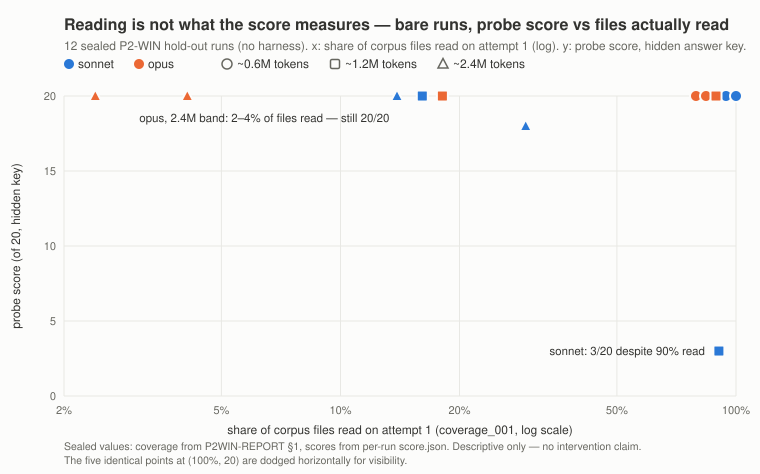

# ベンチマーク — 事前登録・封印・機械採点

[English](benchmark.md) | [日本語](benchmark.ja.md) ｜ [トップページ](../README.ja.md)に戻る

このページは README の数字の全根拠です — **ハーネスが勝てなかった箇所も含めて**
載せています。ベンチマークはモデルごとに1レーンで、測定が済み次第
行が増えます（tracking:
[#129](https://github.com/caty-ai/caty-agent-harness/issues/129)）。

## 5つの実験ファミリー — このページの読み方

1. **EV-006 — 素 vs 出荷済みハーネス。** 外側の機構は完遂を救えるか。本走は
   claude-haiku-4.5（見出しの 13%→43%）。**P1 モデル一般化**は同じ封印設計を
   sonnet-5 / opus-5 で繰り返し、「haiku が弱かっただけでは？」に答えます —
   [EV-006 P1](#ev-006-p1)。
2. **EV-008 — 素 vs オーバーフロー・センチネル**（常時オンではなく適応的発火）。
   モデル別の発火プロファイル・default-on の GO 条件・信頼区間つきの
   **n=3 反復補遺** — [EV-008](#ev-008) と [補遺](#ev-008-n3)。
3. **P2-WIN — 素のモデルのみ。** 仕事が窓を越えて育つと完遂はどこで止まり、
   崩れ方はどんな形か — [P2-WIN](#p2-win)。
4. **EV-009 — 溢れ帯の中での素 vs ハーネス。** P2-WIN が意図的に外した介入腕。
   封印済み hold-out 8走・逸脱 0・事前登録済みの honest-failure 分岐込み —
   [EV-009](#ev-009) を参照。
5. **EV-007 / EV-007b — 学習ループ。**「レビューしてから昇格」は同じ間違いの
   再発を止めるか。2レーンとも学習効果の数字は出ていません: 審査が2回
   fail-close し、次の計測器を用意した頃にはハーネスが試した計測器のすべてで
   19〜20/20 を出していました。レーンが残したのは製品変更と実地の配線証明
   です — [EV-007](#ev-007) を参照。

ここにある本走はすべて、開始前に封印・事前登録されています。EV-007b の較正パイロット
は事前に書かれた規則のもとで封印前に走り、本走は開始されませんでした（事前登録は草稿
のままです）。すべて機械採点され、限界の記述つきで報告されています — ハーネスが勝てなかった場所も含めて。

---

## 何を測ったか

この製品が存在する理由である失敗 — **やっていないのに「できました！」と言う AI**。
それを「コンテキストが溢れる量の仕事」の上で測りました（M≈15万・L≈30万トークン＝
1つのコンテキストウィンドウを超える。S≈7.5万は収まるサイズで、対照として置く）。

- **検証済み完了**（`task_resolved`）: 封印済みの機械ゲート（スキーマ +
  transcript からの**実測**読了カバレッジ + 逐語引用の実在 + 退化解答 lint）を
  通過し、**かつ**隠された正解キーで 20/20 を取った run。
- **完了ハルシネーション**: 構造化された完了申告（成果物一式を提出）のうち、
  **実測**カバレッジが「コーパスを読み切っていない」ことを示すもの。
  「全部読みました」という自己申告ログは一切信用せず、ツール呼び出しの
  transcript だけを証拠にします。

<a id="ev-006"></a>

## レーン1 — Claude Haiku 4.5（2026-08）

構成: 3課題（架空企業コーパスのリサーチ / 固定リビジョンの VS Code 実コードへの
質問 / CSV 抽出転記）× 3サイズ（S≈7.5万・M≈15万・L≈30万トークン）×
独立5インスタンス × 腕。腕は **素**（最善の単発プロンプト・最大10回試行）・
**ハーネス**（`install.sh` フルインストール・task file 運用・製品既定値）・
**素朴リトライ対照**（素 + 前回解答を渡して継続・Mサイズのみ）。トークン上限は
サイズごとに全腕同一。両腕とも使えるツールは同じ3つ — Read・Glob・Write で
**検索なし**（実読を強制するため。検索ありの実運用への外挿はできません）。
試行の単位は設計上腕で異なります: 素腕は安全上限10回・ハーネスは製品既定の
予算（S/M=16回/90分・L=24回/150分）。素腕の M/L 30本中14本は attempt 上限で
終端しました（拘束資源であるトークン上限は全腕同一です）。
順序は、仮説と解析の事前登録 → コーパス・採点器・
ランナーのハッシュ封印（`SEAL-MANIFEST`・185ファイル）→ 実走。採点は機械のみ・
惜しい解答の裁定は腕ラベル非可視で実施（候補54件・受理3件=各腕1件ずつ）。

### 主結果 — M/L（コンテキスト溢れ）サイズの検証済み完了

| | 素 | ハーネス |
|---|---|---|
| 検証済み完了・M/L プール（各腕 n=30） | 4/30（13%・CI 5–30%） | **13/30（43%・CI 27–61%）** |

効果 **+30pt**・層別 exact 検定 **p = 0.0079**（rig が計算した事前登録の exact
検定です）。素朴リトライ対照は 2/15（13%）でコストは素腕並み — リトライだけでは
差は埋まりません。

課題別（M/L プール）: リサーチ 4/10 → 7/10・コード質問 0/10 → **6/10**・
CSV **0/10 → 0/10**（下の「弱点」参照）。

### 完了ハルシネーション — 一番大事な数字

ここで言う「完了ハルシネーション」= 完了申告のうち、**実測**カバレッジが
「コーパスを読み切っていない」ことを示すもの。母集団を明記して両方出します:

| 未読のままの完了申告（申告あたり） | 素 | ハーネス |
|---|---|---|
| コンテキスト溢れサイズ M/L（各腕30本） | 222/226（**98%**） | 2/26（**8%**） |
| 全サイズ S+M+L（各腕45本） | 247/263（94%） | 2/41（5%） |

失敗の形が質的に違います: 素腕の偽申告はほぼ全部が**未読のまま**の申告。
ハーネスはほぼ常に全部読んでから申告します — 検証不合格だった納品19件
（全サイズ）のうち未読ファイルを含んだのは2件で、その2件もゲートが捕捉
しました — そして前に進めない時は成功を装わず**正直に停止**します
（no-progress）。

ハルシネーションは3種に分けて測り（M/L 母集団）、**激減したのは完了系 —
その中でも「未読」の形だけ**でした:

| 種類（M/L） | 素 | ハーネス |
|---|---|---|
| 偽完了 — done と申告したが納品が検証不合格（申告あたり） | 222/226（98%） | 13/26（50%） |
| …うち未読型（実測カバレッジ不足） | 222/226（98%） | 2/26（8%） |
| 解答の誤り（per-item 誤答率） | 22–31% | 24–38% |
| 引用が答えを支えない（計） | 138件 | 166件 |

ハーネスは1問ごとの賢さを上げる道具ではありません — 誤答も緩い引用も残るし、
溢れサイズの納品の半分は検証に通っていません。消えるのは**未読の申告** —
読んでいないのに「done」と言うこと、です。

### 時間とコスト（各サイズ15本の合計）

| サイズ | 素 | ハーネス |
|---|---|---|
| M | 2.3時間 / 122M tokens | **1.3時間 / 50M tokens** |
| L | 3.9時間 / 241M tokens | **2.3時間 / 98M tokens** |

素腕は失敗リトライのたびにコーパス全読み直しで予算を焼きます。ハーネスは
構造化された少ない試行で解決するため、溢れるサイズでは**3倍完了しながら
安くて速い**という結果になりました。

### サイズ別の検証済み完了（全課題）

| サイズ | 素 | ハーネス |
|---|---|---|
| S（≈7.5万） | 10/15（67%） | 9/15（60%） |
| M（≈15万） | 4/15（27%） | 8/15（53%） |
| L（≈30万） | **0/15（0%）** | **5/15（33%）** |

## 弱点 — 数字を引用する前に読んでください

- **CSV課題は両腕とも M/L で 0/10。** CSV 行の逐語転記は Haiku 4.5 の能力を
  超えており、ゲートが両腕で正しく落としています。この層では腕差を検出
  できません — 隠さずそう書きます。集計系の作業（合計・グループ化）は
  **未評価**です: CSV 課題が測るのは抽出・転記のみ。
- **Sサイズでは優位なし**（67% vs 60%）: 仕事がコンテキストに収まるなら
  素のモデルで十分です。製品の価値はコンテキストが溢れる所から始まります。
- **単一モデル。** 上の数字は全部 Haiku 4.5 です。完遂率レーンの追加は
  [#129](https://github.com/caty-ai/caty-agent-harness/issues/129) で追跡中で、
  測定済みのクロスモデル EV-008 プロファイルは[下の行列](#ev-008)と README の
  モデル別セクションにあります。
- **43% は 100% ではありません。** ハーネスは M/L 30本中17本で失敗しました —
  正直に（検証済み停止 or ゲート却下）ですが、失敗は失敗です。主張は
  「検証済み完了と正直な報告」であり、完璧ではありません。
- 全実行は作者管理下の環境です。一時的な CLI 障害バーストが2回あり、
  影響 sequence は事前登録済みの手続きで再走しました。うち2本は再走を
  2回要し（手続きの既定より1回多い・逸脱として記録済み）、最終データに
  インフラ起因の終端は0件です。

## 再現・監査

設計（5席クロスモデルレビュー）・事前登録・生 writeback・
裁定ログは
[harness#100](https://github.com/caty-ai/caty-agent-harness/issues/100)
（最終結果コメント）にあります。

採点済み aggregate は
[`docs/benchmark/ev006-aggregate.json`](benchmark/ev006-aggregate.json) として
このリポジトリに同梱しました。SHA-256 は
`61dad2cb43a11ce8ae9f6b0e82d492c71b6b46eae27a07418fd90fa673cf3848` です。
中身は score のみです。`cells` には105本の benchmark run それぞれにつき
1行が入り、`table` は事前集計済みの summary です。再計算スクリプトは
`table` ではなく `cells` を使います。transcript や prompt は含みません。
run ごとの生データ（transcript・gate・score・ledger）はサイズが大きいため
引き続きリポジトリには同梱せず、オフライン保全しています。求めがあれば
提供します。

rig の封印マニフェストは `corpora/main/SEAL-MANIFEST.txt` です。
185ファイルを `2026-08-19T03:36:09Z` に封印し、scope は
`corpora/main tools runner (py/md/json/sh) + design v3 + PREREGISTRATION`
です。マニフェスト自体は同梱せず、SHA-256
`f31e9af832d7ac54922f5176228172aecadd080ff46f8d6a73e331d598389cb0` だけを
記載します。コーパスを求めた読者は、測定に使われたものを受け取ったか
検証できます。

リポジトリのルートから次の1コマンドで、公開した主結果とサイズ別結果を
再計算できます。

```sh
python3 docs/benchmark/recompute.py
```

```text
Primary result (M/L pooled)
  bare verified completion: 4/30 (13%)
  harness verified completion: 13/30 (43%)
  bare unread completion claims: 222/226 (98%)
  harness unread completion claims: 2/26 (8%)
Verified completion by size
  S: bare 10/15 (67%), harness 9/15 (60%)
  M: bare 4/15 (27%), harness 8/15 (53%)
  L: bare 0/15 (0%), harness 5/15 (33%)
EV-006 charge tokens
  M: bare 122,050,790 → harness 49,631,455 (−59.3%)
  L: bare 241,179,467 → harness 98,312,729 (−59.2%)
  M/L pooled: bare 363,230,257 → harness 147,944,184 (−59.3%)
```

この同梱 aggregate が裏づけるのは、このページの検証済み完了と完了
ハルシネーションの主数字、サイズ別・課題別の分割、token/time の削減、Wilson の
信頼区間、そして同じ105本の採点済み run から引けるそのほかの per-run 派生量です。
例外は 2 つだけで、`p = 0.0079` と、54件の near-miss 候補のうち「受理 3 件」です。
これらはこのファイルではなく rig の事前登録済み scoring / adjudication に由来し、
根拠は [harness#100](https://github.com/caty-ai/caty-agent-harness/issues/100) にあります。
スクリプトがカバーする数字については、出力と本文が食い違うなら、間違っているのは
本文です。

---

<a id="ev-006-p1"></a>

## EV-006 P1 — モデル一般化: あの救済は haiku が弱かっただけ？（2026-08）

本走の後に外から来た問い:「+30pt は弱いモデルの話 — 強いモデルでも残るのか？」
P1 は封印設計をそのまま（同じコーパス・ゴール・予算・採点。モデル欄だけ差し替え、
元の封印ハッシュは不変）**claude-sonnet-5**（90 seq）と **claude-opus-5**（60 seq・
M/L のみ）で繰り返しました。公開記録:
[#129 コメント](https://github.com/caty-ai/caty-agent-harness/issues/129#issuecomment-5457130272)。

`correct_resolved` = 隠し答案に対して正答かつ成果物検証済み — 事前登録済みの副次エンドポイント（主要 `task_resolved` は下の注記を参照）。

| モデル | 完遂・素 vs ハーネス | 効率・素÷ハーネス（charge 中央値） |
|---|---|---|
| claude-haiku-4.5（本走） | 13% vs 43%（M/L プール・task_resolved） | トークン −59% |
| claude-sonnet-5 | 28/30 vs 28/30 — 完全同点（correct_resolved） | S 0.52× · M 0.63× · **L 2.40×** |
| claude-opus-5 | 30/30 vs 30/30 — 天井・虚偽完了ゼロ（correct_resolved） | M 1.17× · **L 1.46×** |

引用前に必ず読むこと:

- 完遂の救済は **haiku 帯限定**です — 強いモデルはこの帯の仕事を素でも完遂します。
  代わりに得るのは **L 帯から現れる同精度のトークン削減**（比が 1.0 超 = ハーネスの
  トークンが少ない。sonnet の S/M セルは 1.0 未満 — 仕事が余裕で収まる場面では
  ハーネスの方がトークンを多く使います）。
- 主要指標 `task_resolved` では sonnet のハーネス腕が −27pt — 中身はすべて p2 の
  読了カバレッジ系violation（既知の選択的読みアーティファクト。事前登録済みの
  副次エンドポイント `correct_resolved` が補正し、P1 の near-miss 台帳は空）。
  両方の指標を報告します。
- パイロットの n=1 の opus L 比は最終値より過大で、n=15 で **1.46×** に収束
  しました — 単ペア比があてにならないことの実演です（[EV-008 n=3 補遺](#ev-008-n3)も参照）。
- opus はこのコーパス帯では一度も溢れませんでした（完全な天井）— それが
  [P2-WIN](#p2-win)（帯は実際どこにあるのか）の動機になりました。

---

<a id="ev-008"></a>

## EV-008 — オーバーフロー・センチネルのモデル別発火プロファイル（2026-08）

**オーバーフロー・センチネル**（適応的起動 — [設計 Issue
#159](https://github.com/caty-ai/caty-agent-harness/issues/159)）についての、
別建ての封印付き・事前登録実験です。ハーネスを常時オンで動かす代わりに、
センチネルがターンごとの実測コンテキスト水位を見張り、閾値（80K トークンか
ウィンドウの 50% の小さい方）を超えたときだけ発火 — 実行を止め、コンテキストが
溢れる前に仕事を分解します。Sentinel v1 はその後、claude-code runtime 向けの
opt-in 機能として v0.17.0 で出荷済みです（[#180](https://github.com/caty-ai/caty-agent-harness/issues/180)
は [#159](https://github.com/caty-ai/caty-agent-harness/issues/159) を実装）が、
ここに載せる EV-008 の数字はその実装に先立つリグ事前測定のままで、出荷済み実装では
まだ再測定していません。

セットアップ: モデルごとに封印4セル（M/L サイズ × 2 インスタンス）、腕は
**bare** / **常時ハーネス** / **sentinel**、セルあたり隠し答案 20 問。
事前登録・封印台帳・run ごとの ledger とセンチネルのイベントログは rig 側に
あり、以下の数字は一次 ledger から決定論で再生成したものです
（`step5-reconcile.py`・2026-08-25 再実行）。設計とレビュー記録:
[#159](https://github.com/caty-ai/caty-agent-harness/issues/159)。

### 結果マトリクス

| モデル | セル | 発火 | 正答（発火セル） | sentinel/bare トークン比（4ペアの中央値） |
|---|---|---|---|---|
| claude-sonnet-5（confirmatory） | 4 | 4/4 | 全 20/20 | **0.801**（0.286 / 0.710 / 0.892 / 1.114） |
| claude-opus-5（descriptive・post-GO） | 4 | 4/4 | 全 20/20 | **0.923**（0.726 / 0.913 / 0.932 / 0.940） |
| claude-haiku-4.5（descriptive） | 4 | 4/4 | 19〜20/20 | 0.35（下の交絡注意を参照） |
| gpt-5.6-luna / Codex（confirmatory） | — | **0/127 ターン**（M4 38 + 診断 45 + M4′ 44） | n/a（無発火） | tap オーバーヘッド幾何平均 **0.9944** ≤ 1.05（M4′・M帯 n=3/ペア） |
| qwen3.8-max（confirmatory 無発火） | 4 | **0/4**（注入最大 68.8K〜79.7K @ 80K） | n/a（無発火） | 無発火がエンドポイント — 比は判定対象外 |
| grok-4.6（descriptive・候補） | 4 | 4/4（t6/t6/t6/t8） | 全 20/20 | **2.145**（1.611 / 1.775 / 2.514 / 4.057）— 正しく発火するが、経済が合わない |
| gemini-3.7-flash（descriptive・M6 追補 — 事前登録 GO 条件の対象外） | 4 | 4/4（t31/36/75/82・注入最大 82.1K〜90.6K @ 80K） | 混合 — 下のセル別表を参照 | 比の中央値は引用しない: 両腕完遂ペアが M-i2 の1つのみ＝効率主張の根拠にならない |

削減率で表すなら、比は `1 − median(sentinel/bare)` で変換し、トークン量が
少ないことをマイナス記号で示します: sonnet **0.801** → −20%、
opus **0.923** → −8%（整数パーセントに丸め）。

セル別の絶対トークン量（sonnet / opus・bare → sentinel。2026-08-25 の
`step5-reconcile.py` 再実行出力から転記）:

| セル | sonnet bare → sentinel | opus bare → sentinel |
|---|---|---|
| M-i2 | 2,904,275 → 3,236,215（+11%） | 4,562,380 → 4,254,102（−7%） |
| M-i3 | 3,475,997 → 3,101,258（−11%） | 4,302,965 → 3,927,008（−9%） |
| L-i2 | 16,597,756 → 4,746,361（−71%） | 11,288,180 → 8,192,586（−27%） |
| L-i3 | 7,581,249 → 5,385,942（−29%） | 6,992,297 → 6,574,909（−6%） |

同じ 2026-08-25 reconcile で、bare 腕の正答は sonnet・opus とも全セル
（M-i2・M-i3・L-i2・L-i3）で 20/20、sentinel 腕も両モデルの全4セルで
20/20 でした。

削減効果は仕事サイズに比例して大きくなります: sonnet の L帯セルは 71% / 29% 減、
M帯セルは −11% / +11% — bare 走行は溢れるとコンテキストから落ちた分を読み直す
ため、仕事が大きいほど無駄が膨らみ、センチネルの分解が避ける無駄もその分
大きくなります。

gemini-3.7-flash のセル別（descriptive・発火型= 早期発現・事前登録 GO 条件の
対象外。M6 追補の reconcile から転記・2026-08-25）:

| セル | bare charge（正答） | sentinel charge（正答） | 注記 |
|---|---|---|---|
| M-i2 | 24,293,164（20/20） | 11,000,858（20/20） | 両腕完遂 |
| M-i3 | 10,505,090（19/20） | 11,169,170（0/20） | 子ステップ停滞（headless の command permission 拒否ループ — モデル挙動でありリグ障害ではない） |
| L-i2 | 24,978,973（0/20 — token budget 崩壊） | 7,514,166（0/20） | bare 崩壊・sentinel 子も停滞（M-i3 と同因） |
| L-i3 | 33,149,893（0/20 — token budget 崩壊） | 19,619,857（20/20） | **分解が完遂を救済** |

正直に読むこと: bare の gemini は L帯で崩壊します（2/2 セルが answers 未作成の
まま token budget 到達）。sentinel は 4/4 で発火し L-i3 を完全に救済しました —
一方で sentinel セルの 2/4 は、分解後の子ステップが headless 実行で自動拒否
される shell permission を要求し続けたため正答 0 のままです。このモデルの
トークン比中央値は引用しません: 両腕完遂ペアが1つしかなく、効率主張の根拠に
なりません。

default-on の GO 判定（2026-08-25）は事前登録した4条件に立脚します:
codex 発火率 0（0/127・rule of three の 95% 上限 2.4%/turn）・codex tap
オーバーヘッド幾何平均 ≤ 1.05（0.9944）・sonnet 全ペア中央値 < 1.0（0.801）・
一貫した有害 false-fire なし（1/4 ペアのみ）。qwen が第2の無発火レーンを
加えます: 669 sentinel ターンイベントで発火 0（セル別 102/116/205/246・per-run
sentinel イベントログから再計数・quarantine partial 除外・2026-08-25）— 95% 上限
≈0.45%/turn。

### 引用する前に必ず読むこと（GO と不可分の3点）

1. **codex 条件は最初 FAIL した。** M4（ペアあたり n=1）は幾何平均 **1.337** —
   事前登録どおりの FAIL で、条文どおり差し戻されました。診断の帰結は走行間
   分散（反復ペア比 0.44〜1.81・pooled n=4 で腕差消失）。通った 0.9944 は
   M4′（M帯 n=3/ペア・データを見た後の事後設計を 3席 delta レビュー経由で
   封印）に由来します。FAIL は消すのではなく、持ち歩く歴史です。
2. **努力目標は未達。** sonnet の中央値 0.801 は判定閾値（<1.0）を満たしま
   したが、事前登録の努力目標（<0.8）には 0.001 差で届いていません。
3. **残余不確実性は実在する。** 標準セルはペアあたり n=1（n=3 は M4′ の M帯
   のみ）。M帯の走行間 SD は平均の 30〜40%・n=3 でも比の SE ≈25% —
   0.9944 は「閾値の内側」であって「明確に下回る」ではありません。

### 第3の発見 — 発火することと、割に合うことは別

grok-4.6 は「発火するなら有効化すればいい」への実測の反例です: センチネルは
早いターン（t6〜t8）で発火し、分解は機能し、正答も 20/20 で維持 — それでも
コスト比の中央値は 2.145 です。bare の grok が極端に安いため
（sonnet の bare が 2.9〜16.6M トークンを使う仕事で 0.76〜2.4M）、分解の方が
常に高くつきます。default-on の判定は機構（発火するか）ではなく経済
（sentinel vs bare）で行うものであり、このプロファイルには非推奨です。

### 盲目テレメトリ経路

現行 shim 経由では glm / muse の per-turn usage は全ゼロ・kimi は usage を
出しません。生きた水位が見えなければ、センチネルは成立しません。新モデルの
プロファイルは、テレメトリ全フィールドに実値が入ることを live 1本で確認する
ところから始めてください（モックの PASS は live 経路を検査しません — 実害で
学んだ教訓です）。

### 逸脱と再走（すべて rig の訂正台帳に記録）

- 2セルを事前登録のインフラ手続きで再走しました（opus L-i3: hook の配線ミス
  で Write ツールが全遮断され、成果物を書けない状態 / qwen L-i2: プロバイダ
  クォータ中断）。初回の部分証拠は再走記録と並べて隔離保全しています。感度
  チェック（2026-08-25）により、コアの confirmatory 数値（0.801 / 0.9944 /
  0/127）に**再走データが含まれないこと**を確認済みです。
- haiku レーンは実験途中のプロトコル改訂をまたいでいます: sentinel 腕は全て
  改訂後・bare/always 腕は全て改訂前（腕とフェーズの交絡）。完遂率は境界を
  またいで平坦ですが、haiku のトークン経済の数字は完全には交絡を切り分け
  られません — 0.35 は記述的な参考値として扱ってください。
- 一次 ledger 1本（haiku L-i1 bare）がアーカイブから欠測しています。当該の
  トークン数字はモジュールレポートからの転記です（score ファイルは現存）。

最終報告書全文・訂正台帳つき事前登録・モデル別モジュールレポートは rig 側に
あり、[#159](https://github.com/caty-ai/caty-agent-harness/issues/159) から
たどれます。

<a id="ev-008-n3"></a>

### n=3 反復補遺 — 単走の比に区間を付ける（2026-08-29）

FINAL レポートが自ら残した不確かさは「標準セルのペア比は n=1・走行間 SD ≈
平均の 30〜40%」でした。補遺は封印モジュール条件のまま、標準4セル × 2腕 ×
追加2反復/モデルを再走行（rep1 = 封印済み本走結果の再利用・反復間で
アカウントローテーション・起動前にローカル事前登録+封印）。新規 16/16 走行
driver-ok・16 走全てで sentinel 発火。公開記録:
[#159 コメント](https://github.com/caty-ai/caty-agent-harness/issues/159#issuecomment-5457351973)。

プールしたペア比（モデルごと 12 対数比・t 分布 95% CI・df=11）:

| モデル | プール幾何平均 | 95% CI | 判定（事前登録の規則） |
|---|---|---|---|
| claude-sonnet-5 | **0.617** | [0.439, 0.867] | 削減を確認 — 1.0 をしっかり下回る |
| claude-opus-5 | **0.806** | [0.651, **0.997**] | 削減を確認 — ただし上限 0.997: 紙一重の除外であり、余裕のある除外ではない |

- 単走の中央値（sonnet 0.801・opus 0.923）は両方この幅の内側。個々の反復は
  **同一条件で 0.28〜1.50** の範囲 — n=1 への注意は正当でした。
- 正答: 新規 16 走中 15 走が 20/20・1 走が 19/20（本走と同じ単発ミス型）。
  開示済み・エンドポイントへの影響なし。
- これで出荷主張が締まります: 窓で発火するモデルでの sentinel トークン削減は、
  単走ではなく区間つきの n=3 に裏付けられました。sentinel 自体は出荷済み
  claude-code runtime で **opt-in** のまま（v0.17.0・`OVF_SENTINEL=shadow|active`・
  未設定 = byte-identical passthrough）で、出荷実装上での再測定は未実施です。

---

<a id="p2-win"></a>

## P2-WIN — この18走行で完遂はどこで止まったか: 素のモデル×3帯（2026-08）

第3の封印付き・事前登録実験で、EV-006 と同じ rig・同じコーパス系で走らせました。
**素のモデルのみ — ハーネスもセンチネルも無し。** 介入を測る代わりに、仕事
そのものを特性化します: 仕事がどの大きさになると走行が完遂しなくなるのか、
止まるときどんな崩れ方をするのか。予定した18走行を全件実施（2モデル × 3帯 ×
3 seed）・インフラ失敗 0・記録済み逸脱 1件（opus フェーズの slot 変更・逸脱
台帳に記録）。

このページの「完遂」は走行の封印済みプロトコルゲート（`protocol_accept`）で、
EV-006 の *検証済み完了*（`task_resolved`）とは**別の指標**です — ページを
またいだ比較はできません。主張の水準は走行前に事前登録で凍結済みです: 記述表
のみ — 検定・効果量なし・セルあたり n=2 の hold-out seed を超える一般化なし。
以下の数値はすべて封印済みの式による機械算出です（凍結済みチェックポイント
ツール）。

セットアップ: 封印済み生成器による合成リサーチコーパス3サイズ — **XL ≈ 600K**・
**XXL ≈ 1.2M**・**XXXL ≈ 2.4M** トークン（規模感: 1.2M は測定した両モデルの
製品既定コンテキストウィンドウの約1.2倍）。同一 seed 内では帯は入れ子の上位
集合で、隠し答案 20 問は全帯共通。**seed 間で問題は異なります — seed が違えば
コーパスも別物です**。判定はすべて hold-out 2 seed（9103/9104）で行います。
第3の seed（9102）は先行プローブで使用済みのため、本実験では calibration seed
と位置づけます — 9102 のセル走行自体は P2-WIN 本走のフレッシュなデータであり
（プローブ走行の再利用ではありません）、別枠開示のみで判定には混ぜません。
各セルは帯別 token 予算（44M / 88M / 176M）の下で最大 10 attempt のコールド
スタート反復です。予算は各 attempt 完了後に判定する停止トリガであり、上限保証
ではありません — 超過はあり得ます。attempt はフィードバック注入のない独立試行
であり、学習的リトライではありません。

### 完遂（hold-out 2 seed の k/2・括弧内は終了理由）

| 帯 | claude-sonnet-5 | claude-opus-5 |
|---|---|---|
| XL（≈600K） | **2/2** | **2/2** |
| XXL（≈1.2M） | 0/2（token 予算 ×2） | **1/2**（1本完遂・1本 token 予算） |
| XXXL（≈2.4M） | 0/2（token 予算 / attempt 予算） | 0/2（attempt 予算 ×2） |

### transfer 帯 — 凍結済み規則と、その結果

規則（走行前に封印）: 「transfer band」（完遂 0/2 となる最小の帯）を報告して
よいのは、**hold-out 両 seed のパターンが一致し、かつ帯サイズに対して単調な
場合のみ**。それ以外は **no unique transfer** と報告し、本文でも帯を特定しない。

- **sonnet**: 両 seed 一致（XL 完遂 → XXL/XXXL 非完遂）かつ単調 →
  **transfer band = XXL** — この表の記述であって、モデルの崖位置の確定では
  ありません。
- **opus**: 2つの hold-out seed — 同じ帯・同じ手順・**コーパスは別** — の
  判定がある帯で割れました（1本完遂・1本非完遂。どの帯かは表を参照）→
  **no unique transfer**。凍結規則により、transfer としての帯は特定しません。
  XXXL は両 seed とも 0/2。
- calibration 9102（sonnet: XL のみ完遂 / opus: XL・XXL 完遂）は参考併記のみで、
  どの判定にも使いません。

### attempt 1 の読了率（coverage_001 — コーパス**ファイル数**に占める読了割合・個票）

| 帯 | sonnet 9103 / 9104 | opus 9103 / 9104 |
|---|---|---|
| XL | 1.000 / 1.000 | 1.000 / 1.000 |
| XXL | 0.905 / 0.161 | 0.181 / **1.000** |
| XXXL | 0.294 / 0.139 | 0.041 / 0.024 |



表が圧縮している絵はこれです: **設問スコアだけでは、ファイルが読まれたか
どうかは分かりません。** 図中の opus の ≈2.4M 帯の個票はファイルの 2〜4%
しか読まずに 20/20 を出し、最も深い低スコアの外れ値はコーパスの約90%を
読んでいた sonnet の焼き切り型個票です。この12走で「読むこと」と「スコア」を
見分けたのは、実測の読了カバレッジだけでした。（封印値のみ: 読了率は上の
coverage_001 表・スコアは各走の `score.json`。記述のみ — 介入主張は
ありません。）この2つの帯の中での後続実験が [EV-009](#ev-009) です。

### 縮退ビット（bit が発火した hold-out セルの k/2）

| 帯 | sonnet repeat-gate / 正答<20 | opus repeat-gate / 正答<20 |
|---|---|---|
| XL | 0/2・0/2 | 0/2・0/2 |
| XXL | 0/2・1/2 | 0/2・1/2 |
| XXXL | 0/2・1/2 | 0/2・1/2 |

### 2つの崩れ方（個票レベルの記述 — モデル法則ではありません）

- **焼き切り型（sonnet の個票）**: 帯を超えても読了を続けようとし、token 予算を
  焼き切る — sonnet の非完遂 hold-out 4セル中3セルが token 予算で終了。一部の
  個票では答えの質も低下（XXL の1個票が attempt 1 で 3/20・XXXL の1個票が
  19→18）。
- **見切り型（opus の個票）**: XXXL では 3 seed とも同じ形 — attempt 1 から
  数十ファイルだけ読んで（attempt 1 のファイル数読了率 0.02〜0.04）早期提出し、
  そのまま 10 attempt を消化。それでも opus の XXXL 全 30 attempt（3 seed × 10・
  transfer 判定に使わない calibration 9102 を含む）で **19〜20/20・repeat-gate
  発火ゼロ**: 読むことは放棄しても、答えることは放棄しない個票群です。
- それ以外で 20/20 を割った中身は単発の needle 落ち（19/20）が主で、真の答えの
  劣化は上記 sonnet 個票と、calibration seed 上の散発的 repeat-gate 発火に
  限られます。

### コスト

総 charge ≈1.429B トークン（sonnet 971.3M + opus 457.8M）・停止トリガ 2.5B の
内側。観測最大セル: 327.4M（XXXL）— 帯予算 176M を超えていますが、予算は各
attempt 完了後判定の停止トリガであるためです（セットアップ参照）。

### これが養うもの — #159 の設計材料であって、主張ではありません

1. この走行群では、答えの正しさは過負荷の弱い信号でした — opus はほとんど
   読まないまま、窓の 2.4倍でも 19〜20/20 を出し続けます。観測できた候補信号は
   **読了進捗**と**提出の早さ**で、検知装置として効くかどうかの検証は #159 側で
   行うものであり、ここで確立した事実ではありません。
2. 2つの hold-out seed（同じ帯・同じ手順・コーパスは別）の判定が割れた帯が
   1つありました（どの帯かは表を参照）— この走行群では「帯で二値」は境界の
   記述として成立せず、閾値設計を余裕率の連続量へ向かわせる材料です。
3. 2つの崩れ方はコスト構造が逆です（token 予算が先に効く vs attempt 予算が先に
   効く）— 予算ガードはモデル別の検討が要りそうです。

3点とも [#159](https://github.com/caty-ai/caty-agent-harness/issues/159) の
データ由来閾値設計へ送る材料であり、この18走行を超える主張ではありません。

### 限界 — 引用する前に必ず読むこと

- **セルあたり hold-out n=2、しかも seed が違えばコーパスも別物。** opus の
  1/2 は「seed 間で割れた」以上のことを言えません — コーパス難度差という
  代替説明は排除できていません。
- 帯・指標・calibration seed は先行プローブを見て選んでおり、設計に選択の情報が
  入っています。プローブのデータ自体は本ページの全表から隔離済みです。
- **素の腕のみ。** ハーネス/センチネルとの比較は行わず、含意もしません。
- 非完遂には予算打ち切りが混ざります — 主表に終了理由を併記しているのはその
  ためです。

### 再現・監査

事前登録（`PREREGISTRATION-P2WIN.md` v2）と封印台帳（`SEAL-P2WIN.txt`・SHA-256
`eb9b9582daa5113f86688183f6f44de12f20f8006eeaaab34b9f8b85769c709e`）・逸脱台帳・
レビュー記録（初回3席 + delta レビュー〔うち1件は転写回収〕+ パネル記録）・
run ごとのテレメトリと transcript は rig 側に保全されており、EV-006 と同じ
保持方針で請求に応じて開示します。アンカー: https://github.com/caty-ai/caty-agent-harness/issues/129#issuecomment-5463745355。

---

<a id="ev-009"></a>

## EV-009 — 溢れ帯の中での素 vs ハーネス（2026-08）

P2-WIN は素の走行がどこで完遂しなくなるかを地図にしました — 意図的に介入
主張はしていません。EV-009 はその欠けていた介入腕です: 同じコーパスのセルを、
2つの溢れ帯（**XXL ≈ 1.2M**・**XXXL ≈ 2.4M** トークン）の中で、ハーネスの
段階分割の下で走らせました。**封印済み 8走**（sonnet / opus × XXL / XXXL ×
hold-out seed 9103 / 9104）を、走行前に事前登録・封印 — 事前登録は3席の
ブラインドレビューを経て CRITICAL 1件（パイロットでは捕捉できなかった
結果パス衝突）に収束し、v2 として再封印 — した上で、同日に直列実行:
**インフラ失敗 0・逸脱 0**（逸脱台帳は空のまま）。素側の比較値は P2-WIN の
封印済み実測値の転記です — 再走行はしていません。

**最初に読むこと — これはレジーム比較であり、統制された A/B ではありません。**
素のセルは P2-WIN の枠（token 予算 88M / 176M・コールドスタート最大 10
attempt）で走り、ハーネスのセルは帯スケールの枠（token 予算 100M / 200M・
attempt 上限 42 / 83・33〜67段の計画）で走りました。素の4セル中3セルは、
より小さい枠の下で予算打ち切りでした。腕の効果と予算枠の効果は**分離して
いません**; 以下の記述はすべてセル別の記述であり、一般法則ではありません。

ここでの「検証済み完遂」は**実験ゲート**（`protocol_accept`: 全段の union に
対する読了検証 + 最終答案）です — ハーネス自身の `delivered` ステータスでは
ありません。`delivered` はロスターベースで読了を検証しません（9102 パイロット
がまさにそのギャップを実証したため、事前登録でエンドポイントをゲートに固定
しました）。また素側の単一 attempt ゲートとも同一ビットではありません —
比較は同一 corpus/seed セル内でのみ成立します。

### 主結果 — 検証済み完遂 k/2（括弧内は終了時の内訳）

| セル | 素（P2-WIN・封印値） | ハーネス（EV-009） |
|---|---|---|
| sonnet XXL | 0/2（token 予算 ×2） | 0/2（delivered ×2 — ゲートが読了検証で拒否: honest failure ×2） |
| opus XXL | 1/2（1本 token 予算） | **2/2** |
| sonnet XXXL | 0/2（token 予算 / attempt 予算） | 0/2（delivered ×2 — honest failure ×2） |
| opus XXXL | 0/2（attempt 予算 ×2・読了率 0.02〜0.04） | **2/2** |

素の opus は XXL の1 seed を完遂しているため、「素が完遂できなかったセル」
という括りはこの表では成立しません — セルごとに読んでください。

### honest-failure 分岐（sonnet）— 事前登録済みの結果であり、事故ではありません

sonnet の4走すべてでハーネスは **delivered** に到達しました: 隠し答案 20/20
正答・引用全件有効・根拠なし回答 0。その上で実験ゲートは4走すべての検証済み
完遂を拒否し、処理ロスターに載りながら一度も読まれなかったコーパスファイル
約 10〜12% を列挙しました（targeted-search 挙動・9102 パイロットと同じ形）。
この分岐は公開可能な結果として事前登録されており、同時に計測器のネガティブ
コントロールでもあります: この8走の中で、同じゲートは4走を通し4走を
拒否しました — 識別であり、追認印ではありませんでした。

### 個票（封印済みの式で算出・unread = ロスターに載ったが読まれなかったファイル）

| model | 帯 | seed | unread / total | 読了率 | 正答 | attempt / 計画 | charge（トークン） | 実時間 |
|---|---|---|---|---|---|---|---|---|
| sonnet | XXL | 9103 | 43/430 | 0.900 | 20/20 | 33/33 | 21,814,452 | 27分 |
| sonnet | XXL | 9104 | 44/429 | 0.897 | 20/20 | 34/34 | 22,023,118 | 28分 |
| opus | XXL | 9103 | **0/430** | **1.000** | 20/20 | 33/33 | 38,278,099 | 32分 |
| opus | XXL | 9104 | **0/429** | **1.000** | 20/20 | 34/34 | 32,763,706 | 30分 |
| sonnet | XXXL | 9103 | 108/879 | 0.877 | 20/20 | 68/67 | 55,908,895 | 60分 |
| sonnet | XXXL | 9104 | 97/848 | 0.886 | 20/20 | 66/66 | 53,226,271 | 57分 |
| opus | XXXL | 9103 | **0/879** | **1.000** | 20/20 | 67/67 | 83,751,901 | 65分 |
| opus | XXXL | 9104 | **0/848** | **1.000** | 20/20 | 66/66 | 82,977,825 | 64分 |

8走の合計: **160/160 正答・根拠なし回答 0。** opus の4走はコーパスファイルの
100% を読了し、attempt 数は計画段数と完全一致（無駄 attempt 0）— P2-WIN では
同じモデルの XXXL 個票がファイルの 2〜4% だけ読んで提出を繰り返していました
（[P2-WIN 節](#p2-win)の散布図がその素の走行の絵です）。
coverage は腕ごとに異なる面で算出されています（素: attempt 1 ゲート /
ハーネス: 走行 union のテレメトリ）— 封印済み・脚注固定の差異です。

### コストとリソース

総 charge **390,744,267 トークン** — 事前登録上限 1.2B の 32.6%（停止規則は
一度も発火せず）。帯別: XXL ≈ 22M（sonnet）/ ≈ 35M（opus）毎走; XXXL ≈ 55M
（sonnet）/ ≈ 83M（opus）毎走。参考として、これらの帯で最も重い素の走行は
XXL 98.7M・XXXL 327.4M まで課金しました — レジーム差の注意つき参照のみ
（枠が異なります; 327.4M の最大値は sonnet の calibration 走です）。
**同一セル・同一 seed のコストは両方向に出ます**: opus XXXL 9103 — 素は
104.9M 課金して失敗、ハーネスは 83.8M で完遂; opus XXXL 9104 — 素は 28.8M で
予算打ち切り失敗、ハーネスは 83.0M。コスト比率の主張はしません。実時間:
8走直列で約6時間（1走 27〜65分）。

### calibration（9102）— 文脈のための併記・判定には不使用

| model | 帯 | terminal | ゲート | 正答 | charge |
|---|---|---|---|---|---|
| sonnet | XXL | delivered | 拒否（76/417 未読） | 20/20 | 21,081,555 |
| opus | XXXL | delivered | **受理**（868/868 読了） | 20/20 | 92,601,550 |

パイロットは設計（帯スケール予算・ゲート固定エンドポイント）に反映され、
事前登録の data-informed design 節で開示済みです。

### 引用する前に読むこと（表と不可分）

1. **レジーム比較** — 素とハーネスは異なる予算枠で走行; 腕の効果と枠の効果は
   分離していません。
2. hold-out はセルあたり n=2。セル別記述と k/2 のみ — 検定なし・効果量なし・
   モデル一般法則なし・これらの帯が一般化するという主張もなし。
3. `protocol_accept` は腕をまたいで同一ビットではありません; coverage も腕ごとに
   異なる面で算出されています。
4. 帯スケール予算とゲート固定エンドポイントは 9102 パイロット由来です
   （data-informed design・封印前に全開示）。
5. ハーネス自身の `delivered` は読了を検証しません — これは脚注ではなく発見
   です: だからこそエンドポイントは実験ゲートです。

### 再現・監査

事前登録 `PREREGISTRATION-EV009.md` v2 + 封印 `SEAL-EV009.txt`（28ファイル・
SHA-256）・3席ブラインドレビュー r1 + delta（`reviews-ev009/`・裁定込み）・
走行ログ `RUN-LOG.txt`・報告 `EV009-REPORT.md`（封印済み §2 式で機械算出）・
一次データ `results/ev009/{sonnet,opus}/harness/*/`（台帳 / ゲート / スコア /
テレメトリ + attempt transcript）は private experiments tree に保全され、
[#235](https://github.com/caty-ai/caty-agent-harness/issues/235) に要約があります。

---

<a id="ev-007"></a>

## EV-007 / EV-007b — 学習ループ:「レビューしてから昇格」は同じ間違いの再発を止めるか（2026-08/09）

README の主張のもう半分は、ハーネスが**生の経験から学び、次の仕事が良くな
る**というものです。これに2レーンを当てました。どちらも学習効果の数字を出
していません: EV-007 は**学習イベント 0**で終了し、EV-007b は本走を開始で
きませんでした — ループが働きかける「間違い」を生む計測器が、私たちの手元
にもう1つも残っていなかったからです。この節はその停止・原因・レーンが生ん
だ製品変更を公開します。このページの規律は同じです — 見出しを出せなかった
走行も書き残します。

**最初に読むこと。** 以下は「学習ループに効果がない」証拠では**ありません**。
これは**計測器の失敗**であり、最大の原因は製品自身がピン間で良くなったこと
です: 2026-08-19 のピンではハーネスは `p3-M` の5インスタンス平均で1ジョブあたり 13.6
件の誤答を出していました（`p3-M-i1` 単体では 14/20・誤答6・引用不正7）。v0.21.1 でも
EV-007 自身の前ブロックではまだ間違えていました（B 73/80・C 72/80、いずれも j1〜j3b。
採点された feeder ジョブ j4〜j7 は 20/20。C-j4 は空走として除外）が、P0.7 では同じ `p3-M-i1` が4ジョブすべてで 20/20（引用不正
0/0/0/5）でした。
測られる側が良くなったせいで、物差しの方が溶けました。

### 何を測ったか

EV-007 の事前登録（2026-08-27 封印・pin `v0.21.1`）は主張をこう書いていま
す: *「この走行は、出荷されている学習ループが下流のタスク性能を変えるかを
測る」*。オーナー設計判断 **C5** が軸を固定しました — *「蒸留の本質的な価
値は、将来のジョブで同じ間違いを二度と繰り返さないこと — 複利で積み上がる
資産である」*。したがって主分析は**縦断的**（1つの昇格境界の前後での再発率）
であり、腕どうしの終点レースではありません。

3腕・タスクモデルは claude-haiku-4.5・ハーネス腕は各1つの永続ワークスペー
ス:

| 腕 | 中身 |
|---|---|
| A `bare` | ハーネスなしのモデル・ジョブごとに新規ワークスペース — リグ/採点器のアンカーであり、記憶条件ではありません |
| B `harness-no-learning` | ハーネス全部入り・lessons/rules チャネルのみオフ（hooks なし・intake なし・review なし）。エピソード記憶チャネルは設計上オープン |
| C `harness-learning` | ハーネス全部入り + 生ログ層 → クロスモデル審査 → apply（封印済みのルール承認ポリシー下） |

**EV-007b**（後継・ホーム Issue
[#264](https://github.com/caty-ai/caty-agent-harness/issues/264)）は C5 の
見出し文言を保ったまま、**回数軸**に変えました: 何かを昇格させるのに ISO
週2つを要するカレンダー境界ではなく、同日に3ラウンドの学習 — before = ラウ
ンド1・after = 最終ブロック — で、B と C が各8ジョブ、A は目印2ジョブに縮
小。その事前登録は **DRAFT（v0.2 + v0.2.1 の状況注記）であり、封印されてい
ません**。

### 結果マトリクス — EV-007: 学習イベントなし

走行は封印済みの条項を、終端条項まで実行しました:

| 封印条項 | 事象 | 日付 | 結果 |
|---|---|---|---|
| §5 測定不能フォールバック | 学習腕の before ブロック j1–j3 の true-misquote が 3 未満 | 2026-08-28 | 延長が発火 → 全腕で j3b を走行 |
| §5 測定不能フォールバック（2回目） | 延長後の before ブロック j1–j3b でも 3 未満 | 2026-08-29 | 見出しを **inconclusive** と機械的に宣言 |
| §5 clobber プローブ | intake 後に j6 と j7 のブロックが両方 `loop/archive/` にある | 2026-09-01 | **PASS** |
| §4 審査 | nightly `raw-review.sh`・単一 reviewer チェーン | 2026-09-01 | **fail-closed**（`fabricated=2/4`・しきい値 `fabricated_floor=2` / `fabricated_pct=50`） |
| §4 fail-close 処理 | 次の UTC ロールオーバー後に1回だけ再試行（封印済み） | 2026-09-02 | 再試行も **fail-closed**（`fabricated=3/4`） |
| §4 終端条項 | 学習イベントなし → 見出し測定不能 → after ブロック j8–j10 中止 → 走行終了 | 2026-09-02 | 文字どおり適用 |

昇格 = **0**・承認ルール = **0**。封印済みの帰属規則の下では、この走行の何
ひとつを「レビューしてから昇格」に帰属させられません — どちらの方向にも。
どの腕にも after ブロックはありません。

見出しを計算するはずだった before ブロック（j1–j3b・各腕4ジョブ・採点 80
項目）:

| 腕 | 正答 | ゲート級 NG | true-misquote | 平均 charge |
|---|---|---|---|---|
| A `bare` | 53/80（0.662） | 14/80（0.175） | 14 | 9,126,484 |
| B `harness-no-learning` | 73/80（0.912） | 0/80 | 0 | 1,806,126 |
| C `harness-learning` | 72/80（0.900） | 1/80（0.013） | 1 | 3,531,493 |

この最後の列のゼロこそが発見であり、分母が縮退した理由です。スコア級
`quote_invalid` のジョブ別系列（j1, j2, j3, j3b, j4, j5, j6, j7 の順）: 素
は **8, 0, 6, 0, 0, 1, 6, 0**、ハーネス両腕は**全ジョブ 0**（採点済みハー
ネス 15/15 ジョブがスコア級・ゲート級では 14/15 — 唯一の例外は正答だが引用
が無効の項目）。ハーネスの attempt ループとゲートのフィードバックが、**ジ
ョブ内で**採点対象の引用ミスを消してしまうため、素の腕で間違いのばらつきを
生む trap 計測器が、ハーネス下ではほとんど何も生みません。B と C はこの計
測器上で区別がつかず、しかも B は学習ループがオフです — つまりこれは学習に
ついて何も語りません。

### 結果マトリクス — EV-007b: 本走なし

EV-007b の封印前の仕事は、ハーネス + haiku がまだ間違える計測器を見つける
ことでした。局在化パイロット（P0.7）と2ラウンドの難易度ラダーを走らせまし
た。事前記述の適格規則は **mistake(job) = 誤答 ∪ 無効引用（question id 単
位）・両ジョブとも mistake ≥2 かつ正答 ≥10/20 でその水準が適格**です。

| 段 | コーパス | 姿勢 | 正答（2ジョブ） | ジョブ別 mistake | charge（P0.7: ジョブ別 / ラダー: 2ジョブ合計） |
|---|---|---|---|---|---|
| P0.7 | `p3-M-i1` | sentinel active ×2 | 20/20・20/20 | 0・0 | 3.69M・4.25M |
| P0.7 | `p3-M-i1` | sentinel off ×2 | 20/20・20/20 | 0・5（Q06〜Q10 引用不正） | 4.12M・4.16M |
| ラダー r1 | `p3-S-i1` | active | 19/20・20/20 | 1・0 | 4,092,993 |
| ラダー r1 | `p2-L-i1` | active | 20/20・19/20 | 0・1 | 11,517,917 |
| ラダー r1 | `p3-L-i1` | active | 20/20・19/20 | 0・1 | 12,622,123 |
| ラダー r2 | `p2xxl-L-i9102`（≈1.2M トークン・33段） | active | 20/20・20/20 | 0・0 | 44,873,830 |
| ラダー r2 | `p2xxxl-L-i9102`（≈2.4M トークン・66段） | active | 20/20・20/20 | 1・0 | 87,437,650 |

**適格な水準はゼロ** — 両ジョブで mistake 2 に届いた水準は1つもありません。
P0.7 は自らの仮説も棄却しました: オーバーフロー・センチネルは「消しゴム」
ではなく（判定 `neither`）、attempt ループでもありません（4本のうち2本は計画
段数ちょうどで delivered・再試行なし・間違いもなし）。

データが許すかぎり狭く述べた発見: **ハーネス + haiku は試したすべての計測器で 19〜20/20 だった —
v0.21.1（P0.7・ラダー r1）では `p3-M` / `p3-S` / `p2-L` / `p3-L` の各1インスタンス、
v0.24.0（ラダー r2）では EV-009 の `xxl` / `xxxl` 較正インスタンス（約 1.2M / 2.4M トー
クン）— つまり試した計測器のどれにも、この主張が必要とする「繰り返す間違い」の母集団
は無い。** これは試したインスタンスについての記述であり、ファミリー内の全コーパスに
ついての記述ではありません。 オーナーの停止規則に従い、封印もせず本
走も開始しませんでした（次の計測器案への自動フォールスルーもなし）。溢れ帯
コーパスそのものは [EV-009](#ev-009) を参照してください — その表はここでは
繰り返しません。

### このレーンが生んだ製品変更

このレーンは製品的な成果ゼロではありません — 変更を1つと、ループが配線され
ている実地の証明を残しました。

**[#263](https://github.com/caty-ai/caty-agent-harness/issues/263) →
[#267](https://github.com/caty-ai/caty-agent-harness/pull/267)・v0.24.0 で
出荷: 昇格の再発単位は「異なるセッション数」。** `General rules` /
`Verified facts` への昇格ゲートは、`docs/engineering.md` では「**異なるジ
ョブ**での再発」と規定されながら、実装は「**異なる ISO 週**での再発」でし
た — 週は生ログ層が週次で切られることから受け継いだ単位で、選ばれたもので
はありません。午後のうちに2回再発した教訓が、次の月曜の夜まではルールにな
れない。EV-007 はたった1回の学習イベントに2週間のカレンダーを要し、そのま
まイベント 0 で終わりました。単位は `loop/review.conf` で設定可能になりま
した: `recurrence_unit=sessions`（既定）または `weeks`・`promote_min_k=2`・
任意のカレンダー幅要件 `promote_min_weeks=0`（既定オフ）。
[リファレンス](reference.ja.md)の review 節を参照してください。

**v0.24.0 上での実地の配線再確認 — PASS 6/6。** ピン `90a602f` 上・実在の
flush ファイルを（日付だけ書き換えて）種にした新規ワークスペースで、レシー
ト付き: intake は `files_scanned=0` までドレイン。審査レシートには新フィー
ルド `unit=sessions`。apply は **16** テーマを昇格させ、すべて
`unit=sessions`。さらに、2つのメンバーが**同じ日**のファイル内にありながら
`session=` が2つ異なる *rule* テーマが k ゲートを `run-k: 2`（週数は 1）で通過し、
`awaiting-approval` に置かれました（rule は承認パスが要ります）。
保留パスは、バイト同一の candidates ファイルを `recurrence_unit=weeks` で
再適用する反実仮想で示され、単一週・複数セッションの7テーマがちょうど
`k-below-2` のトークンで保留されました。2回目の apply は昇格 0・
`skipped-already-applied=16`（冪等）。STATE.md に入った 14 行（昇格 16 件のうち skill クラスの 2 件は STATE.md ではなく
`skills/_staging/` に入るため）はすべて完全な出所トレーラ（
`source: / reviewer: / weeks: / k= / unit=sessions / approver:`）を持ちま
す。`## General rules` は 0 行 — `rule` クラスのテーマは設計どおり全件
`awaiting-approval` のままです。

**P0 の当初の配線証明（2026-08）。** これらすべての前に、P0 はループが実タ
スクのジョブ群と永続ワークスペースをまたいで1周まわるかを確認しました: 生
成は 4/4 ジョブで発火・fold は 4/4 で成功・fold された内容は次ジョブのプロ
ンプトに 4/4 で出現 — **PASS**。同時に P0 は、運ばれた内容がほぼ無価値であ
ることも示しました。それを置き換えたのが「レビューしてから昇格」の設計です。
P0 は配線確認であり、蒸留が役に立つかは何も測っていません。

### 引用する前に読むこと

1. **これは「効果なし」の結果ではありません。** 昇格は起きず・ルールは1つ
   も承認されず・after ブロックは走らず・EV-007b の本走は始まっていませ
   ん。どちらのレーンにも前後比較は存在しません。この節から「ループは効
   く」も「ループは無駄」も読み取らないでください — どちらも支持されて
   いません。
2. **計測器が死んだのは製品が良くなったからです。** 2026-08-19 のピンでは
   ハーネスは `p3-M` の5インスタンス平均で1ジョブ 13.6 件（`p3-L` で 17.6 件）の誤答を
   出していました。EV-007b のパイロットで v0.21.1 上に試した `p3-M-i1` / `p3-S-i1` / `p2-L-i1` /
   `p3-L-i1` は 19〜20/20（EV-007 自身の前ブロックは同じピンで1ジョブ 16〜20/20 と
   幅があり、走行中に間違いが消えていきました）、v0.24.0 で試した EV-009 の2インス
   タンスは 20/20 でした。
   難易度を上げても間違いは戻りませんでした — 約 2.4M トークンでも、ラ
   ダー2水準4ジョブで mistake は 0 件と 1 件だけでした。
3. **審査のばらつきが fail-close の境界に乗っていました。** EV-007 の2回の
   審査はバイト同一のプロンプト（`prompt_bytes=10437`・同じ3ファイル・
   同じ窓）を食べて、2/4 と 3/4 という異なる判定を返しました — しきい値
   はちょうど 4 中 2 です。n=2 では審査モデルの非決定性としきい値が境界
   に乗っていることを分離できません（原因は裁定しません）。加えて
   fabrication 判定は機械的な引用前方一致チェックであり、審査対象 14 ブ
   ロックのうち 4 ブロックはインフラ失敗ジョブ由来で、互いに矛盾するコ
   ーパス記述が「捏造」の形に見えました。ガードが発火したのは出荷済みの
    fail-closed 設計が仕様どおり動いたということです。きれいな生ログ層
   なら審査を通ったかどうかは、**この走行からは判定できません**。
4. **姿勢の注記（D4）。** P0.7 とラダー r1 は**正規化されていないスロット
   プロファイル**で走りました: ジョブスロットの `settings.json` /
   `CLAUDE.md` が操作者のユーザー全体設定に再リンクされており、それらの
   セッションはユーザー全体の SessionStart hook 6 本と約 67k トークンの
   注入ベースラインを抱えていました。これは記録であり、再走行はしていま
   せん。ラダー r2 は正規化後（ユーザー全体 hook 0 本・step 1 のベース
   ライン 45.8k）に走りました。r1 と r2 は異なる姿勢の下での測定として
   読んでください。
5. **配線再確認から出た製品への3つの観察** — 主張ではなく、Issue へのポイ
   ンタ付きの観察です: (a) GLM-5.3 は約 142 KB の nightly プロンプトで2
   ラウンドとも 900 秒の reviewer タイムアウトを使い切り、出力を出した
   のはチェーン2番手の Kimi K3 でした — GLM を先頭に置くチェーンは1ター
   ンあたり約 15 分の空走りを払います。(b) `apply-promotions.sh` は
   `k ≥ promote_min_k` だけで判定し、**審査側の `promote: not-yet` を無
   視します** — 該当4テーマがそのまま k ゲートを通りました（capability-fact
   2件は昇格・rule 2件は `awaiting-approval`）。つまり審査側は昇格を拒否でき
   ません（
   [#201](https://github.com/caty-ai/caty-agent-harness/issues/201) /
   [#268](https://github.com/caty-ai/caty-agent-harness/issues/268) 系
   の設計論点）。(c) `flush-intake.sh` は当日（UTC）の flush ファイルを
   決してアーカイブしないため、種として置く素材は走行日より厳密に前の日
   付でないと intake がドレインしません。
6. **腕 B はレシピの約束どおりには動きませんでした。** B はエピソード記憶
   チャネル（Last session + handoff）を開けたまま lessons/rules チャネ
   ルだけを切る設計でしたが、ディスク上では8ジョブすべてで Last-session
    0 件・handoff 0 件でした — CHECKPOINT を要求するのは B が持たない
   Stop hook だからです。実際に成立した対比は「hooks なし」対「hooks +
   生ログ層」です。
7. **計測器のギャップ。** ハーネス腕の `telemetry.json` は EV-007 の全 16
   ジョブで `events_total=0` を記録しており、ゲートの読了率チェック —
   したがって `task_resolved` と residue アクセス数 — はハーネス腕では
   未測定です。トークン計上も attempt のストリームから再構成する必要が
   ありました。

### 逸脱と訂正台帳

EV-007 は7件の逸脱（D1–D7）を台帳に持ちます。インフラ失敗した 8 つの走行デ
ィレクトリはすべての分母から除外され、件数のみ計上されています:

| id | 日付 | 何が起きたか | 処理 |
|---|---|---|---|
| D1 | 08-28 | ジョブスロットのプロファイルが操作者のユーザー全体設定（hook 39 件・壊れたパス → Write 拒否）と約 117k トークンの注入ベースラインを抱えていた | プロファイル正規化・全腕で j1 再走行・最初の j1 ×3 を除外 |
| D2 | 08-28 | 不正な答案ファイルで採点器がクラッシュし、ゲートが既に棄却した attempt の走行ごと落ちた | 採点器の棄却を「失敗・未採点の attempt」として扱う修正・A-j1 再走行 |
| D3 | 08-28 | ランナーが before スナップショットをジョブがリセットするディレクトリに書き、2件が失われた | スナップショットの置き場を移動・分母への影響なし |
| D4 | 08-29 | アカウント切替の共有機能が起動のたびにスロットプロファイルを生きたユーザー全体ファイルへ再リンクし、D1 を静かに巻き戻していた | バックアップから復元・正規化ツールで D1 を恒久化 |
| D5 | 08-29 | コーパスの複製が初回のみで、j4 が前ジョブのコーパスに対して走った（ハーネス両腕が空振り） | ジョブ別コーパスの union マージ・B/C の j4 再走行・初回2本を除外 |
| D6 | 08-29 | C-j4 の再走行が、注入された状態に失敗走行の「コーパスが壊れている」主張を抱えたまま空振りした | リグ交絡: C-j4 を全定量分母から除外・記述的記録は保持 |
| D7 | 08-31 | D5 の union がファイル名の非交差を前提としていたが、2つのコーパス実体は 60 名すべてを共有 → j7 が新しい名前で古い内容を配った | union が内容も比較するよう修正・B/C の j7 再走行（各 20/20）・再走行の attempt 数には残留物の注意が付く |

EV-007b 側の記録済み逸脱（すべて封印前）: RUNPLAN の停止規則（どの姿勢も 1
ジョブ 2 件以上の true-misquote に届かなければ止める）は実行されず、**難易
度ラダーに置き換えられました**（#264 に記録・2026-09-03 に計測器選択（案1・不合格なら停止）と併せてオーナーが承認 — 決裁記録は [#264](https://github.com/caty-ai/caty-agent-harness/issues/264#issuecomment-5530742823)）。ラダー r2
の最初の xxl 起動は 33 段中 6〜7 段で中断 — スロットプロファイルがまたユー
ザー全体ファイルへ再リンクされていた（D4 と同じ経路）ため、正規化後に再起
動しました。さらに xxxl の初回起動は投入時に拒否されました（前の帯の
attempt 予算がラダーランナー内で次の水準へ漏れた:
`plan-step count exceeds attempts_budget: value=66 attempts_budget=42`）—
修正済み・**支出ゼロ**。代替計測器案だった `attempts_budget=1` は、そもそ
も走行不能と判明しました（task-runner は計画段数を下回る予算を拒否します）。

### コスト

| レーン | charge トークン |
|---|---|
| EV-007・採点対象の走行ディレクトリ（全腕） | **116,782,940** — 封印上限 120M の 97.3 % |
| EV-007・インフラ失敗 8 ディレクトリを含む | 130,228,564 — 上限の 108.5 % |
| EV-007b パイロット: P0.7 | 16.2M |
| EV-007b パイロット: ラダー r1 | ≈28.2M |
| EV-007b パイロット: ラダー r2 | 132.3M |
| **EV-007b 合計・80M 上限の枠外として報告** | **176,756,410（≈176.8M）** |

EV-007 の封印文は「全腕合計の charge トークン」に上限を課し、別条でインフ
ラ失敗はどの指標分母にも入らないと述べていますが、上限に数えるかは書いてい
ません。そのため両方の読みを併記します。中止された after ブロック（9ジョブ）
はどちらの読みでも上限を超えていました。ラダー水準ごとの charge は上の EV-007b の表にあります（2ジョブ合計。P0.7 の行は
ジョブ別）— 高いのは溢れ帯の2水準です（XXL 1ジ
ョブ ≈21〜24M・XXXL 1ジョブ ≈42〜46M）。

### 再現・監査

Issue: [#202](https://github.com/caty-ai/caty-agent-harness/issues/202)（
EV-007 の走行記録と訂正台帳 D1–D7）・
[#264](https://github.com/caty-ai/caty-agent-harness/issues/264)（EV-007b:
P0.7・ラダー2ラウンド・リグ事実・配線再確認）・
[#263](https://github.com/caty-ai/caty-agent-harness/issues/263) /
[#267](https://github.com/caty-ai/caty-agent-harness/pull/267)（再発単位の
変更・v0.24.0 で出荷）・
[#265](https://github.com/caty-ai/caty-agent-harness/issues/265)（
Sonnet/Opus ラダー・どちらの走行にも含まれません）。

ピン: EV-007 は `v0.21.1`（`74b9fbc9…`）で封印。EV-007b のパイロットは
2026-09-02 19:43 UTC 以降 `v0.24.0`（`90a602f`）。この2つのピンの間の loop
層の差分は**ゼロではない**ため、配線再確認は流用せずやり直しました。

private experiments tree にある記録（ポインタとして表記）:
`PREREGISTRATION-MAIN-SEALED-20260827.md`（2026-08-27 封印）・
`REPORT-MAIN.md`（全数字は `tmp/report-aggregate.py` で再現）・
`PREREGISTRATION-P0.md` + `REPORT-P0.md`（配線証明）・
`PREREGISTRATION-B.md`（DRAFT v0.2 + v0.2.1 状況注記・未封印）と
`EV007B-DESIGN-NOTE.md`・`EV007B-RUNPLAN.md`・`results-main/`（ジョブ別の
score / gate / ledger / attempt ストリーム・ループ日のレシート・走行台帳）・
`results-p07/`・`results-calib/`（パイロット・ラダーの数字は
`tools/calib_report.py` で再計算）・`results-b/wiring/recheck-v0.24.0.md`
（v0.24.0 の配線再確認・全レシートを逐語で引用）。

### 今後

以下はどれも予定に入っておらず、日付の約束もしません。haiku に間違いの母集
団を作る残りの道は #264 に記録されたものです: **trap 注入型の計測器**（ほ
ぼ同一・矛盾するレコードを混ぜ、特定の抽出規則を必要にして、間違いのクラス
を「おとりを掴んだ」に変える — 生成器の作業とコーパス再封印が必要）か、
**より弱いタスクモデル**（ループの機構は測れますが、製品のモデルでは
ありません）。Sonnet/Opus ラダー
（[#265](https://github.com/caty-ai/caty-agent-harness/issues/265)）はその後、
動くと分かった計測器から始めることになります。EV-007b の事前登録は DRAFT
のままです。そのために作ったリグ — 回数軸ラウンドと再開可能な台帳・2席の
reviewer チェーン・flush 隔離ツール・コーパス解決スクリプト — はディスク上
に残り、後継の走行が使えます。
